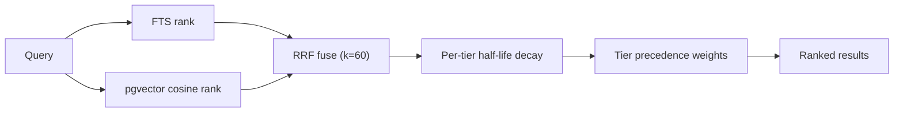

This document explains how Omnia gives agents durable, long-term memory that
outlives a single conversation — how memories are tiered, how they are recalled,
and how they decay and are pruned over time.

Memory is distinct from [sessions](/explanation/agents/sessions/). A session is the
transient transcript of one conversation; memory is the distilled, cross-session
knowledge an agent accumulates about a user, about its own domain, and about the
organisation it serves. Memory is served by the per-workspace **memory-api**
service and reached by agents through the `memory__save`, `memory__recall`, and
`memory__forget` platform tools.

## What is a Memory?

A memory is a durable, typed observation — a fact, a preference, a piece of
context — stored with metadata that lets it be ranked, deduplicated, decayed, and
(when a consent policy applies) classified. Each memory carries:

- **Content** — the observation text, plus an optional title and summary.
- **Kind** — e.g. `fact`, `preference`, `context`.
- **Confidence** — how strongly the agent believes the observation.
- **Embedding** — an optional vector, when an embedding Provider is configured,
  enabling semantic recall.
- **Consent category** — an optional privacy classification (Enterprise).
- **Scope** — which tier the memory belongs to (see below).

## Memory Tiers

Memories are organised into tiers that scope who and what a memory is about.
Recall queries fan out across the tiers and fuse the results into one ranked
list.

| Tier | Scope | Example |
|---|---|---|
| **User** | A specific end-user, across all agents | "Prefers metric units" |
| **Agent** | A specific agent, across all users | "This agent's booking flow requires a confirmation step" |
| **User-for-agent** | One user as seen by one agent | "This user asked this agent about refunds twice" |
| **Institutional** | The whole workspace / organisation | "Company return policy is 30 days" |

The `user_for_agent` tier is derived at recall time from the intersection of a
user and an agent — it inherits the user tier's ranking weight rather than
carrying its own.

:::note[Enterprise Feature]
The **institutional** tier — organisation-wide shared memory, its ingestion
pipeline, and cross-tier ranking — is an enterprise feature
(`ee/pkg/memory`). Open-source deployments use the user, agent, and
user-for-agent tiers. See [Installing a License](/how-to/operations/install-license/).
:::

## The Recall Model

When an agent calls `memory__recall`, memory-api runs a ranked retrieval across
all applicable tiers and returns a single fused, ranked list. How ranking works
depends on whether an embedding Provider is configured.

### Hybrid retrieval with Reciprocal Rank Fusion

With an embedding Provider configured and a non-empty query, recall is
**hybrid**: two independent rankings are computed and fused.

1. **Full-text search (FTS)** ranks memories lexically against the query.
2. **Vector search** ranks memories by pgvector cosine similarity between the
   query embedding and each memory's embedding.

The two ranked lists are combined with **Reciprocal Rank Fusion (RRF)** using a
constant **k = 60**. RRF scores each memory by `1 / (k + rank)` in each list and
sums the contributions, so a memory that ranks well in *either* list surfaces —
crucially, this lets semantic-only matches (no lexical overlap with the query)
appear alongside keyword matches.

Without an embedding Provider — or on an embedding failure, or an empty query —
recall **falls back to FTS-only** multi-tier retrieval. Semantic-only matches are
not available in that mode, but the tier fan-out and decay still apply.

### Half-life recency decay

After fusion, each memory's score is multiplied by a **per-tier recency-decay
multiplier** driven by a half-life. A memory whose age equals the tier's
half-life scores at 0.5× the recency multiplier; at 5× the half-life it is
effectively gone. The half-life is configurable per tier via
`spec.recall.halfLife.{user,agent,institutional}` and defaults to **30 days** per
tier.

This read-path half-life is distinct from the retention **decay half-life**
(`spec.tiers.<tier>.decay.halfLifeDays`, default 90 days), which governs when a
memory is *pruned* rather than how it is *ranked*. One demotes a memory in
recall; the other eventually deletes it.

### Tier precedence

Finally, a per-tier multiplier biases the fused score across tiers — for example
to make institutional policy outrank a casual user preference. Ordering *within*
a tier is preserved; the weights bias *across* tiers. This is configured via
`spec.tierPrecedence.multiplicative`.

:::note[Enterprise Feature]
Cross-tier ranking (`ee/pkg/memory/tier_ranking.go`) is an enterprise feature.
See [Installing a License](/how-to/operations/install-license/).
:::

### Large memories: inline vs preview

To keep recall responses small, memories whose body exceeds
`spec.recall.inlineThresholdBytes` (default 2048) are returned as title +
summary + `content_preview` rather than the full body. The agent calls
`memory__open(id)` when it actually needs the full text.

## Retention and Decay

Memory is not append-only forever. A per-workspace retention worker prunes
memories according to the bound `MemoryPolicy`. Each tier chooses a mode:

- **Manual** — never auto-pruned (the usual choice for the institutional tier).
- **TTL** — pruned when `expires_at` passes.
- **Decay** — a per-row score (confidence, access frequency, recency) drops
  below a floor and the row is soft-deleted.
- **LRU** — pruned when it hasn't been accessed within a staleness window.
- **Composite** — TTL, Decay, and LRU run independently; the first to fire wins.

Pruning is two-phase: a **soft-delete** (`forgotten=true`) followed by a
**hard-delete** after a grace window, so an over-aggressive policy can be caught
before data is irrecoverable. Full field-by-field configuration lives in the
[MemoryPolicy CRD reference](/reference/policies/memorypolicy/).

## Deduplication

Two mechanisms keep the store from filling with near-duplicates:

- **Structured-key dedup** — identity-class kinds (e.g. `fact`, `preference`)
  can be required to carry an `about={kind, key}` hint, so repeated observations
  about the same entity collapse onto one row.
- **Embedding-similarity dedup** — when embeddings are available, a new memory
  whose cosine similarity to an existing one is above `autoSupersedeAbove`
  (default 0.95) automatically supersedes it; matches above
  `surfaceDuplicatesAbove` (default 0.85) are surfaced to the agent as
  `potential_duplicates` to reconcile on a later turn.

## Consolidation

Beyond mechanical dedup, an optional **consolidation worker** runs scheduled
LLM-driven passes over stale, cross-scope, and duplicate-entity memories. Each
axis is dispatched to a function-mode `AgentRuntime` that returns a typed action
list (create-summary, supersede, rescope, merge); the platform validates each
action against mutability, PII, k-anonymity, and scope gates before applying it
transactionally.

:::note[Enterprise Feature]
Memory consolidation (`ee/pkg/memory/consolidation`) is an enterprise feature.
See [Configure memory consolidation](/how-to/memory/configure-memory-consolidation/)
and [Installing a License](/how-to/operations/install-license/).
:::

## Embeddings

Semantic recall, embedding-similarity dedup, and consent-embedding
classification all depend on an embedding **Provider** (`spec.role: embedding`).
memory-api sizes its pgvector columns to the provider's model dimension at
startup, so any embedding model — Azure/OpenAI 1536, ollama `nomic-embed-text`
768, `mxbai-embed-large` 1024, `all-minilm` 384 — works by configuration alone.
Changing the dimension on a store that already holds vectors is destructive
(every vector must be re-embedded) and gated by one-shot consent. See
[Change the memory embedding model](/how-to/memory/change-memory-embedding-model/).

Without an embedding Provider, memory still works — recall degrades to FTS-only
and embedding-based dedup and classification are disabled.

## Memory Galaxy

The **Memory Galaxy** is a clustering overview that projects a workspace's
memories into a 2D layout for an operator/demo view. A background projection
worker pre-renders the layout so the projection endpoint serves it instantly.

Every memory contributes a point so the cluster shape stays faithful, but points
whose consent category is PII-sensitive (`memory:identity`, `memory:location`,
`memory:health`) are **masked server-side before serialization**: their
identifying and content fields are stripped, leaving an anonymous,
non-interactive dot. Dropping the `id` is the security boundary — a masked dot
cannot be clicked through to the underlying memory. Masking is applied at
read-time on every serve (including the cached path) and is scope-independent, so
an operator cannot enumerate users to defeat it.

:::note[Enterprise Feature]
The Memory Galaxy projection worker (`ee/pkg/memory/projection`) is an enterprise
feature. See [Installing a License](/how-to/operations/install-license/).
:::

## Consent Classification

When enterprise privacy enforcement is enabled, a consent-category validator runs
on every memory write. It merges several signals using **upgrade-only**
semantics — a detected category overrides the caller's claim only when it is more
restrictive:

1. The caller's declared `consent_category` is the primary signal.
2. A PII regex pass classifies content into `memory:health`,
   `memory:identity`, `memory:location`.
3. When an embedding Provider is configured, an embedding-similarity pass
   classifies content against per-category exemplar centroids
   (`memory:preferences`, `memory:context`, `memory:history`, plus
   reinforcement of the regex categories).

The classification drives per-category retention overrides
(`spec.tiers.<tier>.perCategory`), Galaxy masking, and consent-revocation
handling. In open-source deployments the validator is off and `consent_category`
stays `NULL` — a binary opt-out is the only gate.

:::note[Enterprise Feature]
Consent classification runs only under enterprise privacy enforcement. See
[Installing a License](/how-to/operations/install-license/).
:::

## Best Practices

1. **Configure an embedding Provider for quality recall** — FTS-only fallback
   misses semantic matches.
2. **Use `Manual` retention for the institutional tier** — authoritative content
   should not silently decay.
3. **Set per-tier half-lives to match the data's shelf life** — short for
   volatile user context, long for durable policy.
4. **Require `about` hints for identity-class kinds** — it keeps the structured
   dedup path effective.
5. **Review Galaxy masking before demoing** — sensitive categories are anonymised
   by design; verify your consent policy is classifying them.

## Related Resources

- [MemoryPolicy CRD](/reference/policies/memorypolicy/) — full field-by-field reference.
- [Configure memory consolidation](/how-to/memory/configure-memory-consolidation/) —
  operator setup for the consolidation worker.
- [Change the memory embedding model](/how-to/memory/change-memory-embedding-model/) —
  swap the embedding provider and vector dimension.
