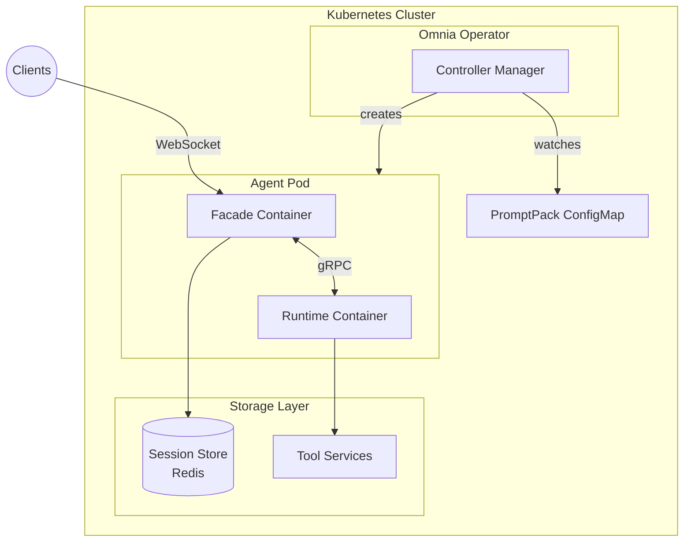
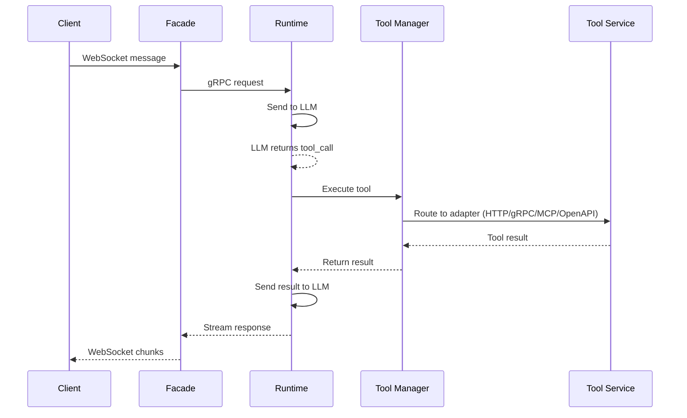
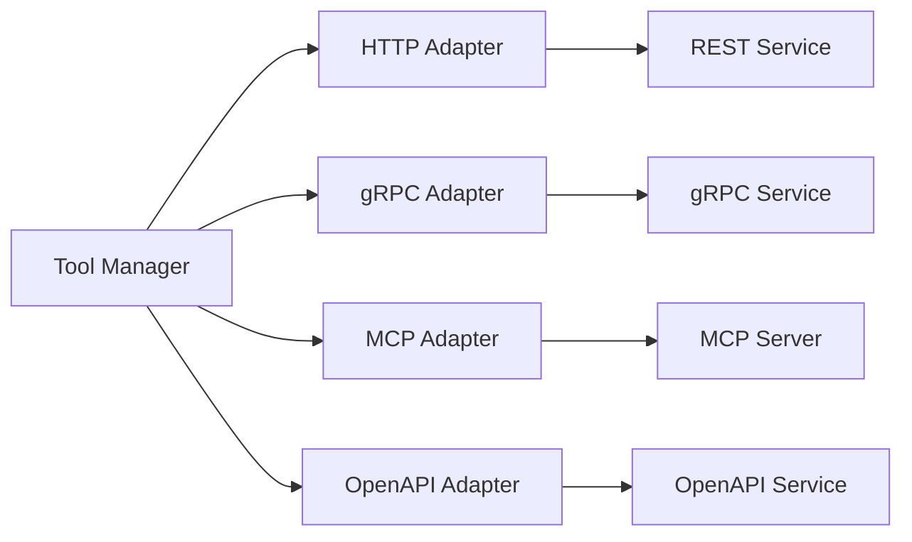
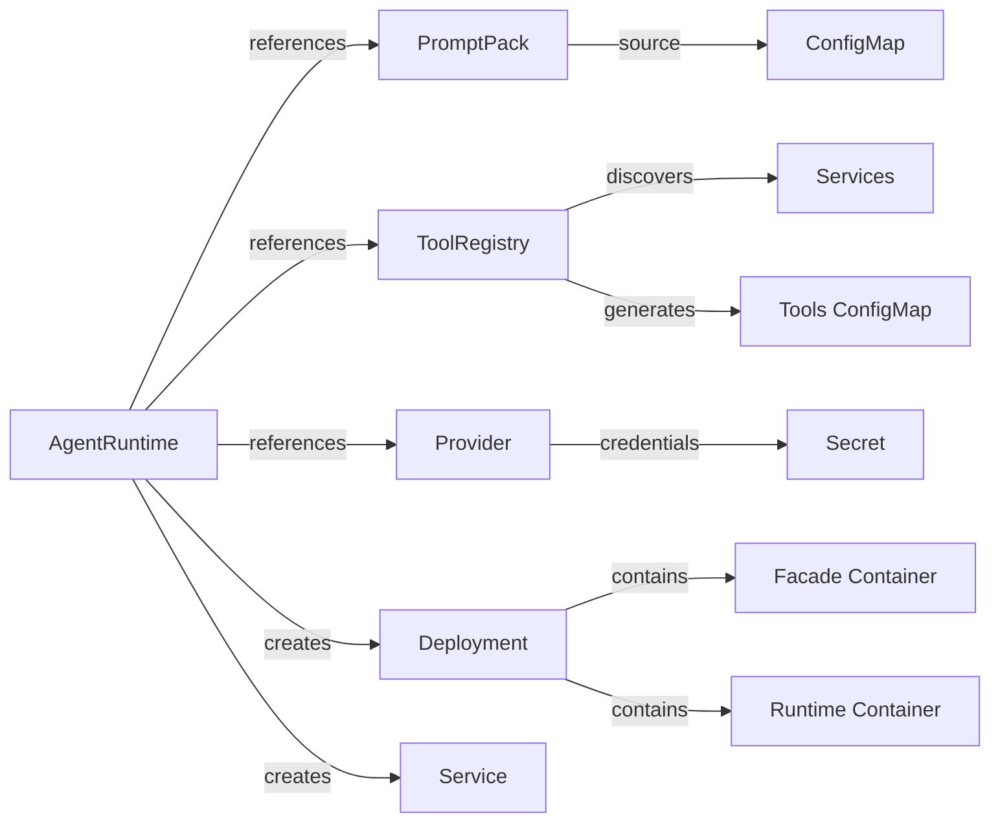

This document explains the architecture of Omnia and the design decisions behind it.

## High-Level Architecture

Omnia consists of three main components:



## Components

### Omnia Operator

The operator is a Kubernetes controller that:

- Watches for AgentRuntime, PromptPack, ToolRegistry, and Provider resources
- Creates and manages Deployments for agent pods
- Generates ConfigMaps for tools configuration
- Creates Services for agent access
- Monitors referenced resources and updates agents accordingly

The operator follows the standard Kubernetes controller pattern:

1. **Watch** - Monitor custom resources for changes
2. **Reconcile** - Bring actual state to desired state
3. **Status** - Report current state back to the resource

### Agent Pod (Sidecar Architecture)

Each agent pod runs two containers in a sidecar pattern:

#### Facade Container

The facade container handles external client communication:

- **WebSocket Server** - Manages client connections and message routing
- **Session Management** - Creates and tracks conversation sessions
- **Protocol Translation** - Converts WebSocket messages to gRPC calls
- **Connection Lifecycle** - Handles connect, disconnect, and heartbeat
- **Media Storage** (optional) - Handles file uploads for multi-modal messages

##### Optional Media Storage

The facade can optionally provide media storage for runtimes that don't have built-in media externalization. When enabled, clients can upload files via HTTP before referencing them in WebSocket messages.

This is useful when:
- Using a custom runtime without media handling
- Need a runtime-agnostic upload endpoint
- Want to avoid base64-encoding large files in WebSocket messages

Runtimes like PromptKit have built-in media externalization, so facade media storage can remain disabled (the default).

#### Runtime Container

The runtime container handles LLM interactions and tool execution:

- **PromptKit Integration** - Uses PromptKit SDK for LLM communication
- **Tool Manager** - Loads and manages tool adapters (HTTP, gRPC, MCP, OpenAPI)
- **State Persistence** - Saves conversation state to the session store
- **Tracing** - OpenTelemetry instrumentation for observability

The containers communicate via gRPC on localhost, providing clean separation between client-facing logic and LLM processing.

### Custom Resource Definitions

#### AgentRuntime

The primary resource for deploying agents. It references:

- Provider configuration (which LLM to use)
- PromptPack (what prompts to use)
- ToolRegistry (what tools are available)
- Session configuration
- Runtime resources and scaling

#### PromptPack

Defines versioned prompt configurations following the [PromptPack specification](https://promptpack.org/docs/spec/schema-reference). Supports:

- Structured prompt definitions with variables, parameters, and validators
- ConfigMap-based storage of compiled PromptPack JSON
- Canary rollouts for safe prompt updates
- Automatic agent notification on changes

#### ToolRegistry

Defines tool handlers available to agents:

- **HTTP handlers** - REST endpoints with explicit schemas
- **gRPC handlers** - gRPC services using the Tool protocol
- **MCP handlers** - Self-describing Model Context Protocol servers
- **OpenAPI handlers** - Self-describing services with OpenAPI specs
- Service discovery via label selectors

#### Provider

Configures LLM provider settings:

- Provider type (claude, openai, gemini, etc.)
- Model selection
- API credentials
- Custom base URLs

## Tool Execution Flow



The Tool Manager routes calls to the appropriate adapter based on handler type:



1. Client sends message via WebSocket
2. Facade creates/resumes session and forwards to Runtime
3. Runtime sends message to LLM via PromptKit
4. LLM returns tool call request
5. Tool Manager routes call to appropriate adapter
6. Adapter executes tool and returns result
7. Result sent back to LLM for final response
8. Response streamed back through Facade to client

## Observability

Omnia provides comprehensive observability through OpenTelemetry:

### Tracing

The runtime container creates spans for:

- **Conversation turns** - End-to-end request processing
- **LLM calls** - Time spent in provider API calls
- **Tool executions** - Individual tool call latency

Traces include:

- Session ID for correlation
- Token usage (input/output)
- Cost information
- Tool results (success/error)

### Metrics

The operator and agent containers expose Prometheus metrics:

- Request latency histograms
- Tool call counts and durations
- Session counts
- LLM token usage

### Configuration

Enable tracing via environment variables:

```yaml
env:
  - name: OMNIA_TRACING_ENABLED
    value: "true"
  - name: OMNIA_TRACING_ENDPOINT
    value: "otel-collector.observability:4317"
  - name: OMNIA_TRACING_SAMPLE_RATE
    value: "1.0"
```

## Design Decisions

### Why Kubernetes Operator?

We chose the operator pattern because:

1. **Native integration** - Agents are first-class Kubernetes citizens
2. **Declarative configuration** - Define desired state, not procedures
3. **Self-healing** - Automatic recovery from failures
4. **Scalability** - Leverage Kubernetes scaling mechanisms

### Why Sidecar Architecture?

Separating facade and runtime enables:

1. **Separation of concerns** - Client handling vs LLM processing
2. **Independent scaling** - Different resource requirements
3. **Protocol flexibility** - Easy to add new client protocols
4. **Testability** - Components can be tested in isolation
5. **Language flexibility** - Containers can use different languages

### Why WebSocket?

WebSocket was chosen for the client facade because:

1. **Streaming** - Essential for LLM response streaming
2. **Bidirectional** - Enables tool calls and results
3. **Persistent** - Maintains connection for multi-turn conversations
4. **Efficient** - Lower overhead than HTTP polling

### Why Separate PromptPack?

Separating prompts from agents allows:

1. **Reusability** - Same prompts across multiple agents
2. **Versioning** - Track prompt changes independently
3. **Safe rollouts** - Canary deployments for prompts
4. **Separation of concerns** - Prompt engineers vs DevOps

### Why Handler-Based Tools?

The handler abstraction enables:

1. **Self-describing services** - MCP and OpenAPI discover tools automatically
2. **Explicit schemas** - HTTP and gRPC tools define their interface
3. **Unified management** - All tool types in one registry
4. **Dynamic updates** - Add/remove tools without redeploying agents

## Resource Relationships



## Reconciliation Flow

When an AgentRuntime is created or updated:

1. Validate the referenced PromptPack exists
2. Optionally validate the referenced ToolRegistry
3. Fetch Provider configuration
4. Generate tools ConfigMap from ToolRegistry
5. Build the pod spec with facade and runtime containers
6. Create or update the Deployment
7. Create or update the Service
8. Update the AgentRuntime status

When a ToolRegistry changes:

1. Process handlers (HTTP, gRPC, MCP, OpenAPI)
2. Discover tools from self-describing handlers
3. Update discovered tools in status
4. Find all AgentRuntimes referencing this ToolRegistry
5. Regenerate tools ConfigMaps for affected agents

## Security Considerations

### Secrets Management

- API keys are stored in Kubernetes Secrets
- Secrets are mounted as environment variables, not files
- Secrets can be from the same or different namespace

### Network Policies

Consider implementing NetworkPolicies to:

- Restrict agent egress to allowed LLM providers
- Limit tool access to specific services
- Isolate agent namespaces

### RBAC

The operator requires specific permissions:

- Full access to Omnia CRDs
- Read access to ConfigMaps and Secrets
- Create/Update access to Deployments and Services
