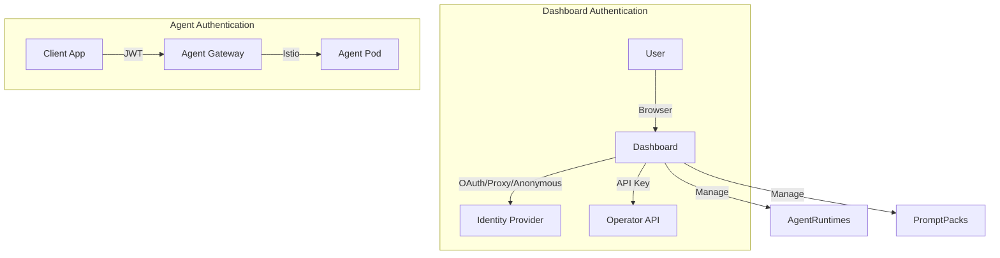
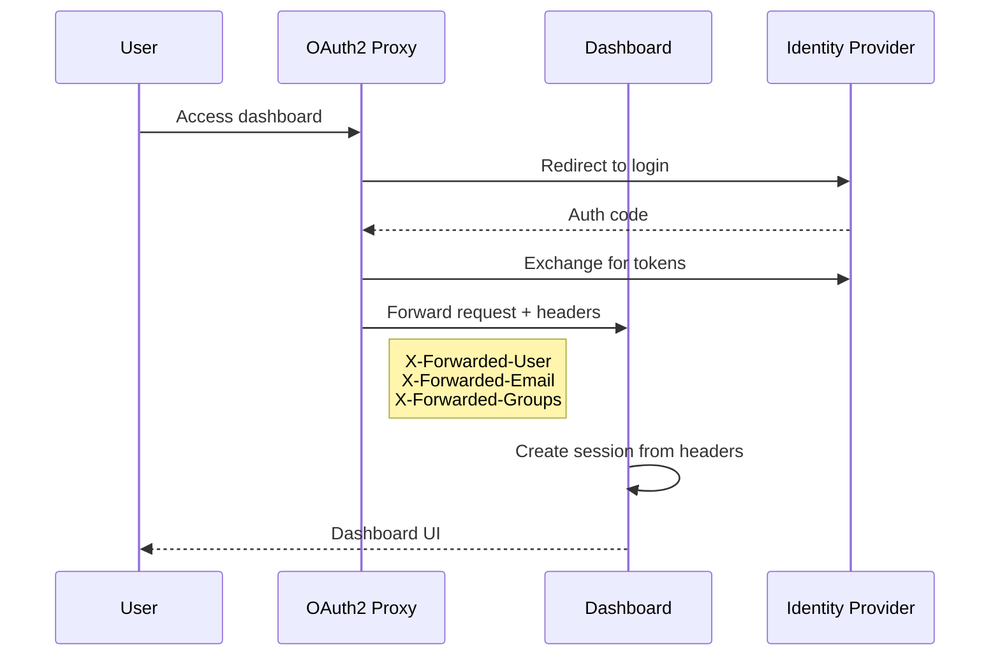
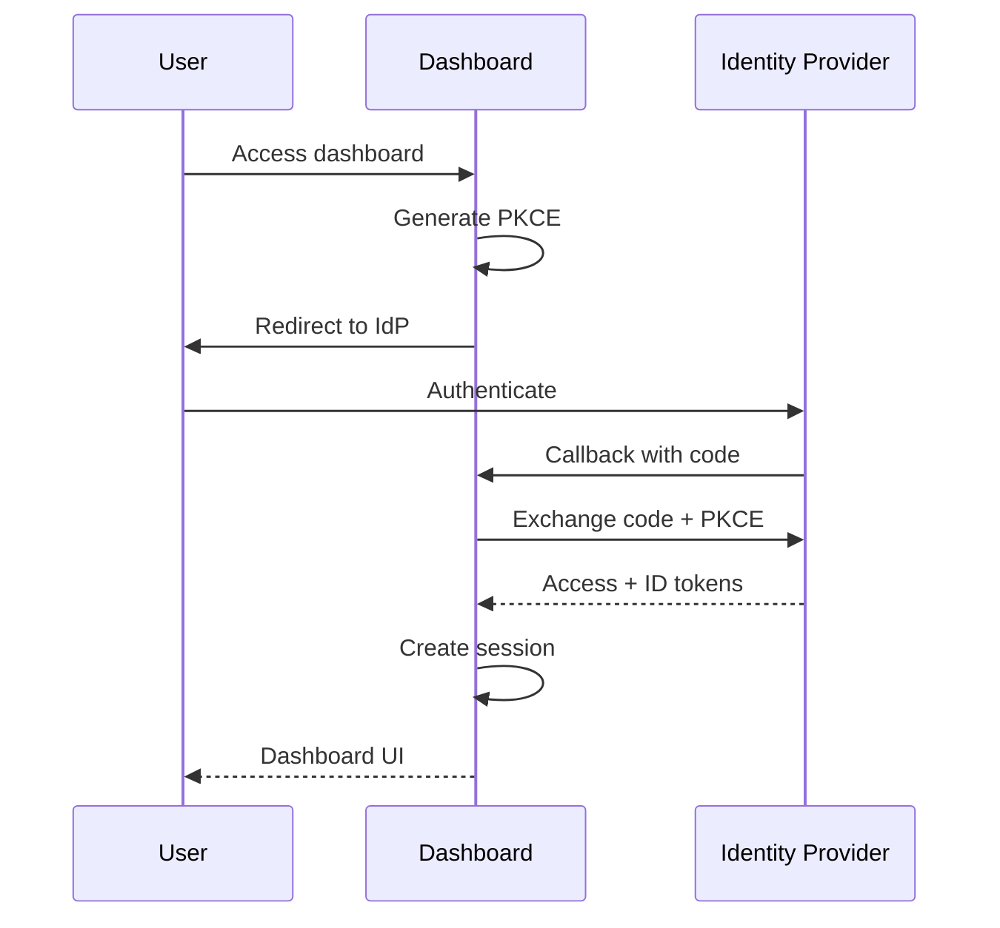
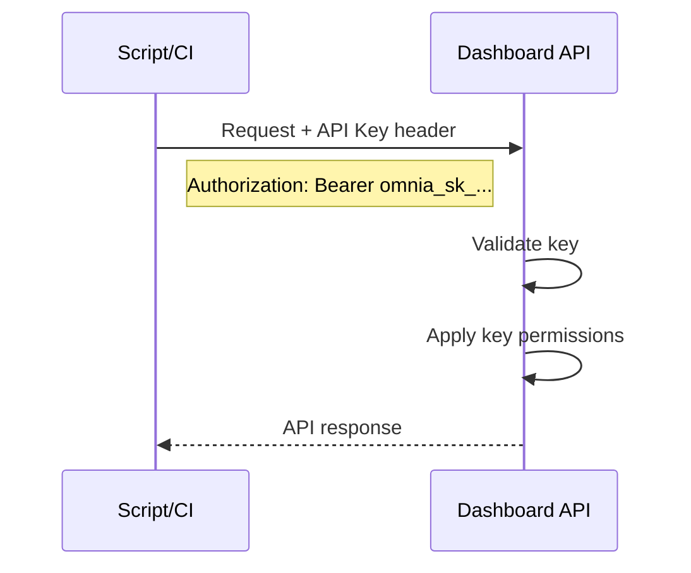
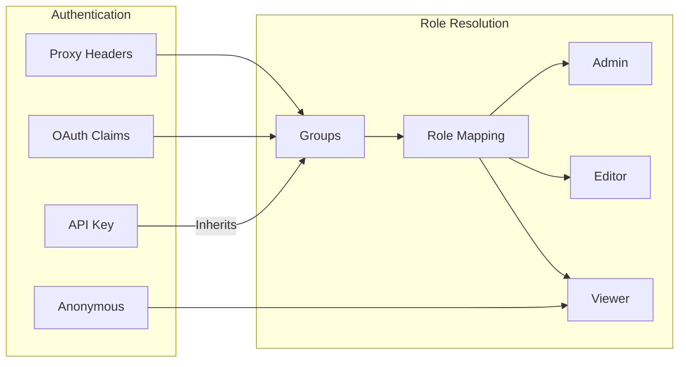
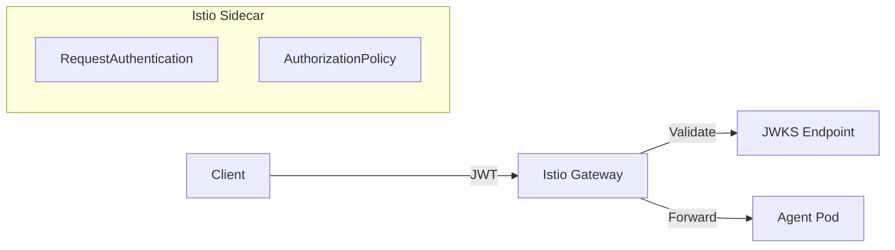
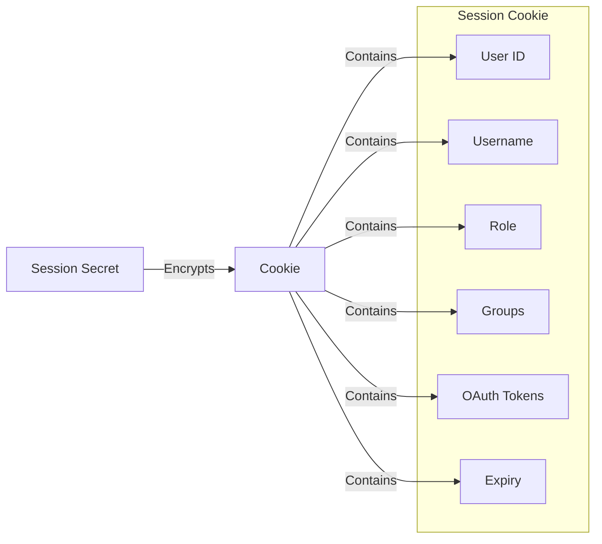
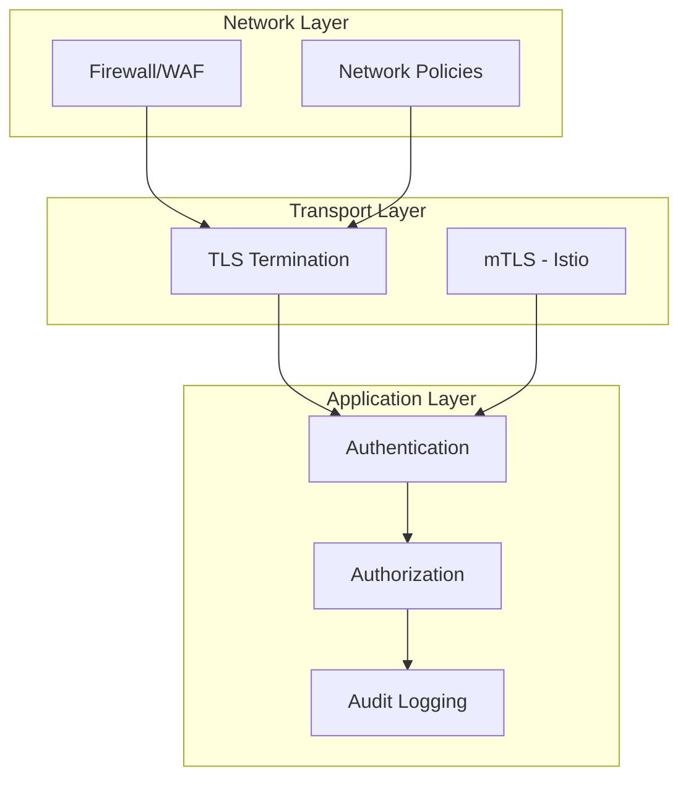

This document explains the authentication architecture in Omnia, covering both dashboard access and agent endpoint security.

## Authentication Layers

Omnia has two distinct authentication layers that serve different purposes:



### Dashboard Authentication

The dashboard is a web UI for managing Omnia resources. It supports multiple authentication modes:

| Mode | Use Case | Security Level |
|------|----------|----------------|
| **Anonymous** | Development, demos | None |
| **Proxy** | Behind OAuth2 Proxy, Authelia, etc. | Delegated |
| **OAuth** | Direct IdP integration | Full |
| **API Keys** | Programmatic access | Token-based |

### Agent Authentication

Agent endpoints are protected separately using Istio's JWT validation. This allows:

- Different authentication for dashboard vs agents
- Service-to-service authentication for agent clients
- Fine-grained access control per agent

## Dashboard Authentication Modes

### Anonymous Mode

The simplest mode with no authentication. All users are treated as anonymous viewers.

```
OMNIA_AUTH_MODE=anonymous
```

**When to use:**
- Local development
- Demonstrations
- Air-gapped environments with network-level security

**Limitations:**
- No user identity
- No audit trail
- Single role for all users

### Proxy Mode

Delegates authentication to a reverse proxy that handles OAuth/OIDC and passes user info via headers.



**When to use:**
- Kubernetes with ingress controller
- Existing OAuth2 Proxy deployment
- Centralized authentication gateway
- Multiple applications behind same proxy

**Benefits:**
- Single sign-on across applications
- Proxy handles token management
- No secrets in dashboard

### OAuth Mode

Direct integration with identity providers using OAuth 2.0 / OpenID Connect.



**When to use:**
- Standalone deployment
- No existing proxy infrastructure
- Need SSO logout
- Need automatic token refresh

**Supported providers:**
- Generic OIDC (any compliant provider)
- Google
- GitHub (OAuth 2.0)
- Azure AD / Entra ID
- Okta

### API Key Mode

API keys provide programmatic access to the dashboard API without browser-based authentication.



**When to use:**
- CI/CD pipelines
- Automation scripts
- Service integrations
- Monitoring tools

**Features:**
- Scoped permissions
- Expiration dates
- Usage tracking
- Multiple keys per user

## Role-Based Access Control

All authentication modes map to the same RBAC system:



### Roles and Permissions

| Permission | Viewer | Editor | Admin |
|------------|--------|--------|-------|
| View agents, prompts, tools | Yes | Yes | Yes |
| View metrics and logs | Yes | Yes | Yes |
| Scale agents | No | Yes | Yes |
| Deploy new agents | No | Yes | Yes |
| Modify configurations | No | Yes | Yes |
| Manage API keys | Own | Own | All |
| Manage users | No | No | Yes |

### Group-to-Role Mapping

Groups from identity providers are mapped to roles:

```bash
# Users in these groups get admin role
OMNIA_AUTH_ROLE_ADMIN_GROUPS=omnia-admins,platform-admins

# Users in these groups get editor role
OMNIA_AUTH_ROLE_EDITOR_GROUPS=omnia-editors,developers

# Everyone else gets viewer role (default)
```

The first matching group wins, checked in order: admin, editor, then viewer.

## Agent Authentication

Agent endpoints use JWT-based authentication via Istio's RequestAuthentication and AuthorizationPolicy.



### Authentication Flow

1. Client obtains JWT from identity provider
2. Client connects to agent with `Authorization: Bearer <token>`
3. Istio validates JWT signature using JWKS
4. Istio checks issuer, audience, and expiration
5. If valid, request is forwarded to agent
6. Claims can be extracted to headers for agent use

### Why Separate from Dashboard?

Agent authentication is separate because:

1. **Different clients** - Dashboard serves humans, agents serve applications
2. **Different tokens** - Browser sessions vs service tokens
3. **Different lifetimes** - Short sessions vs long-lived API access
4. **Different providers** - May use different IdPs for internal vs external

## Session Management

Dashboard sessions use encrypted cookies via iron-session:



### Security Properties

- **Encrypted** - Cookie contents are AES-encrypted
- **Server-side secret** - Cannot be forged without secret
- **HTTP-only** - Not accessible to JavaScript
- **Secure** - Only sent over HTTPS (in production)
- **SameSite** - Protected against CSRF

### Token Refresh

In OAuth mode, tokens are automatically refreshed:

1. Dashboard checks token expiry before API calls
2. If expiring soon (< 5 minutes), refresh is attempted
3. New tokens are stored in session
4. If refresh fails, user is redirected to login

## Security Best Practices

### Production Checklist

- [ ] Set `OMNIA_SESSION_SECRET` to a strong 32+ character secret
- [ ] Use HTTPS for all dashboard access
- [ ] Enable OAuth or proxy mode (never anonymous in production)
- [ ] Configure role mapping to match your organization
- [ ] Set appropriate session TTL
- [ ] Enable API key expiration
- [ ] Use network policies to restrict dashboard access

### Defense in Depth



### Secrets Management

| Secret | Storage | Rotation |
|--------|---------|----------|
| Session secret | K8s Secret / env | On restart |
| OAuth client secret | K8s Secret / file mount | Provider-dependent |
| API keys | File store (encrypted) | User-controlled |
| JWT signing keys | JWKS endpoint | Provider-controlled |

## Architecture Decisions

### Why Multiple Auth Modes?

Different deployments have different requirements:

- **Enterprises** need proxy integration with existing SSO
- **Startups** want simple OAuth setup
- **Developers** need quick anonymous access

Supporting all modes allows Omnia to fit into any environment.

### Why Cookie-Based Sessions?

Alternatives considered:

| Approach | Pros | Cons |
|----------|------|------|
| JWT in localStorage | Stateless | XSS vulnerable, can't revoke |
| JWT in cookie | Stateless | Can't revoke, size limits |
| **Encrypted session cookie** | Secure, revocable, simple | Server-side state |
| Redis sessions | Scalable, revocable | Infrastructure overhead |

Encrypted cookies provide the best balance of security and simplicity for a dashboard.

### Why PKCE for OAuth?

PKCE (Proof Key for Code Exchange) prevents authorization code interception attacks:

1. Dashboard generates random code_verifier
2. Dashboard sends hash (code_challenge) to IdP
3. After redirect, dashboard proves it initiated the request
4. Even if code is intercepted, attacker can't exchange it

PKCE is mandatory for public clients and recommended for all OAuth flows.
