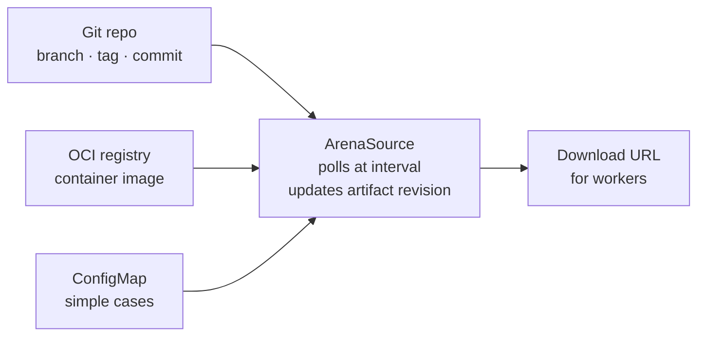
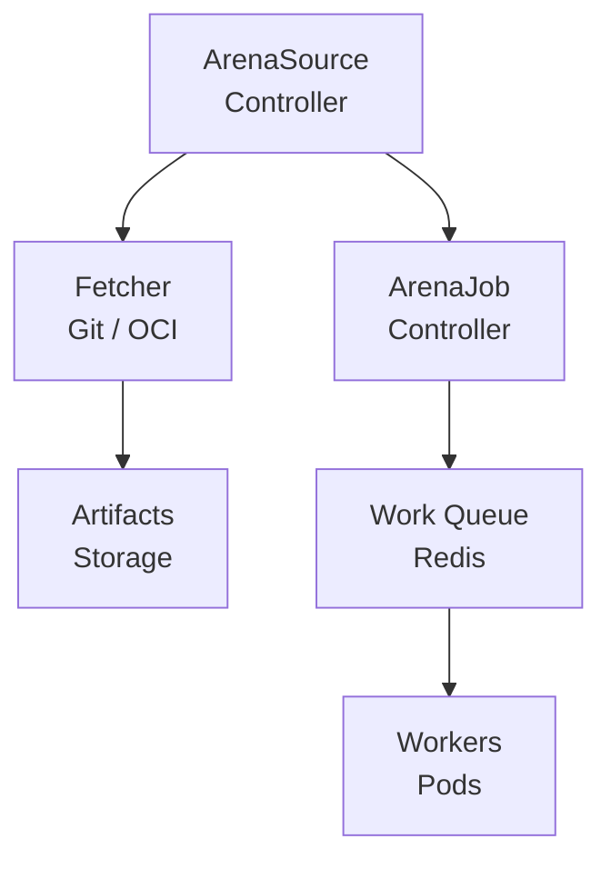
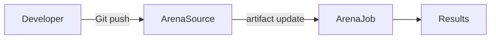

Arena is Omnia's distributed testing framework for evaluating PromptKit bundles at scale. It enables systematic testing of prompts against datasets, tracking results, and comparing performance across versions.

## Overview

Arena provides:

- **Distributed execution**: Run tests across multiple workers
- **GitOps integration**: Source bundles from Git, OCI, or ConfigMaps
- **Revision tracking**: Track which bundle versions were tested
- **Result aggregation**: Collect and analyze test results
- **Scalability**: Handle large test datasets efficiently
- **Unified provider model**: LLM providers and agents are interchangeable in the evaluation matrix

## Core concepts

### PromptKit bundles

Arena tests [PromptKit](https://promptpack.org) bundles - structured collections of prompts with versioning, templating, and parameter definitions. Bundles are fetched from external sources and tested against datasets.

### Sources

An **ArenaSource** defines where to fetch PromptKit bundles from:



The controller automatically:
1. Polls the source at the configured interval
2. Detects changes (new commits, tags, or versions)
3. Updates the artifact URL and revision
4. Triggers downstream jobs when sources change

### Providers and agents

An ArenaJob references **providers** — the LLM backends or agents that execute prompts during a test run. Providers are organized into named groups (e.g., `default`, `judge`) that correspond to roles defined in the arena configuration file.

Each entry in a provider group is either:

- A **providerRef** pointing to a Provider CRD (direct LLM access)
- An **agentRef** pointing to an AgentRuntime CRD (the worker connects via WebSocket)

Agents and LLM providers are interchangeable — they can appear in any provider position within the scenario-by-provider evaluation matrix. There is no separate "fleet mode"; an agent is simply another provider entry.

### Jobs

An **ArenaJob** executes a test run:

- References an ArenaSource via `sourceRef`
- Maps provider groups to Provider or AgentRuntime CRDs
- Partitions work across workers
- Tracks progress and collects results
- Stores aggregated results

## Architecture



## Workflow

### 1. Define sources

Create ArenaSource resources pointing to your PromptKit bundles:

```yaml
apiVersion: omnia.altairalabs.ai/v1alpha1
kind: ArenaSource
metadata:
  name: my-prompts
spec:
  type: git
  interval: 5m
  git:
    url: https://github.com/acme/prompts
    ref:
      branch: main
```

### 2. Run jobs

Create an ArenaJob that references the source and maps provider groups:

```yaml
apiVersion: omnia.altairalabs.ai/v1alpha1
kind: ArenaJob
metadata:
  name: evaluation-run-001
spec:
  sourceRef:
    name: my-prompts
  providers:
    default:
      - providerRef:
          name: claude-sonnet
```

The `providers` field maps group names (here, `default`) to lists of provider or agent entries. Groups correspond to the roles defined in the arena configuration file within the source. You can mix LLM providers and agents in the same group:

```yaml
  providers:
    default:
      - providerRef:
          name: claude-sonnet
      - providerRef:
          name: gpt-4o
      - agentRef:
          name: my-custom-agent
    judge:
      - providerRef:
          name: claude-opus
```

### 3. Monitor results

Check job status and retrieve results:

```bash
kubectl get arenajob evaluation-run-001 -o yaml
```

## Revision tracking

Arena tracks source revisions for reproducibility:

| Source Type | Revision Format | Example |
|-------------|-----------------|---------|
| Git | `branch@sha1:commit` | `main@sha1:abc123` |
| OCI | `tag@sha256:digest` | `v1.0@sha256:def456` |
| ConfigMap | `resourceVersion` | `12345` |

This enables:
- **Reproducible tests**: Re-run with exact same bundle version
- **Change detection**: Only re-test when sources change
- **Audit trail**: Track which versions were tested

## GitOps integration

Arena integrates naturally with GitOps workflows:

1. **Developers** push prompt changes to Git
2. **ArenaSource** detects changes and updates artifacts
3. **ArenaJob** runs tests against new version
4. **Results** inform whether to promote changes



## Next steps

- **[ArenaSource CRD Reference](/reference/evaluation/arenasource)**: Complete spec details
- **[ArenaJob CRD Reference](/reference/evaluation/arenajob)**: Job execution details
