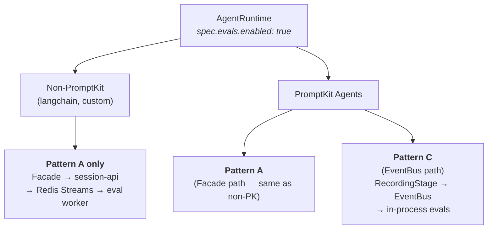
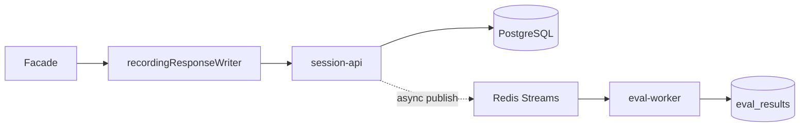
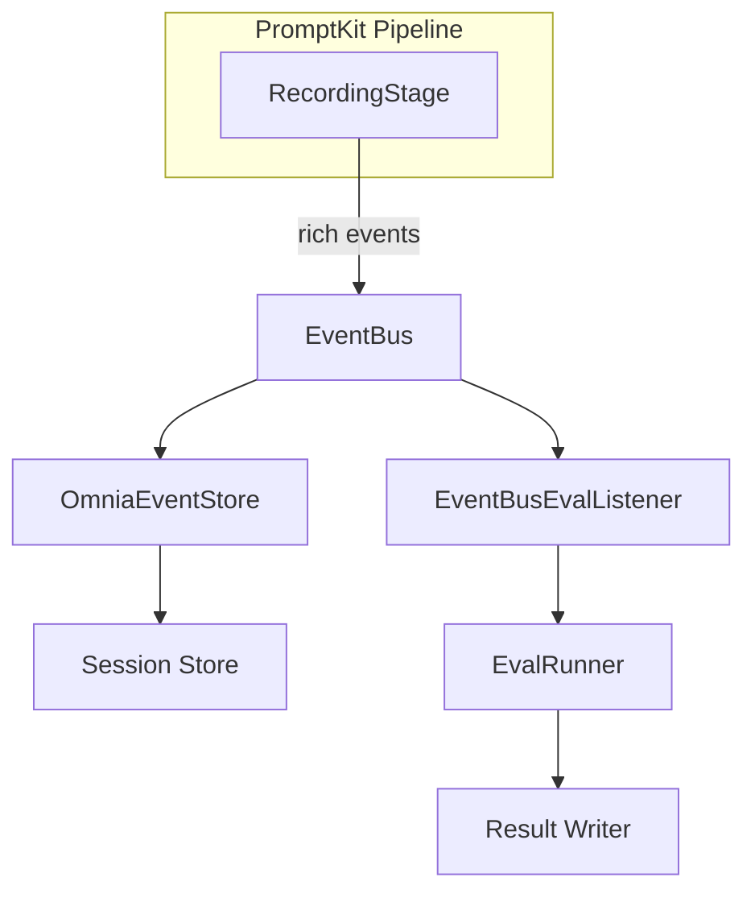

Realtime evals extend Omnia's evaluation engine to run continuously against live production sessions. Eval definitions live in the PromptPack alongside validators and guardrails, and execution is triggered automatically by session events.

## Overview

**Key principle: same rubric, two contexts.** A PromptPack author defines "what good looks like" once. The enterprise eval system uses those definitions pre-deploy against synthetic scenarios (via Arena batch jobs) and post-deploy against live traffic (via realtime evals). Same assertion engine, same eval definitions, different input data.

Evals are:

- **Non-blocking** — they run asynchronously after the response is sent, with zero latency impact on the conversation
- **Event-driven** — triggered by session events, not polling
- **Per-agent** — each AgentRuntime configures its own eval settings (judges, sampling, rate limits)

## Eval definitions

Evals are defined in the PromptPack's `pack.json` as a sibling to `validators`:

```json
{
  "prompts": {
    "customer-support": {
      "system": "You are a helpful customer support agent...",
      "validators": [
        { "type": "banned_words", "params": { "words": ["competitor"] } }
      ],
      "evals": [
        {
          "id": "helpfulness",
          "type": "llm_judge_turn",
          "trigger": "every_turn",
          "params": {
            "judge": "fast-judge",
            "criteria": "Is the response helpful, accurate, and on-topic?",
            "rubric": "1-5 scale"
          }
        },
        {
          "id": "resolution",
          "type": "llm_judge_turn",
          "trigger": "on_session_complete",
          "params": {
            "judge": "strong-judge",
            "criteria": "Did the agent resolve the customer's issue?"
          }
        },
        {
          "id": "no-pii-leak",
          "type": "content_includes",
          "trigger": "every_turn",
          "params": {
            "pattern": "\\b\\d{3}-\\d{2}-\\d{4}\\b",
            "should_match": false
          }
        }
      ]
    }
  }
}
```

### Trigger types

| Trigger | Fires when | Use case |
|---------|-----------|----------|
| `every_turn` | After each assistant message is recorded | Per-turn quality scoring, safety checks |
| `on_session_complete` | Session ends or times out | Conversation-level judgments, resolution checks |
| `on_n_turns` | Every N assistant messages | Periodic checks during long sessions |

### Eval types

| Type | Description | Requires LLM Judge |
|------|-------------|-------------------|
| `llm_judge_turn` | LLM evaluates a single turn against criteria | Yes |
| `content_includes` | Check if response contains (or doesn't contain) a pattern | No |
| `guardrail_triggered` | Check if a specific validator fired during the turn | No |

Non-LLM eval types (`content_includes`, `guardrail_triggered`) are free to run and can evaluate every session. LLM judge evals incur API costs and are typically sampled.

## Dual-pattern architecture

Realtime evals use two execution patterns depending on the agent's framework type:



### Pattern A: platform events (all agents)

Every AgentRuntime uses the facade's `recordingResponseWriter`, which captures assistant messages, tool calls, token counts, and cost. This data flows through session-api to PostgreSQL. Session-api then publishes lightweight events to Redis Streams. The eval worker subscribes and runs evals. The worker is provisioned per service group (see [Eval Worker](#eval-worker) below), so a multi-workspace cluster runs several workers, each scoped to its group's agents.



Pattern A is framework-agnostic by construction: it records off the facade, so it
works with any runtime that implements the `omnia.runtime.v1` contract, including
custom runtimes. It is verified against PromptKit only — community and custom
runtimes are not covered by this repo's tests.

### Pattern C: EventBus-driven (PromptKit agents)

For PromptKit agents, an additional path wires PromptKit's `RecordingStage` and `EventBus` into the pipeline. This provides richer event data including provider call metadata, validation events, and pipeline stage timings. An in-process `EventBusEvalListener` triggers evals with lower latency.



PromptKit agents run both patterns concurrently, with eval **groups** deciding which path executes which eval. Inline results land in `eval_results` with `source="runtime-inline"`; worker results land with `source="worker"`.

### Data comparison

| Data | Pattern A (Facade) | Pattern C (EventBus) |
|------|-------------------|---------------------|
| Assistant message content | Yes | Yes |
| Tool calls (name, args) | Yes | Yes (+ schema validation) |
| Token counts and cost | Yes | Yes (+ per-call breakdown) |
| Latency | Total only | Per-provider-call |
| Provider call metadata | No | Yes (model, temperature) |
| Validation/guardrail events | No | Yes |
| Pipeline stage timings | No | Yes |

### Group-based routing

Every eval belongs to one or more **groups**. PromptKit auto-classifies handlers into `fast-running` (deterministic, no network — e.g. `contains`, `regex`), `long-running` (LLM calls, slow I/O — e.g. `llm_judge`), and `external` (arbitrary external APIs). Every eval also carries the `default` group; authors may add custom groups via `EvalDef.Groups` in the pack.

Each path executes only the evals whose groups match its filter:

```yaml
# AgentRuntime spec
evals:
  enabled: true
  inline:
    groups: ["fast-running"]                 # runs synchronously in the runtime (Pattern C)
  worker:
    groups: ["long-running", "external"]     # runs out-of-band in the eval-worker (Pattern A)
```

Those values are the built-in defaults — absent or empty lists fall back to them. To disable evals entirely, set `spec.evals.enabled: false`; the groups fields are not an off-switch (an empty list still falls back to defaults, per PromptKit's `FilterByGroups` semantics).

The defaults are deliberately disjoint so an agent never runs the same eval twice. `"default"` is *not* in either default because every eval carries it — including `"default"` in the inline filter would route every long-running handler (e.g. `llm_judge`) onto the turn path. PromptKit auto-classifies any non-long-running / non-external handler as `"fast-running"`, so user-defined lightweight handlers are covered by the default without extra registration. If you override the defaults to overlap, you get duplicate `eval_results` rows — one with `source="runtime-inline"` and one with `source="worker"` — which is occasionally useful for comparing in-line vs. reloaded-session behavior on the same turn.

## Eval worker

The eval worker (`eval-worker`) is a long-running Deployment that subscribes to Redis Streams and runs evals for agents using Pattern A. It is **provisioned per service group**, not as a single cluster-wide singleton — the operator reconciles one worker for a `WorkspaceServiceGroup` and only when that group has work for it to do.

By default, the worker watches its deployment namespace. To watch additional namespaces, configure the `enterprise.evalWorker.namespaces` Helm value with the list of namespaces to monitor. The worker reads from multiple Redis streams concurrently via `XREADGROUP`. See [Eval Worker Helm values](/reference/platform/helm-values/#eval-worker-configuration) for details.

### When a worker is created

The operator creates a group's eval-worker automatically when the group has a **non-PromptKit**, eval-enabled AgentRuntime. PromptKit agents self-evaluate lightweight (`fast-running`) evals inline via Pattern C, so a group made up entirely of PromptKit agents would get no worker — and its `long-running` / `external` evals (e.g. `llm_judge`) would run nowhere.

To force a worker for such a group, opt in explicitly on the service group:

```yaml
# Workspace spec — a service group
evalWorker:
  enabled: true          # force an eval-worker even for all-PromptKit groups
```

This matters for rollout gating: only the worker tags `omnia_eval_*` metrics with the `variant` label that `RolloutAnalysis` gates key on, so a PromptKit agent behind a variant-gated eval must have a worker to produce its gate metric. `enabled` has no effect when the group has no eval-enabled agent — there is nothing to evaluate.

### Worker pod configuration and RBAC

Pod-level configuration comes from the service group's `evalWorker.podOverrides`, mirroring the memory/session `podOverrides` on the group. The most common use is pointing the worker at a shared ServiceAccount (e.g. an `azure.workload.identity/use: "true"` SA) so its `llm_judge` can mint a federated token for a keyless cloud judge provider — otherwise the judge LLM is never actually called and every score is `0`. The operator binds the worker's Role and the workspace-reader ClusterRole to the **effective** ServiceAccount (get on `configmaps`, `secrets`, and `promptpacks`), so an overridden SA keeps working. See the [eval-worker Helm values](/reference/platform/helm-values/) for the group configuration surface.

### What the worker does

1. Subscribes to Redis Streams events using a consumer group for horizontal scaling
2. Looks up the agent's AgentRuntime to check eval config and PromptPack reference
3. Resolves the PromptPack CR to its content source and loads eval definitions (cached per version)
4. Fetches session data from session-api
5. Runs assertions using the PromptKit eval engine
6. Writes results to the `eval_results` table via session-api

### Metrics

The worker exposes its `omnia_eval_*` metrics (faithfulness, pass rates, judge cost, etc.) as Prometheus metrics at `/metrics` on port `:9090`. The operator stamps each worker pod with the `app.kubernetes.io/component=eval-worker` label plus `prometheus.io/{scrape,port,path}` annotations, and a scrape job discovers workers by label across namespaces — so metrics scale automatically as more workers appear in a multi-workspace cluster. These metrics feed variant-gated `RolloutAnalysis` gates.

**Why a long-running Deployment instead of Kubernetes Jobs?** Enterprise batch evaluation (Arena) uses Jobs because each ArenaJob is a discrete unit of work. Realtime evals are continuous — spinning up a Job per session event would be too slow (pod scheduling takes 5-15 seconds) and wasteful. A persistent per-group worker pool is the right model.

## Judge provider resolution

LLM judge evals need an LLM provider for judging. The eval worker resolves provider specs from the AgentRuntime's `spec.providers` list. Add a named provider (e.g., `"judge"`) to supply the judge model:

```yaml
spec:
  providers:
    - name: default
      providerRef:
        name: claude-sonnet        # Primary LLM for the agent
    - name: judge
      providerRef:
        name: claude-haiku         # Cheap/fast model for eval judging
```

The eval worker (Pattern A) and the facade's eval listener (Pattern C) both resolve these Provider CRDs to obtain credentials for making LLM judge calls. This allows different agents to use different judge models based on their quality requirements and cost constraints.

## Session completion detection

For `on_session_complete` evals, the system needs to detect when a session has ended. Two mechanisms are used:

1. **Explicit close** — when a session's status is set to `"completed"` via the session-api, a `session.completed` event is published immediately.

2. **Inactivity timeout** — the eval system tracks the last message time per session. After the configured `inactivityTimeout` (default 5 minutes), the session is considered complete and session-level evals are triggered.

The timeout is configurable per agent:

```yaml
spec:
  evals:
    sessionCompletion:
      inactivityTimeout: 10m   # Wait 10 minutes of inactivity
```

## Cost controls

LLM judge evals cost money. At scale, uncontrolled eval execution can produce significant spend. Omnia provides three layers of cost control:

### Sampling

Sampling controls what percentage of sessions/turns are evaluated. It uses deterministic hashing on `sessionID:turnIndex`, so the same session/turn always produces the same sampling decision. This ensures consistent behavior across retries.

```yaml
spec:
  evals:
    sampling:
      defaultRate: 100    # 100% for lightweight evals (fast, free)
      extendedRate: 10    # 10% for extended evals (model-powered, costs money)
```

### Rate limiting

Rate limits use a token bucket algorithm for overall throughput and a semaphore for concurrent judge calls:

```yaml
spec:
  evals:
    rateLimit:
      maxEvalsPerSecond: 50          # Token bucket
      maxConcurrentJudgeCalls: 5     # Semaphore for LLM API calls
```

### Judge model selection

Use cheaper, faster models for high-volume per-turn evals and reserve more capable models for session-level evaluations:

| Judge | Model | Cost per eval | Use for |
|-------|-------|--------------|---------|
| `fast-judge` | Claude Haiku | ~$0.0005 | `every_turn` evals |
| `strong-judge` | Claude Sonnet | ~$0.005 | `on_session_complete` evals |

## Result storage

Eval results are stored in the `eval_results` table in PostgreSQL (managed by session-api). Each result records:

- The session and message that was evaluated
- The eval definition ID, type, and trigger
- Pass/fail status and optional numeric score (0.0-1.0)
- Execution details (duration, judge tokens used, judge cost)
- Whether it was executed by the eval worker (Pattern A) or in-process (Pattern C)

### API endpoints

Results are accessed through session-api endpoints:

| Method | Path | Description |
|--------|------|-------------|
| `POST /api/v1/eval-results` | Write eval result(s) | Called by eval worker or in-process listener |
| `GET /api/v1/sessions/{id}/eval-results` | Get results for a session | Used by dashboard session detail |
| `GET /api/v1/eval-results` | List/query results | Filter by agent, eval ID, passed, time range |
| `GET /api/v1/eval-results/summary` | Aggregate statistics | Pass rates, score distributions, trends |

## Quality dashboard

The dashboard provides two views for eval results:

1. **Session detail** — inline eval scores displayed next to each assistant message, showing which evals passed/failed and their scores.

2. **Agent quality view** — aggregate pass rates, score trends over time, and comparison across agents and PromptPack versions. Drill down by eval type to identify specific quality dimensions.

Data flows from the dashboard through the operator proxy to session-api's eval-results endpoints.

## Design decisions

### Why per-agent eval config?

Eval configuration lives on the AgentRuntime (not a global setting or separate CRD) because:

- Evals are tied to the agent's PromptPack, which is already on AgentRuntime
- Judge providers may differ per agent (cheap judges for low-stakes agents, strong judges for critical agents)
- Sampling rates vary by agent traffic volume
- Operators enable/disable evals per agent, not globally

### Why dual patterns?

Pattern A (platform events) provides universal coverage for any framework. Pattern C (EventBus) provides a better experience for PromptKit agents with richer data and lower latency. Supporting both means evals work regardless of framework choice while PromptKit users get enhanced capabilities.

### Why long-running workers, not jobs?

Kubernetes Jobs have 5-15 seconds of pod scheduling overhead. For realtime evals triggered on every assistant message, this latency is unacceptable. A persistent worker pool processes events in milliseconds and scales horizontally via consumer groups.

### Why hash-based sampling?

Deterministic hashing on `sessionID:turnIndex` ensures:

- The same turn always gets the same sampling decision (idempotent on retry)
- Sampling is evenly distributed across sessions
- No need for external state to track what has been sampled
