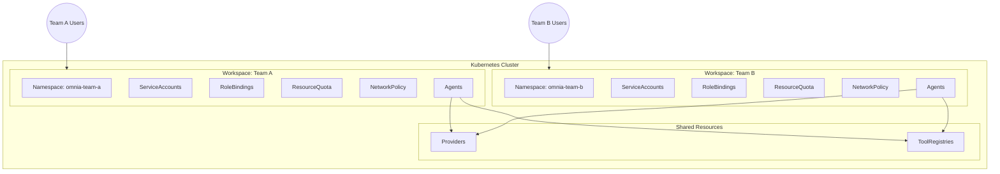
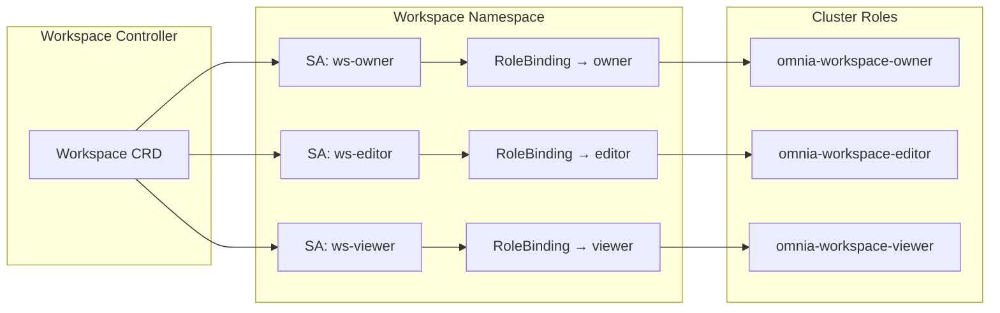
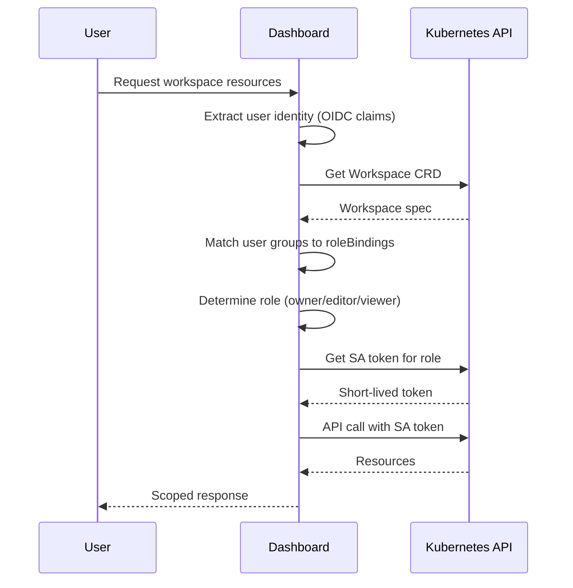
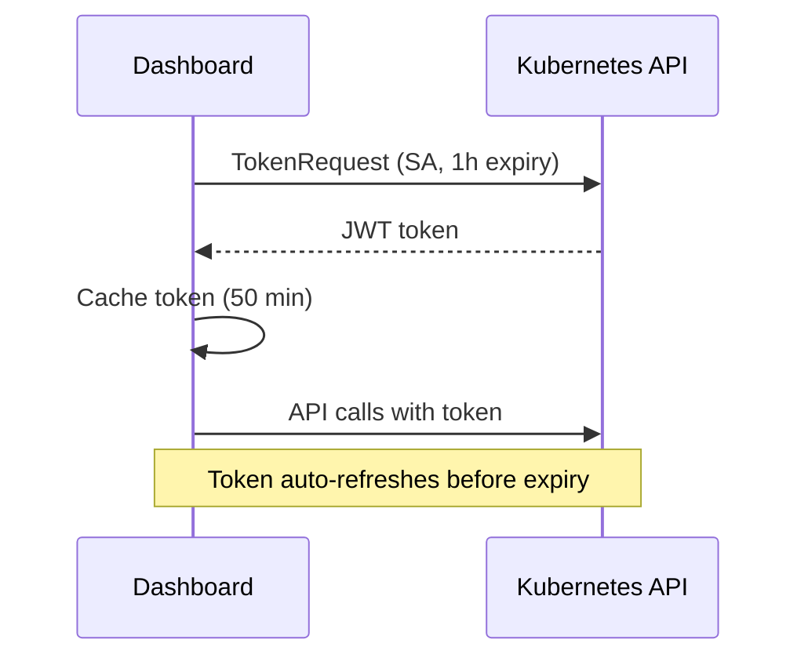
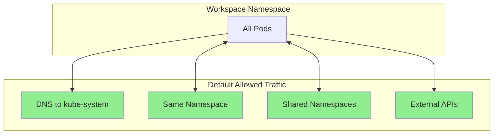

This document explains how Omnia provides multi-tenancy through Workspaces, the design decisions behind the architecture, and how it scales from small teams to enterprise deployments.

## Overview

Workspaces provide logical isolation for teams sharing an Omnia cluster. Each workspace has:

- **Dedicated namespace** - Kubernetes namespace for resource isolation
- **Role-based access** - Three roles (owner, editor, viewer) with scoped permissions
- **Resource quotas** - Limits on compute, objects, and Omnia-specific resources
- **Network isolation** - Automatic NetworkPolicy generation to restrict cross-tenant traffic
- **Cost attribution** - Tags for tracking spend by team



## Isolation Model

### Namespace Isolation

Each workspace maps to exactly one Kubernetes namespace. This provides:

- **Resource scoping** - Agents, PromptPacks, and Arena jobs are namespace-scoped
- **Network isolation** - NetworkPolicies can restrict cross-namespace traffic
- **RBAC boundaries** - Permissions are scoped to the namespace

The controller creates the namespace when `spec.namespace.create: true`:

```yaml
spec:
  namespace:
    name: omnia-customer-support
    create: true
    labels:
      environment: production
```

### Role-Based Access Control

Workspaces define three roles with increasing permissions:

| Role | View Resources | Create/Edit | Delete | Manage Members |
|------|---------------|-------------|--------|----------------|
| **viewer** | Yes | No | No | No |
| **editor** | Yes | Yes | Yes | No |
| **owner** | Yes | Yes | Yes | Yes |

The controller creates a ServiceAccount and RoleBinding for each role:



## Authorization Flow

### Dashboard Authorization

When a user accesses the dashboard, authorization happens at the application layer:



1. **Identity extraction** - User's email and groups from OIDC token
2. **Role determination** - Match groups against `spec.roleBindings`
3. **Token acquisition** - Fetch ServiceAccount token for the determined role
4. **Scoped API calls** - Use token to make workspace-scoped K8s API calls

### Why Application-Layer Authorization?

Kubernetes RBAC has scaling limitations:

| Scale | Users | RoleBindings | Problem |
|-------|-------|--------------|---------|
| Small | <50 | <100 | Works well |
| Medium | 50-500 | 500-5000 | etcd pressure, slow reconciliation |
| Large | 500+ | 5000+ | Unmanageable, audit nightmare |

Application-layer authorization keeps the Workspace CRD small (10-20 group entries) while supporting thousands of users. User management happens in your identity provider, not Kubernetes.

### Group-Based Access

Groups are the primary access mechanism:

```yaml
spec:
  roleBindings:
    - groups:
        - "omnia-admins@acme.com"      # Azure AD group
        - "engineering-team"            # Okta group
      role: editor
```

When a user's JWT contains matching groups, they get the associated role. Multiple groups can map to the same role, and users get the highest privilege role from any matching group.

### ServiceAccount Access

For CI/CD and automation, ServiceAccounts use native Kubernetes RBAC:

```yaml
spec:
  roleBindings:
    - serviceAccounts:
        - name: argocd-application-controller
          namespace: argocd
      role: editor
```

The controller creates actual RoleBindings for ServiceAccounts, allowing direct K8s API access without going through the dashboard.

## Token Management

### Short-Lived Tokens

The dashboard uses the Kubernetes TokenRequest API to get short-lived ServiceAccount tokens:



Benefits:
- **Security** - Tokens expire automatically
- **Least privilege** - Token matches user's role
- **Audit** - Token identity appears in K8s audit logs

### Token Caching

Tokens are cached to avoid excessive TokenRequest calls:

- **TTL**: Tokens have 1-hour expiry
- **Cache duration**: 50 minutes (refresh before expiry)
- **Cache key**: workspace + role combination

## Shared Resources

Some resources are shared across workspaces:

### Providers

LLM providers are typically cluster-wide:

```yaml
apiVersion: omnia.altairalabs.ai/v1alpha1
kind: Provider
metadata:
  name: claude-sonnet
  namespace: omnia-shared
  labels:
    omnia.altairalabs.ai/shared: "true"
```

Agents reference shared providers:

```yaml
spec:
  providerRef:
    name: claude-sonnet
    namespace: omnia-shared
```

### ToolRegistries

Common tools can be shared:

```yaml
apiVersion: omnia.altairalabs.ai/v1alpha1
kind: ToolRegistry
metadata:
  name: common-tools
  namespace: omnia-shared
  labels:
    omnia.altairalabs.ai/shared: "true"
```

Access to shared resources requires explicit reference. Workspaces can't enumerate or modify resources in other namespaces.

## Resource Quotas

### Kubernetes ResourceQuota

The controller can create ResourceQuotas in workspace namespaces:

```yaml
spec:
  quotas:
    compute:
      requests.cpu: "50"
      requests.memory: "100Gi"
```

This maps directly to Kubernetes ResourceQuota objects.

### Omnia-Specific Quotas

Additional quotas control Omnia resources:

```yaml
spec:
  quotas:
    agents:
      maxAgentRuntimes: 20
      maxReplicasPerAgent: 10
    arena:
      maxConcurrentJobs: 10
      maxJobsPerDay: 100
```

These are enforced by admission webhooks (planned) or controller validation.

## Design Decisions

### Why 1:1 Workspace:Namespace?

Simplicity and Kubernetes alignment:

- **Native RBAC** - Permissions naturally scope to namespaces
- **Resource isolation** - Standard Kubernetes isolation model
- **Familiar model** - Teams understand namespace boundaries
- **Tool compatibility** - Works with existing K8s tooling

Future versions may support multiple namespaces per workspace for complex organizational structures.

### Why Not Kubeflow Profiles?

Kubeflow Profiles require Istio and additional infrastructure. Workspaces are:

- **Self-contained** - No external dependencies
- **Lightweight** - Minimal resource overhead
- **Focused** - Built for Omnia's specific needs

### Why Not Capsule or HNC?

Third-party multi-tenancy solutions add operational complexity:

- **Capsule** - Powerful but requires learning new abstractions
- **HNC** - Archived in April 2025
- **Workspaces** - Integrated into Omnia, purpose-built

### Why Application-Layer Auth for Users?

Kubernetes RBAC doesn't scale for human users:

- **RoleBinding explosion** - N users × M workspaces = N×M bindings
- **No dynamic groups** - Changes require RoleBinding updates
- **No directory sync** - Manual user provisioning

Application-layer auth with IdP groups provides:

- **Scalability** - Thousands of users, minimal CRD entries
- **Dynamic membership** - Add users in IdP, instant access
- **Centralized management** - Single source of truth in IdP

## Security Considerations

### Principle of Least Privilege

- Users get the minimum role needed
- Anonymous access defaults to viewer
- ServiceAccount tokens are scoped to workspace

### Token Security

- Short-lived tokens (1 hour default)
- Tokens cached server-side, not exposed to browser
- Automatic refresh before expiry

### Audit Trail

- Kubernetes audit logs capture all API calls
- Token identity shows which workspace SA was used
- Dashboard can log user actions separately

### Network Isolation

Workspaces can automatically generate NetworkPolicies to enforce network boundaries between tenants. When enabled, the controller creates a NetworkPolicy that restricts traffic while allowing essential communication.

```yaml
spec:
  networkPolicy:
    isolate: true
```

#### Generated NetworkPolicy

The controller creates a NetworkPolicy named `workspace-{name}-isolation` with these default rules:



| Default Rule | Direction | Purpose |
|--------------|-----------|---------|
| DNS (port 53) | Egress | Allow pods to resolve DNS |
| Same namespace | Both | Allow intra-workspace communication |
| Shared namespaces | Both | Allow access to shared Providers/Tools |
| External IPs (0.0.0.0/0) | Egress | Allow LLM API calls |
| Private IPs (10.x, 172.16.x, 192.168.x) | Blocked | Prevent cross-tenant access |

:::tip[Why these IP ranges?]
The blocked private IP ranges are [RFC 1918](https://datatracker.ietf.org/doc/html/rfc1918) addresses:
- `10.0.0.0/8` - Class A private network
- `172.16.0.0/12` - Class B private networks
- `192.168.0.0/16` - Class C private networks

These ranges are used internally by Kubernetes clusters. Blocking them prevents workspaces from accessing other tenants' pods, services, or internal infrastructure while still allowing external API calls.
:::

#### Customizing Network Rules

For fine-grained control, add custom ingress and egress rules:

```yaml
spec:
  networkPolicy:
    isolate: true
    allowExternalAPIs: true      # Default: true
    allowSharedNamespaces: true  # Default: true
    allowFrom:
      - peers:
          - namespaceSelector:
              matchLabels:
                kubernetes.io/metadata.name: ingress-nginx
    allowTo:
      - peers:
          - ipBlock:
              cidr: 10.0.0.0/8  # Internal database network
        ports:
          - protocol: TCP
            port: 5432
```

#### High-Security Mode

For maximum isolation, disable external API access and explicitly allow only required endpoints:

```yaml
spec:
  networkPolicy:
    isolate: true
    allowExternalAPIs: false
    allowTo:
      # Only allow specific LLM provider
      - peers:
          - ipBlock:
              cidr: 104.18.0.0/16  # Anthropic API
        ports:
          - protocol: TCP
            port: 443
```

This approach provides defense-in-depth: even if application-layer authorization is compromised, network-layer controls prevent unauthorized data exfiltration or cross-tenant access.

#### Local Development Mode

For local development where agents need to access services on private networks (e.g., local Ollama):

```yaml
spec:
  networkPolicy:
    isolate: true
    allowPrivateNetworks: true  # Removes RFC 1918 exclusions
```

This is useful when running LLM providers locally or accessing internal development services. Do not use in production.

## Scaling Considerations

### Small Deployments (<50 users)

Use the default setup:

- Anonymous mode for development
- Basic OIDC for production
- Single workspace per team

### Medium Deployments (50-500 users)

Enable full workspace features:

- OIDC with group claims
- Multiple workspaces by team
- Resource quotas per workspace

### Large Deployments (500+ users)

Leverage the scalability design:

- IdP groups for all access (no direct grants)
- Automated workspace provisioning via GitOps
- Monitoring and alerting on quota usage

### Enterprise (5000+ users)

Consider additional patterns:

- External policy engine (OPA, Cedar) for complex rules
- Hierarchical workspaces (parent/child)
- Cross-workspace sharing policies

## Next Steps

- [Manage Workspaces](/how-to/manage-workspaces/) - Create and configure workspaces
- [Configure Dashboard Authentication](/how-to/configure-dashboard-auth/) - Set up OIDC
- [Workspace CRD Reference](/reference/workspace/) - Complete field reference
