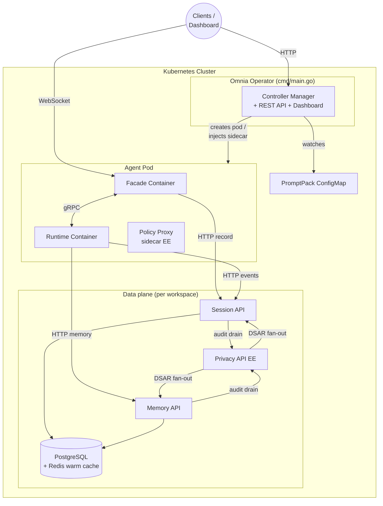
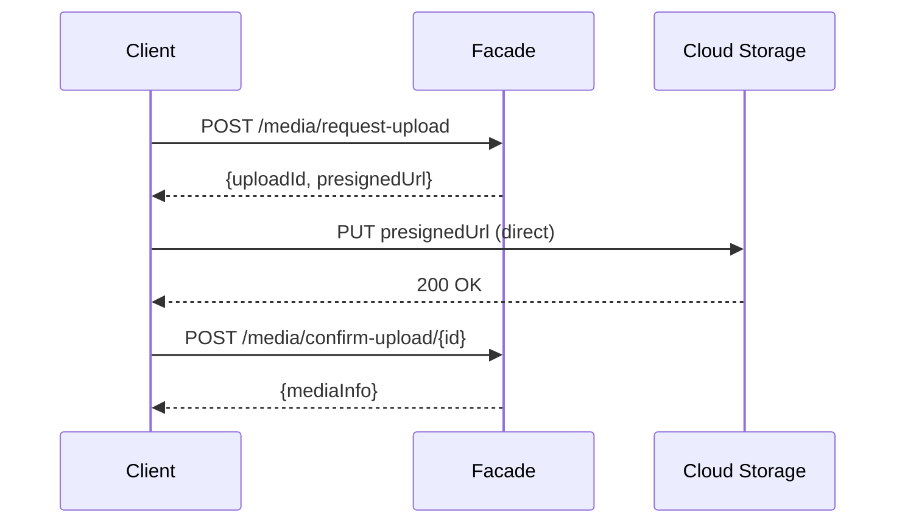
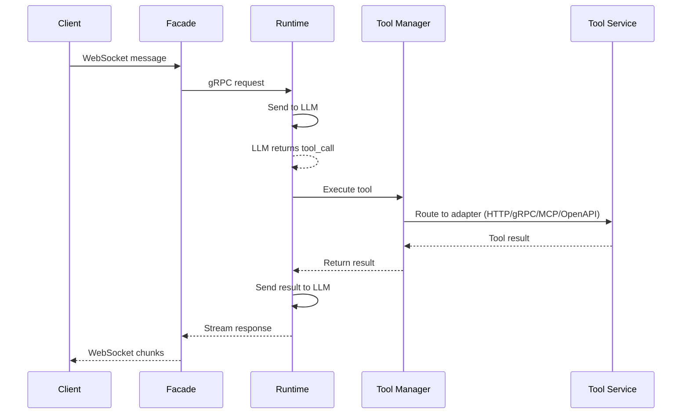
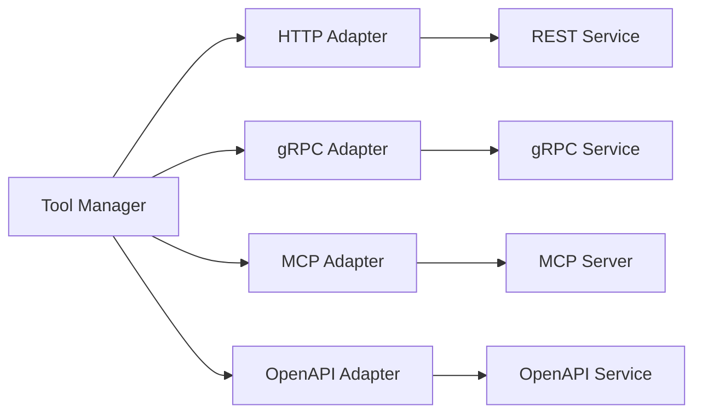
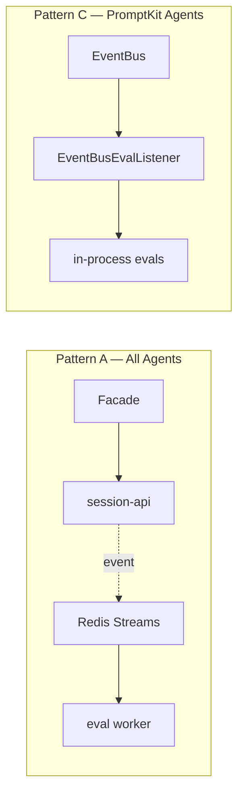
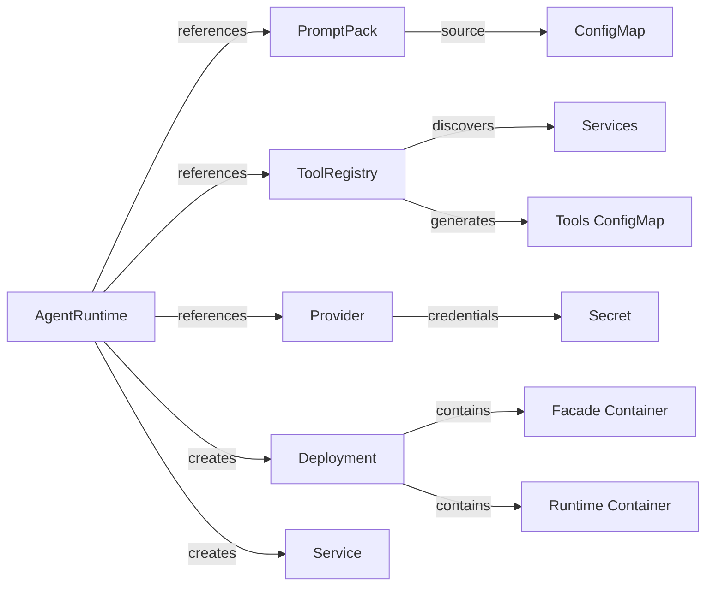

This document explains the architecture of Omnia and the design decisions behind it.

## High-Level Architecture

Omnia is a Kubernetes operator plus a set of standalone services. The operator
reconciles custom resources into running agent pods and hosts the dashboard and
REST API. The live request path is served by the agent pod (a facade + runtime
sidecar pair), and session, memory, and privacy data are owned by separate
per-workspace services — the facade never writes to a database directly.



The full node/edge topology, protocol table, and tracing inventory live in
`SERVICES.md` at the repository root.

## Components

### Omnia Operator

The operator is a Kubernetes controller that:

- Watches for AgentRuntime, PromptPack, ToolRegistry, and Provider resources
- Creates and manages Deployments for agent pods
- Generates ConfigMaps for tools configuration
- Creates Services for agent access
- Monitors referenced resources and updates agents accordingly

The operator follows the standard Kubernetes controller pattern:

1. **Watch** - Monitor custom resources for changes
2. **Reconcile** - Bring actual state to desired state
3. **Status** - Report current state back to the resource

### Agent Pod (Sidecar Architecture)

Each agent pod runs two containers in a sidecar pattern:

#### Facade Container

The facade container handles external client communication:

- **Client-facing surfaces** - Serves the agent's facade surfaces (WebSocket, A2A, MCP, REST) and routes messages
- **Session recording** - Captures conversation off the gRPC bus and records it through the Session API over HTTP (it does not write to a database directly)
- **Protocol Translation** - Converts client messages to gRPC calls to the runtime
- **Connection Lifecycle** - Handles connect, disconnect, heartbeat, and realtime park-and-resume
- **Media Storage** (optional) - Handles file uploads for multi-modal messages

##### Facade Composition

An `AgentRuntime` composes one or more **single-protocol facade surfaces** via
`spec.facades[]`. Each entry declares a `type`:

- `websocket` - persistent WebSocket for browser/client chat (agent mode)
- `a2a` - the A2A JSON-RPC protocol for agent-to-agent communication
- `rest` - a one-shot HTTP endpoint (`POST /functions/{name}`, function mode)
- `mcp` - a Model Context Protocol (Streamable HTTP) surface (function mode)

A single agent pod can therefore expose several surfaces at once (e.g. a
WebSocket surface plus an A2A surface), each on its own port, all backed by the
same runtime.

##### Plane Isolation

Each management-capable facade surface is served on **two listeners**:

- an **external** port running the data-plane auth chain (`spec.externalAuth`
  validators — shared token / API keys / OIDC / edge trust), and
- an internal **management-plane twin** port (`facade-mgmt` 18080 /
  `a2a-mgmt` 19999 / `mcp-mgmt` 19998) that accepts only dashboard-minted
  management-plane JWTs.

Twin ports are ClusterIP-only (never placed on an external Gateway/HTTPRoute)
and fail closed without a valid management JWT. The twin is gated per-facade by
`spec.facades[].managementPlane` (default enabled); the enabled internal
endpoints are advertised on `AgentRuntime.status.managementEndpoints`. The
dashboard's WebSocket proxy (and the Doctor diagnostic tool) read that status to
dial the management plane — so a dashboard "Try this agent" session reaches the
agent even when no external auth validators are configured.

##### Optional Media Storage

The facade can optionally provide media storage for runtimes that don't have built-in media externalization. When enabled, clients can upload files via HTTP before referencing them in WebSocket messages.

This is useful when:
- Using a custom runtime without media handling
- Need a runtime-agnostic upload endpoint
- Want to avoid base64-encoding large files in WebSocket messages

Runtimes like PromptKit have built-in media externalization, so facade media storage can remain disabled (the default).

**Supported Storage Backends:**

| Backend | Description | Authentication |
|---------|-------------|----------------|
| `local` | Local filesystem | N/A |
| `s3` | Amazon S3, MinIO, LocalStack | IAM roles, IRSA, access keys |
| `gcs` | Google Cloud Storage | Workload Identity, service accounts |
| `azure` | Azure Blob Storage | Managed Identity, account keys |

Cloud backends use presigned URLs for direct uploads, bypassing the facade for better performance:



See [Configure Media Storage](/how-to/operations/configure-media-storage/) for detailed setup instructions.

#### Runtime Container

The runtime container handles LLM interactions and tool execution:

- **PromptKit Integration** - Uses PromptKit SDK for LLM communication
- **Tool Manager** - Loads and manages tool adapters (HTTP, gRPC, MCP, OpenAPI)
- **Event Recording** - Records turn/tool events to the Session API over HTTP
- **Memory** - Calls the Memory API over HTTP for retrieval/extraction when memory is enabled
- **Tracing** - OpenTelemetry instrumentation for observability

The containers communicate via gRPC on localhost, providing clean separation between client-facing logic and LLM processing.

### Data Plane Services

Session, memory, and privacy data are owned by standalone per-workspace
services rather than by the agent pod. This keeps the request path stateless and
lets storage scale independently.

- **Session API** (`cmd/session-api/`) - HTTP service for session CRUD and
  tiered storage. The facade and runtime record through it over HTTP;
  **Redis is a warm cache inside the Session API, not a separate store**, and
  PostgreSQL is the authoritative tier.
- **Memory API** (`cmd/memory-api/`) - HTTP service for cross-session agentic
  memory, backed by PostgreSQL with pgvector for semantic search.
- **Privacy API** (`ee/cmd/privacy-api/`, enterprise) - per-workspace owner of
  consent and opt-out preferences, the central privacy/compliance **audit hub**
  (Session API and Memory API drain their enforcement records to it), and the
  **DSAR / right-to-erasure lifecycle** (it fans deletion out across every
  service-group's Session API and Memory API).
- **Policy Proxy** (`ee/cmd/policy-proxy/`, enterprise) - an
  operator-**injected sidecar** in the agent pod (not a standalone deployment)
  that reverse-proxies requests after evaluating AgentPolicy CEL rules.

See [Multi-Tenancy Architecture](/explanation/platform/multi-tenancy/) for how these
services are scoped per workspace.

### Custom Resource Definitions

#### AgentRuntime

The primary resource for deploying agents. It references:

- Provider configuration (which LLM to use)
- PromptPack (what prompts to use)
- ToolRegistry (what tools are available)
- Session configuration
- Evals configuration (judges, sampling, rate limits)
- Runtime resources and scaling

#### PromptPack

Defines versioned prompt configurations following the [PromptPack specification](https://promptpack.org/docs/spec/schema-reference). Supports:

- Structured prompt definitions with variables, parameters, and validators
- ConfigMap-based storage of compiled PromptPack JSON
- Canary rollouts for safe prompt updates
- Automatic agent notification on changes

#### ToolRegistry

Defines tool handlers available to agents:

- **HTTP handlers** - REST endpoints with explicit schemas
- **gRPC handlers** - gRPC services using the Tool protocol
- **MCP handlers** - Self-describing Model Context Protocol servers
- **OpenAPI handlers** - Self-describing services with OpenAPI specs
- Service discovery via label selectors

#### Provider

Configures LLM provider settings:

- Provider type (claude, openai, gemini, etc.)
- Model selection
- API credentials
- Custom base URLs

## Tool Execution Flow



The Tool Manager routes calls to the appropriate adapter based on handler type:



1. Client sends message via WebSocket
2. Facade creates/resumes session and forwards to Runtime
3. Runtime sends message to LLM via PromptKit
4. LLM returns tool call request
5. Tool Manager routes call to appropriate adapter
6. Adapter executes tool and returns result
7. Result sent back to LLM for final response
8. Response streamed back through Facade to client

## Observability

Omnia provides comprehensive observability through OpenTelemetry:

### Tracing

The runtime container creates spans for:

- **Conversation turns** - End-to-end request processing
- **LLM calls** - Time spent in provider API calls
- **Tool executions** - Individual tool call latency

Traces include:

- Session ID for correlation
- Token usage (input/output)
- Cost information
- Tool results (success/error)

### Metrics

The operator and agent containers expose Prometheus metrics:

- Request latency histograms
- Tool call counts and durations
- Session counts
- LLM token usage

### Configuration

Enable tracing via environment variables:

```yaml
env:
  - name: OMNIA_TRACING_ENABLED
    value: "true"
  - name: OMNIA_TRACING_ENDPOINT
    value: "otel-collector.observability:4317"
  - name: OMNIA_TRACING_SAMPLE_RATE
    value: "1.0"
```

## Realtime Evals

Omnia includes a realtime evaluation system that continuously assesses the quality of live agent conversations. Eval definitions are authored in the PromptPack (alongside validators/guardrails) and executed automatically as sessions progress.

The system uses a **dual-pattern architecture** based on the agent's framework type:



- **Pattern A (Platform Events)** uses the eval-worker Deployment. The facade records sessions through session-api, which publishes lightweight events to Redis Streams. A per-namespace eval worker subscribes, loads the PromptPack's eval definitions, and runs assertions against the session data. By default the worker runs the `long-running` and `external` eval groups — LLM judges and external API checks.

- **Pattern C (EventBus-Driven)** runs in-process inside PromptKit agents. PromptKit's `RecordingStage` and `EventBus` provide richer event data (provider call metadata, validation events, pipeline timings). An in-process `EventBusEvalListener` triggers evals synchronously during the turn. By default the inline path runs the `fast-running` group — deterministic handlers (contains, regex) that are cheap enough to gate on.

Both paths run concurrently for PromptKit agents, split by eval group. The defaults are disjoint so a given eval runs on exactly one path; operators can override the routing per agent. Eval configuration — routing, judges, sampling rates, rate limits — is defined per-agent on the [AgentRuntime CRD](/reference/core/agentruntime/#evals). Results land in the `eval_results` table tagged `source="worker"` (Pattern A) or `source="runtime-inline"` (Pattern C), and are surfaced in the dashboard's quality view.

For the complete explanation, see [Realtime Evals](/explanation/evaluation/realtime-evals/).

## Design Decisions

### Why Kubernetes Operator?

We chose the operator pattern because:

1. **Native integration** - Agents are first-class Kubernetes citizens
2. **Declarative configuration** - Define desired state, not procedures
3. **Self-healing** - Automatic recovery from failures
4. **Scalability** - Leverage Kubernetes scaling mechanisms

### Why Sidecar Architecture?

Separating facade and runtime enables:

1. **Separation of concerns** - Client handling vs LLM processing
2. **Independent scaling** - Different resource requirements
3. **Protocol flexibility** - Easy to add new client protocols
4. **Testability** - Components can be tested in isolation
5. **Language flexibility** - Containers can use different languages

### Why WebSocket?

WebSocket was chosen for the client facade because:

1. **Streaming** - Essential for LLM response streaming
2. **Bidirectional** - Enables tool calls and results
3. **Persistent** - Maintains connection for multi-turn conversations
4. **Efficient** - Lower overhead than HTTP polling

### Why Separate PromptPack?

Separating prompts from agents allows:

1. **Reusability** - Same prompts across multiple agents
2. **Versioning** - Track prompt changes independently
3. **Safe rollouts** - Canary deployments for prompts
4. **Separation of concerns** - Prompt engineers vs DevOps

### Why Handler-Based Tools?

The handler abstraction enables:

1. **Self-describing services** - MCP and OpenAPI discover tools automatically
2. **Explicit schemas** - HTTP and gRPC tools define their interface
3. **Unified management** - All tool types in one registry
4. **Dynamic updates** - Add/remove tools without redeploying agents

## Resource Relationships



## Reconciliation Flow

When an AgentRuntime is created or updated:

1. Validate the referenced PromptPack exists
2. Optionally validate the referenced ToolRegistry
3. Fetch Provider configuration
4. Generate tools ConfigMap from ToolRegistry
5. Build the pod spec with facade and runtime containers
6. Create or update the Deployment
7. Create or update the Service
8. Update the AgentRuntime status

When a ToolRegistry changes:

1. Process handlers (HTTP, gRPC, MCP, OpenAPI)
2. Discover tools from self-describing handlers
3. Update discovered tools in status
4. Find all AgentRuntimes referencing this ToolRegistry
5. Regenerate tools ConfigMaps for affected agents

## Security Considerations

### Secrets Management

- API keys are stored in Kubernetes Secrets
- Secrets are mounted as environment variables, not files
- Secrets can be from the same or different namespace

### Network Policies

Consider implementing NetworkPolicies to:

- Restrict agent egress to allowed LLM providers
- Limit tool access to specific services
- Isolate agent namespaces

### RBAC

The operator requires specific permissions:

- Full access to Omnia CRDs
- Read access to ConfigMaps and Secrets
- Create/Update access to Deployments and Services

### Multi-Tenancy

For team isolation, Omnia provides Workspaces:

- **Namespace isolation** - Each workspace gets a dedicated namespace
- **Role-based access** - Owner, editor, viewer roles with scoped permissions
- **Resource quotas** - Limits on compute, objects, and Omnia resources
- **IdP integration** - Map identity provider groups to workspace roles

See [Multi-Tenancy Architecture](/explanation/platform/multi-tenancy/) for details.
