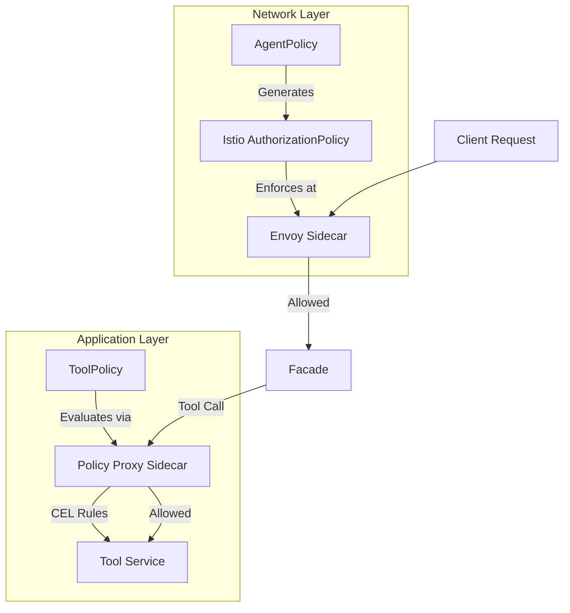
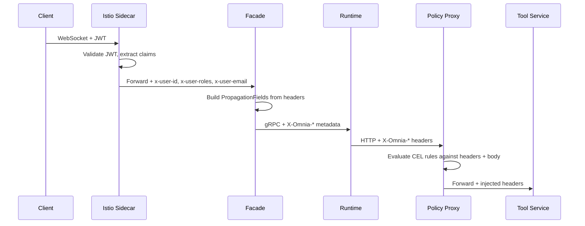
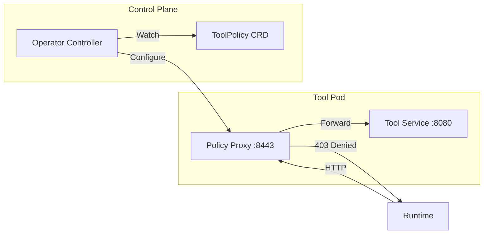

Omnia's policy engine provides guardrails for AI agents at two distinct enforcement layers. This document explains *why* policies exist, how the two policy types differ, and how context flows through the system to enable fine-grained access control.

## Why Policies?

AI agents can invoke tools, call LLM providers, and act on behalf of users. Without guardrails, an agent could:

- Call tools it shouldn't have access to
- Exceed cost or usage limits
- Act without knowing *who* the end user is
- Bypass compliance requirements

Policies solve this by introducing **declarative, Kubernetes-native access control** that operators configure once and the platform enforces automatically.

## Two Policy Types

Omnia separates policy enforcement into two layers, each with a distinct enforcement mechanism:



### AgentPolicy (Network-Level)

AgentPolicy operates at the **Istio/Envoy level**. The operator controller translates each AgentPolicy into an Istio `AuthorizationPolicy`, which Envoy enforces before the request reaches the application. This provides:

- **Tool allowlist/denylist** — restrict which tool registries and tools an agent can invoke
- **JWT claim mapping** — extract claims from the user's JWT and propagate them as `X-Omnia-Claim-*` headers
- **Enforcement modes** — `enforce` blocks violations; `permissive` logs without blocking

Because enforcement happens at the network level, there is no application code to bypass.

### ToolPolicy (Application-Level, Enterprise)

ToolPolicy operates at the **application level** via a policy proxy sidecar deployed alongside each tool service. It provides:

- **CEL deny rules** — evaluate request headers and body using [Common Expression Language](https://github.com/google/cel-go) expressions
- **Required claims** — verify that specific JWT claims are present before allowing the request
- **Header injection** — add static or CEL-computed headers to the upstream request
- **Audit logging** — structured logs for every policy decision with optional field redaction

ToolPolicy is an [Enterprise](/explanation/licensing/) feature.

## Context Propagation

For policies to make decisions based on *who* is calling and *what* they're calling, identity and request context must flow through every service boundary:



### Propagated Headers

The following headers are propagated across service boundaries:

| Header | Source | Description |
|--------|--------|-------------|
| `x-omnia-agent-name` | Facade | Name of the AgentRuntime |
| `x-omnia-namespace` | Facade | Kubernetes namespace |
| `x-omnia-session-id` | Facade | Current session identifier |
| `x-omnia-request-id` | Facade | Per-request trace identifier |
| `x-omnia-user-id` | Istio | Authenticated user identity |
| `x-omnia-user-roles` | Istio | Comma-separated user roles |
| `x-omnia-user-email` | Istio | User email address |
| `x-omnia-provider` | Runtime | LLM provider type |
| `x-omnia-model` | Runtime | LLM model name |
| `x-omnia-tool-name` | Runtime | Tool being invoked |
| `x-omnia-tool-registry` | Runtime | ToolRegistry containing the tool |
| `x-omnia-claim-*` | AgentPolicy | Mapped JWT claims (e.g., `x-omnia-claim-team`) |
| `x-omnia-param-*` | Runtime | Promoted scalar tool parameters |

### JWT Claim Extraction

AgentPolicy's `claimMapping` section controls which JWT claims are extracted and forwarded:

```yaml
claimMapping:
  forwardClaims:
    - claim: team
      header: X-Omnia-Claim-Team
    - claim: org.region
      header: X-Omnia-Claim-Region
```

Claims support dot-notation for nested values (e.g., `org.region` extracts `{"org": {"region": "us-east"}}`). Headers must use the `X-Omnia-Claim-` prefix, enforced by CRD validation.

## Enforcement Modes

Both policy types support a mode that controls whether violations are blocked or only logged:

| Policy Type | Enforce Mode | Permissive/Audit Mode |
|-------------|-------------|----------------------|
| AgentPolicy | `enforce` — Istio blocks the request | `permissive` — Istio allows but logs |
| ToolPolicy | `enforce` — proxy returns 403 | `audit` — proxy allows but logs the would-deny decision |

### Failure Behavior

Both policy types also support `onFailure` to control what happens when policy evaluation itself fails (e.g., a CEL expression error):

- `deny` (default) — treat evaluation failures as denials
- `allow` — permit the request despite the error

## Audit Logging

The policy proxy emits structured JSON logs for every deny decision and, when audit mode is active, for would-deny decisions:

```json
{
  "msg": "policy_decision",
  "decision": "deny",
  "wouldDeny": true,
  "mode": "audit",
  "policy": "refund-limits",
  "rule": "max-refund-amount",
  "message": "Refund amount exceeds $500 limit",
  "path": "/v1/refund",
  "method": "POST"
}
```

ToolPolicy's `audit.redactFields` option allows sensitive field names to be masked in log output.

## Architecture: Policy Proxy Sidecar

The ToolPolicy proxy runs as a sidecar container in the tool service pod. It intercepts HTTP requests, evaluates CEL rules, and either forwards or denies:



The proxy:
1. Receives the request with all `X-Omnia-*` headers
2. Checks required claims
3. Evaluates CEL deny rules in order (first match stops)
4. If allowed, evaluates header injection rules and adds computed headers
5. Forwards to the upstream tool service

## Related Resources

- [AgentPolicy CRD Reference](/reference/agentpolicy/) — field-by-field specification
- [ToolPolicy CRD Reference](/reference/toolpolicy/) — field-by-field specification (Enterprise)
- [Configure Agent Policies](/how-to/configure-agent-policies/) — operational guide
- [Configure Tool Policies](/how-to/configure-tool-policies/) — operational guide (Enterprise)
- [Securing Agents with Policies](/tutorials/securing-agents/) — end-to-end tutorial
