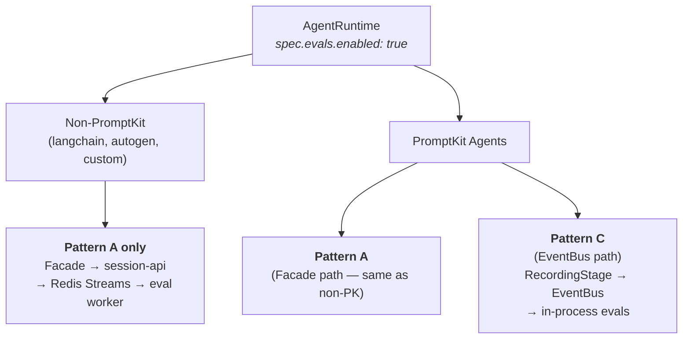
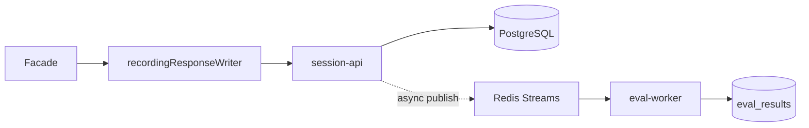
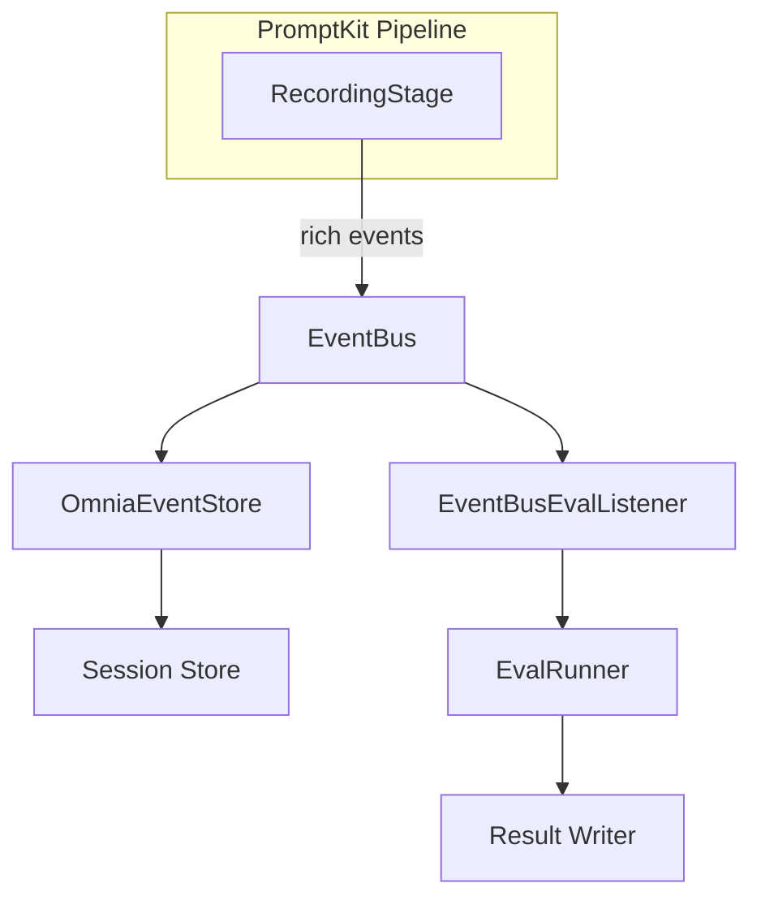

Realtime evals extend Omnia's evaluation engine to run continuously against live production sessions. Eval definitions live in the PromptPack alongside validators and guardrails, and execution is triggered automatically by session events.

## Overview

**Key principle: same rubric, two contexts.** A PromptPack author defines "what good looks like" once. The enterprise eval system uses those definitions pre-deploy against synthetic scenarios (via Arena batch jobs) and post-deploy against live traffic (via realtime evals). Same assertion engine, same eval definitions, different input data.

Evals are:

- **Non-blocking** — they run asynchronously after the response is sent, with zero latency impact on the conversation
- **Event-driven** — triggered by session events, not polling
- **Per-agent** — each AgentRuntime configures its own eval settings (judges, sampling, rate limits)

## Eval Definitions

Evals are defined in the PromptPack's `pack.json` as a sibling to `validators`:

```json
{
  "prompts": {
    "customer-support": {
      "system": "You are a helpful customer support agent...",
      "validators": [
        { "type": "banned_words", "params": { "words": ["competitor"] } }
      ],
      "evals": [
        {
          "id": "helpfulness",
          "type": "llm_judge_turn",
          "trigger": "every_turn",
          "params": {
            "judge": "fast-judge",
            "criteria": "Is the response helpful, accurate, and on-topic?",
            "rubric": "1-5 scale"
          }
        },
        {
          "id": "resolution",
          "type": "llm_judge_turn",
          "trigger": "on_session_complete",
          "params": {
            "judge": "strong-judge",
            "criteria": "Did the agent resolve the customer's issue?"
          }
        },
        {
          "id": "no-pii-leak",
          "type": "content_includes",
          "trigger": "every_turn",
          "params": {
            "pattern": "\\b\\d{3}-\\d{2}-\\d{4}\\b",
            "should_match": false
          }
        }
      ]
    }
  }
}
```

### Trigger Types

| Trigger | Fires when | Use case |
|---------|-----------|----------|
| `every_turn` | After each assistant message is recorded | Per-turn quality scoring, safety checks |
| `on_session_complete` | Session ends or times out | Conversation-level judgments, resolution checks |
| `on_n_turns` | Every N assistant messages | Periodic checks during long sessions |

### Eval Types

| Type | Description | Requires LLM Judge |
|------|-------------|-------------------|
| `llm_judge_turn` | LLM evaluates a single turn against criteria | Yes |
| `content_includes` | Check if response contains (or doesn't contain) a pattern | No |
| `guardrail_triggered` | Check if a specific validator fired during the turn | No |

Non-LLM eval types (`content_includes`, `guardrail_triggered`) are free to run and can evaluate every session. LLM judge evals incur API costs and are typically sampled.

## Dual-Pattern Architecture

Realtime evals use two execution patterns depending on the agent's framework type:



### Pattern A: Platform Events (All Agents)

Every AgentRuntime uses the facade's `recordingResponseWriter`, which captures assistant messages, tool calls, token counts, and cost. This data flows through session-api to PostgreSQL. Session-api then publishes lightweight events to Redis Streams. A per-namespace eval worker subscribes and runs evals.



Pattern A works with every framework type — PromptKit, LangChain, AutoGen, or custom runtimes.

### Pattern C: EventBus-Driven (PromptKit Agents)

For PromptKit agents, an additional path wires PromptKit's `RecordingStage` and `EventBus` into the pipeline. This provides richer event data including provider call metadata, validation events, and pipeline stage timings. An in-process `EventBusEvalListener` triggers evals with lower latency.



For PromptKit agents, Pattern C is the primary eval path. Pattern A events still fire but the eval worker skips agents that have Pattern C handling evals in-process.

### Data Comparison

| Data | Pattern A (Facade) | Pattern C (EventBus) |
|------|-------------------|---------------------|
| Assistant message content | Yes | Yes |
| Tool calls (name, args) | Yes | Yes (+ schema validation) |
| Token counts and cost | Yes | Yes (+ per-call breakdown) |
| Latency | Total only | Per-provider-call |
| Provider call metadata | No | Yes (model, temperature) |
| Validation/guardrail events | No | Yes |
| Pipeline stage timings | No | Yes |

## Eval Worker

The eval worker (`eval-worker`) is a long-running Deployment created **per namespace** by the operator. It is deployed in any namespace where an AgentRuntime has `evals.enabled: true` and uses a non-PromptKit framework (Pattern A).

The worker:

1. Subscribes to Redis Streams events using a consumer group for horizontal scaling
2. Looks up the agent's AgentRuntime to check eval config and PromptPack reference
3. Loads eval definitions from the PromptPack ConfigMap (cached with a Kubernetes watcher)
4. Fetches session data from session-api
5. Runs assertions using the PromptKit eval engine
6. Writes results to the `eval_results` table via session-api

**Why a long-running Deployment instead of Kubernetes Jobs?** Enterprise batch evaluation (Arena) uses Jobs because each ArenaJob is a discrete unit of work. Realtime evals are continuous — spinning up a Job per session event would be too slow (pod scheduling takes 5-15 seconds) and wasteful. A persistent worker pool is the right model.

## Judge Provider Resolution

LLM judge evals reference a judge by name in the PromptPack (e.g., `"judge": "fast-judge"`). The AgentRuntime's `evals.judges[]` maps these names to Provider CRDs:

```yaml
spec:
  evals:
    judges:
      - name: fast-judge
        providerRef:
          name: claude-haiku       # Cheap/fast model for per-turn evals
      - name: strong-judge
        providerRef:
          name: claude-sonnet      # Capable model for session-level evals
```

The eval worker (Pattern A) and the facade's eval listener (Pattern C) both resolve these Provider CRDs to obtain credentials for making LLM judge calls. This allows different agents to use different judge models based on their quality requirements and cost constraints.

## Session Completion Detection

For `on_session_complete` evals, the system needs to detect when a session has ended. Two mechanisms are used:

1. **Explicit close** — when a session's status is set to `"completed"` via the session-api, a `session.completed` event is published immediately.

2. **Inactivity timeout** — the eval system tracks the last message time per session. After the configured `inactivityTimeout` (default 5 minutes), the session is considered complete and session-level evals are triggered.

The timeout is configurable per agent:

```yaml
spec:
  evals:
    sessionCompletion:
      inactivityTimeout: 10m   # Wait 10 minutes of inactivity
```

## Cost Controls

LLM judge evals cost money. At scale, uncontrolled eval execution can produce significant spend. Omnia provides three layers of cost control:

### Sampling

Sampling controls what percentage of sessions/turns are evaluated. It uses deterministic hashing on `sessionID:turnIndex`, so the same session/turn always produces the same sampling decision. This ensures consistent behavior across retries.

```yaml
spec:
  evals:
    sampling:
      defaultRate: 100    # 100% for rule-based evals (free)
      llmJudgeRate: 10    # 10% for LLM judge evals (costs money)
```

### Rate Limiting

Rate limits use a token bucket algorithm for overall throughput and a semaphore for concurrent judge calls:

```yaml
spec:
  evals:
    rateLimit:
      maxEvalsPerSecond: 50          # Token bucket
      maxConcurrentJudgeCalls: 5     # Semaphore for LLM API calls
```

### Judge Model Selection

Use cheaper, faster models for high-volume per-turn evals and reserve more capable models for session-level evaluations:

| Judge | Model | Cost per eval | Use for |
|-------|-------|--------------|---------|
| `fast-judge` | Claude Haiku | ~$0.0005 | `every_turn` evals |
| `strong-judge` | Claude Sonnet | ~$0.005 | `on_session_complete` evals |

## Result Storage

Eval results are stored in the `eval_results` table in PostgreSQL (managed by session-api). Each result records:

- The session and message that was evaluated
- The eval definition ID, type, and trigger
- Pass/fail status and optional numeric score (0.0-1.0)
- Execution details (duration, judge tokens used, judge cost)
- Whether it was executed by the eval worker (Pattern A) or in-process (Pattern C)

### API Endpoints

Results are accessed through session-api endpoints:

| Method | Path | Description |
|--------|------|-------------|
| `POST /api/v1/eval-results` | Write eval result(s) | Called by eval worker or in-process listener |
| `GET /api/v1/sessions/{id}/eval-results` | Get results for a session | Used by dashboard session detail |
| `GET /api/v1/eval-results` | List/query results | Filter by agent, eval ID, passed, time range |
| `GET /api/v1/eval-results/summary` | Aggregate statistics | Pass rates, score distributions, trends |

## Quality Dashboard

The dashboard provides two views for eval results:

1. **Session detail** — inline eval scores displayed next to each assistant message, showing which evals passed/failed and their scores.

2. **Agent quality view** — aggregate pass rates, score trends over time, and comparison across agents and PromptPack versions. Drill down by eval type to identify specific quality dimensions.

Data flows from the dashboard through the operator proxy to session-api's eval-results endpoints.

## Design Decisions

### Why Per-Agent Eval Config?

Eval configuration lives on the AgentRuntime (not a global setting or separate CRD) because:

- Evals are tied to the agent's PromptPack, which is already on AgentRuntime
- Judge providers may differ per agent (cheap judges for low-stakes agents, strong judges for critical agents)
- Sampling rates vary by agent traffic volume
- Operators enable/disable evals per agent, not globally

### Why Dual Patterns?

Pattern A (platform events) provides universal coverage for any framework. Pattern C (EventBus) provides a better experience for PromptKit agents with richer data and lower latency. Supporting both means evals work regardless of framework choice while PromptKit users get enhanced capabilities.

### Why Long-Running Workers, Not Jobs?

Kubernetes Jobs have 5-15 seconds of pod scheduling overhead. For realtime evals triggered on every assistant message, this latency is unacceptable. A persistent worker pool processes events in milliseconds and scales horizontally via consumer groups.

### Why Hash-Based Sampling?

Deterministic hashing on `sessionID:turnIndex` ensures:

- The same turn always gets the same sampling decision (idempotent on retry)
- Sampling is evenly distributed across sessions
- No need for external state to track what has been sampled
