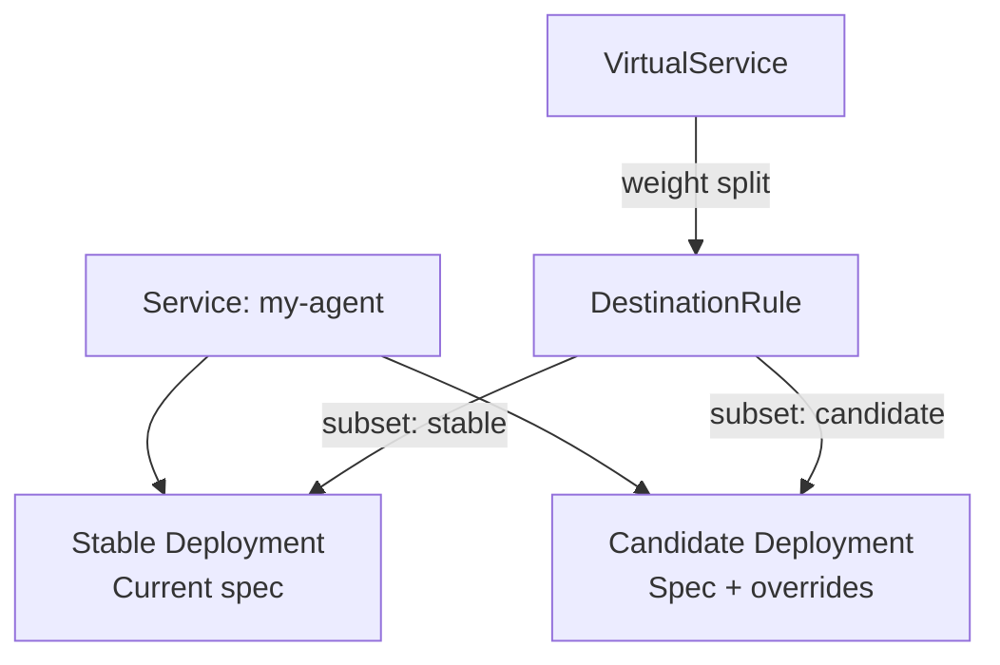

Progressive rollouts let you deploy changes to AI agents incrementally, catching quality regressions before they reach all users. This document explains the design behind Omnia's rollout system and the trade-offs involved.

## Why Progressive Rollouts for AI Agents?

Traditional application rollouts focus on binary correctness — the new version either works or it crashes. AI agents have a subtler failure mode: **quality degradation**. A prompt change might deploy successfully but produce worse responses, hallucinate more, or misuse tools. These failures don't trigger health checks.

Progressive rollouts address this by:

- Exposing the new version to a small percentage of traffic first
- Running automated quality analysis before increasing exposure
- Providing automatic rollback when analysis detects degradation
- Enabling A/B experiments with consistent user routing

## The Dual Deployment Model

When a rollout is active, the controller creates two Deployments behind the same Service:



Both Deployments run the same agent image. The only differences come from the `rollout.candidate` overrides — typically a different PromptPack version, provider, or tool configuration. Istio's VirtualService controls what percentage of traffic reaches each subset.

This model means:

- **No downtime** — the stable Deployment continues serving throughout the rollout
- **Identical infrastructure** — both versions share the same Service, DNS, and TLS
- **Clean teardown** — after promotion or rollback, the candidate Deployment is deleted

## Candidate Overrides

The candidate is a **sparse override**, not a full copy of the spec. Only the fields you want to change need to be specified:

```yaml
rollout:
  candidate:
    promptPackVersion: "2.0.0"        # Different prompts
    providerRefs:                      # Different model
      - name: default
        providerRef:
          name: claude-opus
    toolRegistryRef:                   # Different tools
      name: experimental-tools
```

Any field not listed in the candidate inherits from the main spec. This keeps rollout configurations small and avoids drift between the two versions.

## Step-Based Progression

Rollouts are defined as an ordered sequence of steps. Each step is one of three types:

| Step | Purpose |
|------|---------|
| `setWeight` | Adjust the candidate's traffic percentage (0-100) |
| `pause` | Wait for a duration, or indefinitely until manually resumed |
| `analysis` | Run a RolloutAnalysis template and evaluate the result |

The controller processes steps sequentially. It only advances to the next step when the current one completes successfully. A failed analysis step triggers the configured rollback behavior.

### Canary Pattern

Gradually increase traffic, pausing between steps for observation:

```yaml
steps:
  - setWeight: 10
  - pause: { duration: "5m" }
  - setWeight: 50
  - pause: { duration: "10m" }
  - setWeight: 100
```

### Blue/Green Pattern

Run analysis on the candidate with zero traffic, then flip all at once:

```yaml
steps:
  - analysis: { templateName: smoke-test }
  - setWeight: 100
```

### Experiment Pattern

Split traffic evenly with sticky sessions for A/B testing:

```yaml
steps:
  - setWeight: 50
  - pause: {}  # Indefinite — manual promotion
```

All three patterns use the same step primitives. The strategy emerges from how you compose the steps.

## Traffic Routing with Istio

The rollout controller patches two Istio resources to manage traffic:

- **VirtualService** — contains the weight split between stable and candidate subsets
- **DestinationRule** — defines the subsets using pod labels (`omnia.altairalabs.ai/variant: stable|candidate`)

The controller only modifies the routes listed in `trafficRouting.istio.virtualService.routes`. Other routes on the same VirtualService are untouched.

:::tip
Create the VirtualService and DestinationRule before configuring the rollout. The controller patches existing resources — it does not create them.
:::

## Cohort Tracking

During an active rollout, the facade injects headers to identify which variant served each request:

| Header | Value |
|--------|-------|
| `x-omnia-variant` | `stable` or `candidate` |
| `x-omnia-cohort-id` | Unique cohort identifier for the rollout |

These headers enable downstream analysis, logging, and experiment tracking. They are available in tool call headers and session metadata.

## Sticky Sessions

For experiments that require consistent user routing, configure `stickySession`:

```yaml
rollout:
  stickySession:
    hashOn: "x-user-id"
```

This adds a consistent hash to the Istio DestinationRule, ensuring the same user always reaches the same variant. Without sticky sessions, each request is independently routed by weight — a user might see both variants across consecutive messages.

## Promotion and Rollback

The rollout lifecycle has three terminal states:

**Idle** — when `rollout.candidate` matches the current spec (or is absent), no rollout is active. The controller maintains a single Deployment.

**Promotion** — when the rollout completes all steps, the candidate overrides are merged into the main spec. The candidate Deployment is deleted. The stable Deployment now runs the new configuration.

**Rollback** — the candidate is reverted to match the current spec, and the candidate Deployment is deleted. Traffic returns to 100% stable.

Rollback behavior is controlled by `rollout.rollback.mode`:

| Mode | Behavior |
|------|----------|
| `automatic` | Rolls back immediately when an analysis step fails |
| `manual` (default) | Pauses the rollout on failure; operator must manually remove the candidate |
| `disabled` | Continues the rollout regardless of analysis results |

The `rollback.cooldown` field (default: "5m") prevents rapid rollback/re-deploy cycles by debouncing rollback triggers.

## Analysis Integration

:::note[Enterprise]
RolloutAnalysis is an enterprise feature.
:::

Analysis steps run a `RolloutAnalysis` CRD — a reusable template containing a Prometheus query and success conditions:

```yaml
apiVersion: omnia.altairalabs.ai/v1alpha1
kind: RolloutAnalysis
metadata:
  name: quality-check
spec:
  metrics:
    - name: error-rate
      provider:
        prometheus:
          address: http://prometheus:9090
          query: |
            sum(rate(omnia_agent_errors_total{variant="candidate"}[5m]))
            /
            sum(rate(omnia_agent_requests_total{variant="candidate"}[5m]))
      successCondition: "result < 0.05"
      failureLimit: 3
      interval: "1m"
```

The controller evaluates the query at the specified interval. If the success condition fails more times than `failureLimit`, the analysis step fails and triggers the configured rollback behavior.

## Related Resources

- [Progressive Rollouts Tutorial](/tutorials/progressive-rollouts/) — step-by-step walkthrough
- [AgentRuntime CRD Reference](/reference/agentruntime/#rollout) — field-by-field specification
