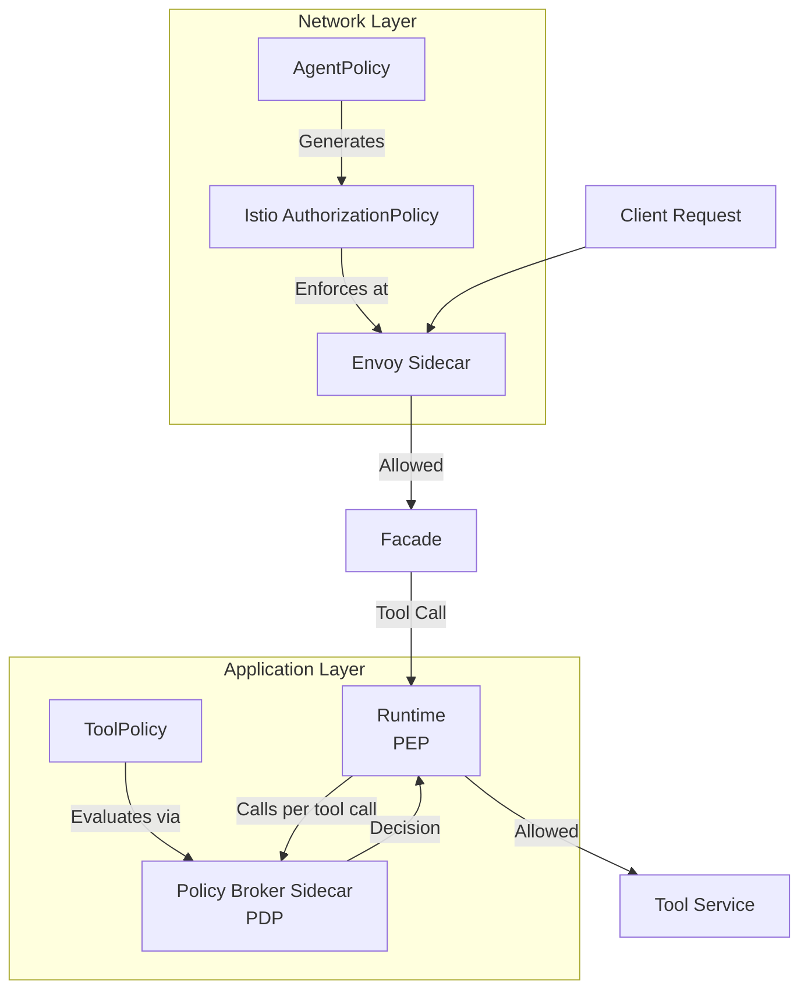
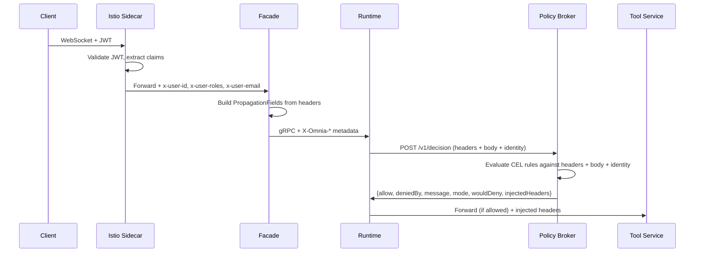
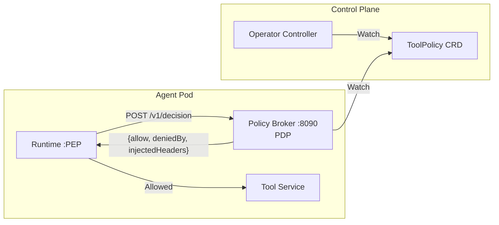

Omnia's policy engine provides guardrails for AI agents at two distinct enforcement layers. This document explains *why* policies exist, how the two policy types differ, and how context flows through the system to enable fine-grained access control.

## Why policies?

AI agents can invoke tools, call LLM providers, and act on behalf of users. Without guardrails, an agent could:

- Call tools it shouldn't have access to
- Exceed cost or usage limits
- Act without knowing *who* the end user is
- Bypass compliance requirements

Policies solve this by introducing **declarative, Kubernetes-native access control** that operators configure once and the platform enforces automatically.

## Two policy types

Omnia separates policy enforcement into two layers, each with a distinct enforcement mechanism:



### AgentPolicy (network-level)

AgentPolicy operates at the **Istio/Envoy level**. The operator controller translates each AgentPolicy into an Istio `AuthorizationPolicy`, which Envoy enforces before the request reaches the application. This provides:

- **Tool allowlist/denylist** — restrict which tool registries and tools an agent can invoke
- **Enforcement modes** — `enforce` blocks violations; `permissive` logs without blocking

JWT claim mapping is configured separately, on the AgentRuntime — see [JWT claim extraction](#jwt-claim-extraction) below.

Because enforcement happens at the network level, there is no application code to bypass.

### ToolPolicy (application-level, Enterprise)

ToolPolicy operates at the **application level** as a *called decision broker*, not a reverse proxy in the request path. The **runtime is the enforcement point (PEP)**: its `OmniaExecutor.dispatch` — the single chokepoint all four tool-executor types (HTTP, OpenAPI, gRPC, MCP) funnel through — calls the **policy-broker** sidecar over `POLICY_BROKER_URL` (localhost, `POST /v1/decision`) once per server-executed tool call, before the tool actually runs. The **policy-broker is the decision point (PDP)**: it watches ToolPolicy CRDs and evaluates CEL rules against the request headers, body, and caller identity, then returns a decision. It provides:

- **CEL deny rules** — evaluate request headers, body, and identity using [Common Expression Language](https://github.com/google/cel-go) expressions
- **Required claims** — verify that specific JWT claims are present before allowing the request
- **Header injection** — obligations returned alongside the allow/deny decision; the runtime attaches them to the outbound tool call only when the request is allowed
- **Fail-closed by default** — if the broker is unreachable, the runtime denies the call (a deployment can opt into fail-open instead)
- **Audit logging** — structured logs for every policy decision with optional field redaction

This shape exists because Omnia runs Istio in **ambient** mode, which has no waypoint proxy on tool egress — a reverse proxy sitting passively in the network path would never see traffic routed to it. Calling the broker directly sidesteps transparent interception entirely.

ToolPolicy is an [Enterprise](/explanation/platform/licensing/) feature.

## Context propagation

For policies to make decisions based on *who* is calling and *what* they're calling, identity and request context must flow through every service boundary:



### Propagated headers

The following headers are propagated across service boundaries:

| Header | Source | Description |
|--------|--------|-------------|
| `x-omnia-agent-name` | Facade | Name of the AgentRuntime |
| `x-omnia-namespace` | Facade | Kubernetes namespace |
| `x-omnia-session-id` | Facade | Current session identifier |
| `x-omnia-request-id` | Facade | Per-request trace identifier |
| `x-omnia-user-id` | Istio | Authenticated user identity |
| `x-omnia-user-roles` | Istio | Comma-separated user roles |
| `x-omnia-user-email` | Istio | User email address |
| `x-omnia-provider` | Runtime | LLM provider type |
| `x-omnia-model` | Runtime | LLM model name |
| `x-omnia-tool-name` | Runtime | Tool being invoked |
| `x-omnia-tool-registry` | Runtime | ToolRegistry containing the tool |
| `x-omnia-claim-*` | Facade | Mapped JWT claims (e.g., `x-omnia-claim-team`) |
| `x-omnia-param-*` | Runtime | Promoted scalar tool parameters |

In addition to these flattened headers, the runtime sends the caller's identity to the broker as a **structured JSON object** (`origin`, `subject`, `endUser`, `workspace`, `agent`, `role`, `claims`) on every decision request, so `identity.*` CEL expressions see the full identity rather than only the scalar claims that get promoted to headers.

### JWT claim extraction

Claim forwarding is not an AgentPolicy concern — it's configured on the **AgentRuntime**'s external-auth block (`spec.externalAuth.oidc.claimMapping` for customer-IdP OIDC, or the edge-trust equivalent). The facade's auth validator extracts the configured claims from the verified JWT and forwards them as `X-Omnia-Claim-*` headers on every request. See [Configure Agent Authentication](/how-to/security/configure-authentication/) for the field reference.

AgentPolicy itself governs only tool allow/deny at the network level (see below) — it has no claim-mapping configuration. Once claims arrive as `X-Omnia-Claim-*` headers, ToolPolicy's `requiredClaims` and CEL rules can consume them.

## Enforcement modes

Both policy types support a mode that controls whether violations are blocked or only logged:

| Policy Type | Enforce Mode | Permissive/Audit Mode |
|-------------|-------------|----------------------|
| AgentPolicy | `enforce` — Istio blocks the request | `permissive` — Istio allows but logs |
| ToolPolicy | `enforce` — broker returns `allow: false`; runtime aborts the tool dispatch | `audit` — broker returns `allow: true` with `wouldDeny: true`; runtime proceeds and logs |

### Failure behavior

Both policy types also support `onFailure` to control what happens when policy evaluation itself fails (e.g., a CEL expression error):

- `deny` (default) — treat evaluation failures as denials
- `allow` — permit the request despite the error

## Audit logging

The policy-broker emits structured JSON logs for every deny decision and, when audit mode is active, for would-deny decisions. Two lines land per non-trivial decision: a shared `policy_decision` line (decision outcome, mode, matched policy/rule, message) and a broker-specific `broker_tool_decision` line carrying `toolName`/`toolRegistry` — since every decision request's path/method is the constant `/v1/decision` POST, tool identity travels in dedicated fields instead:

```json
{
  "msg": "policy_decision",
  "decision": "deny",
  "wouldDeny": true,
  "mode": "audit",
  "policy": "refund-limits",
  "rule": "max-refund-amount",
  "message": "Refund amount exceeds $500 limit"
}
{
  "msg": "broker_tool_decision",
  "toolName": "process_refund",
  "toolRegistry": "customer-tools",
  "allowed": true,
  "deniedBy": "max-refund-amount",
  "mode": "audit"
}
```

ToolPolicy's `audit.redactFields` option allows sensitive field names to be masked in log output.

## Architecture: policy broker (PDP/PEP)

The policy-broker runs as a sidecar container in the **agent pod** (alongside facade and runtime), not in the tool service's pod. It never sits in the tool-call request path — it only answers decision requests the runtime makes:



Per server-executed tool call:
1. The runtime's `OmniaExecutor.dispatch` calls the broker with the request headers, body, and structured identity
2. The broker checks required claims
3. The broker evaluates CEL deny rules in order (first match stops)
4. If allowed, the broker evaluates header injection rules and returns the computed headers
5. The runtime attaches any `injectedHeaders` to the outbound tool call and proceeds; on deny, it aborts the dispatch and surfaces a policy-denied error instead of calling the tool
6. If the broker is unreachable, the runtime **fails closed by default** (denies the call); this is configurable per deployment to fail open instead

## Related resources

- [AgentPolicy CRD Reference](/reference/policies/agentpolicy/) — field-by-field specification
- [ToolPolicy CRD Reference](/reference/policies/toolpolicy/) — field-by-field specification (Enterprise)
- [Configure Agent Policies](/how-to/security/configure-agent-policies/) — operational guide
- [Configure Tool Policies](/how-to/security/configure-tool-policies/) — operational guide (Enterprise)
- [Securing Agents with Policies](/tutorials/securing-agents/) — end-to-end tutorial
