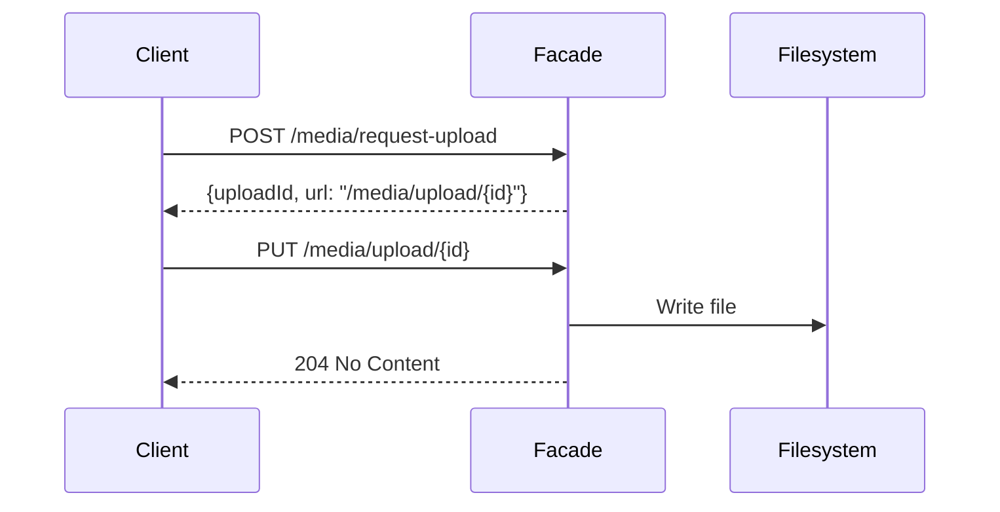
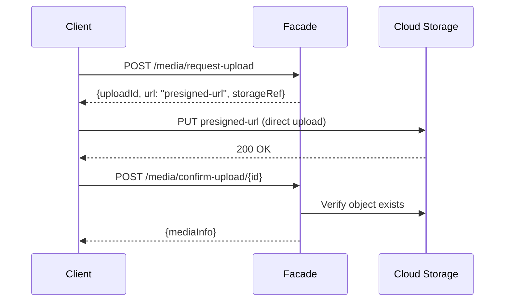

Media storage allows agents to handle file uploads for multi-modal conversations. This guide covers configuring different storage backends.

## Overview

When enabled, the facade container provides HTTP endpoints for:

- **Upload requests** - Get presigned URLs for uploading files
- **File uploads** - Upload files directly (local storage) or to cloud (S3/GCS/Azure)
- **File downloads** - Retrieve uploaded files
- **Media info** - Get metadata about uploaded files

Configure a backend declaratively on `spec.media.storage` (see
[AgentRuntime configuration](#agentruntime-configuration) below) — the operator
translates it into the `OMNIA_MEDIA_STORAGE_*` environment variables shown in
the per-backend sections that follow and injects them into both the facade and
runtime containers.

## Storage backends

Omnia supports four storage backends:

| Backend | Use Case | Authentication |
|---------|----------|----------------|
| `none` | Disable media storage (default) | N/A |
| `local` | Development, single-replica deployments | N/A |
| `s3` | AWS deployments, S3-compatible services (MinIO) | IAM roles, workload identity, access keys |
| `gcs` | Google Cloud deployments | Workload identity, service account keys |
| `azure` | Azure deployments | Managed identity, workload identity, account keys |

## Local storage

Local storage writes files to the pod's filesystem. This is suitable for development and single-replica deployments.

```yaml
# Environment variables
OMNIA_MEDIA_STORAGE_TYPE: local
OMNIA_MEDIA_STORAGE_PATH: /var/lib/omnia/media
OMNIA_MEDIA_MAX_FILE_SIZE: "104857600"  # 100MB
OMNIA_MEDIA_DEFAULT_TTL: "24h"
```

**Limitations:**
- Files are lost when the pod restarts
- Not suitable for multi-replica deployments
- No CDN integration

## S3 storage

S3 storage supports Amazon S3 and S3-compatible services like MinIO and LocalStack.

### AWS S3

```yaml
# Environment variables
OMNIA_MEDIA_STORAGE_TYPE: s3
OMNIA_MEDIA_S3_BUCKET: my-media-bucket
OMNIA_MEDIA_S3_REGION: us-west-2
OMNIA_MEDIA_S3_PREFIX: omnia/media/  # Optional
OMNIA_MEDIA_MAX_FILE_SIZE: "104857600"
OMNIA_MEDIA_DEFAULT_TTL: "24h"
```

### MinIO / S3-compatible

```yaml
OMNIA_MEDIA_STORAGE_TYPE: s3
OMNIA_MEDIA_S3_BUCKET: my-bucket
OMNIA_MEDIA_S3_REGION: us-east-1
OMNIA_MEDIA_S3_ENDPOINT: http://minio.minio-system:9000
OMNIA_MEDIA_S3_PREFIX: media/
```

When `OMNIA_MEDIA_S3_ENDPOINT` is set, path-style addressing is automatically enabled for compatibility with MinIO.

### Authentication

S3 storage uses the AWS SDK default credential chain:

1. **Environment variables** - `AWS_ACCESS_KEY_ID`, `AWS_SECRET_ACCESS_KEY`
2. **IAM Roles for Service Accounts (IRSA)** - Recommended for EKS
3. **EC2 instance profiles** - For self-managed Kubernetes on EC2
4. **Shared credentials file** - `~/.aws/credentials`

#### IRSA setup (EKS)

```yaml
# ServiceAccount annotation
apiVersion: v1
kind: ServiceAccount
metadata:
  name: omnia-agent
  annotations:
    eks.amazonaws.com/role-arn: arn:aws:iam::123456789012:role/omnia-media-role
```

Required IAM policy:

```json
{
  "Version": "2012-10-17",
  "Statement": [
    {
      "Effect": "Allow",
      "Action": [
        "s3:PutObject",
        "s3:GetObject",
        "s3:DeleteObject",
        "s3:ListBucket"
      ],
      "Resource": [
        "arn:aws:s3:::my-media-bucket",
        "arn:aws:s3:::my-media-bucket/*"
      ]
    }
  ]
}
```

## GCS storage

Google Cloud Storage uses presigned URLs for direct uploads.

```yaml
OMNIA_MEDIA_STORAGE_TYPE: gcs
OMNIA_MEDIA_GCS_BUCKET: my-media-bucket
OMNIA_MEDIA_GCS_PREFIX: omnia/media/  # Optional
OMNIA_MEDIA_MAX_FILE_SIZE: "104857600"
OMNIA_MEDIA_DEFAULT_TTL: "24h"
```

### Authentication

GCS storage uses Google's Application Default Credentials:

1. **Workload Identity** - Recommended for GKE
2. **Service account key file** - `GOOGLE_APPLICATION_CREDENTIALS`
3. **Compute Engine default service account**

#### Workload identity setup (GKE)

```yaml
# ServiceAccount annotation
apiVersion: v1
kind: ServiceAccount
metadata:
  name: omnia-agent
  annotations:
    iam.gke.io/gcp-service-account: omnia-media@my-project.iam.gserviceaccount.com
```

Required IAM role: `roles/storage.objectAdmin` on the bucket.

## Azure blob storage

Azure Blob Storage uses SAS tokens for presigned URLs.

```yaml
OMNIA_MEDIA_STORAGE_TYPE: azure
OMNIA_MEDIA_AZURE_ACCOUNT: mystorageaccount
OMNIA_MEDIA_AZURE_CONTAINER: media
OMNIA_MEDIA_AZURE_PREFIX: omnia/media/  # Optional
OMNIA_MEDIA_MAX_FILE_SIZE: "104857600"
OMNIA_MEDIA_DEFAULT_TTL: "24h"
```

### Authentication

Azure storage supports multiple authentication methods:

1. **DefaultAzureCredential** - Managed identity, workload identity, Azure CLI
2. **Account Key** - Explicit key via `OMNIA_MEDIA_AZURE_KEY`

#### Workload identity setup (AKS)

```yaml
# ServiceAccount annotation
apiVersion: v1
kind: ServiceAccount
metadata:
  name: omnia-agent
  annotations:
    azure.workload.identity/client-id: <client-id>
  labels:
    azure.workload.identity/use: "true"
```

**Note:** SAS URL generation currently requires an account key. For full workload identity support without keys, User Delegation SAS would need to be implemented (requires `Storage Blob Delegator` role).

#### Cross-cloud / explicit credentials

For cross-cloud scenarios or when workload identity isn't available, store the
account key in a Kubernetes Secret and reference it via `spec.media.storage.secretRef`.
The Secret's key must be named `AZURE_ACCOUNT_KEY`:

```yaml
apiVersion: v1
kind: Secret
metadata:
  name: azure-storage-key
type: Opaque
stringData:
  AZURE_ACCOUNT_KEY: <your-storage-account-key>
---
# Reference in AgentRuntime
apiVersion: omnia.altairalabs.ai/v1alpha1
kind: AgentRuntime
metadata:
  name: my-agent
spec:
  media:
    storage:
      type: azure
      azure:
        account: mystorageaccount
        container: media
      secretRef:
        name: azure-storage-key
```

## Upload flow

### Local storage



### Cloud storage (S3/GCS/Azure)



## Prometheus metrics

Media storage exposes the following metrics:

| Metric | Type | Description |
|--------|------|-------------|
| `omnia_facade_uploads_total` | Counter | Upload attempts by status (success/failed) |
| `omnia_facade_upload_bytes_total` | Counter | Total bytes uploaded |
| `omnia_facade_upload_duration_seconds` | Histogram | Upload duration |
| `omnia_facade_downloads_total` | Counter | Download attempts by status |
| `omnia_facade_download_bytes_total` | Counter | Total bytes downloaded |
| `omnia_facade_media_chunks_total` | Counter | Media chunks sent by type (json/binary) |
| `omnia_facade_media_chunk_bytes_total` | Counter | Total bytes sent as chunks |

All metrics include `agent` and `namespace` labels.

## AgentRuntime configuration

Configure media storage declaratively on `spec.media.storage`. The operator
injects the equivalent `OMNIA_MEDIA_STORAGE_*` environment variables (shown
above, per-backend) into both the facade and runtime containers — you no
longer need to set them by hand.

### Keyless S3 (recommended for AWS)

```yaml
apiVersion: omnia.altairalabs.ai/v1alpha1
kind: AgentRuntime
metadata:
  name: my-agent
spec:
  media:
    storage:
      type: s3
      s3:
        bucket: my-media-bucket
        region: us-west-2
        # prefix: omnia/media/    # optional
      # No secretRef — credentials come from IRSA / workload identity.
      # maxFileSizeBytes: 104857600   # optional, 100MB
      # defaultTTL: 24h               # optional
```

### Local storage (dev / single-replica)

```yaml
apiVersion: omnia.altairalabs.ai/v1alpha1
kind: AgentRuntime
metadata:
  name: my-agent
spec:
  media:
    storage:
      type: local
      local:
        basePath: /var/lib/omnia/media
```

### Explicit credentials (S3 / Azure)

Omit `secretRef` for keyless access (S3 IRSA, Azure workload identity — GCS is
always keyless via Application Default Credentials). To use explicit
credentials instead, reference a Secret. The Secret must contain the keys
`AWS_ACCESS_KEY_ID` and `AWS_SECRET_ACCESS_KEY` (S3) or `AZURE_ACCOUNT_KEY`
(Azure):

```yaml
spec:
  media:
    storage:
      type: s3
      s3:
        bucket: my-media-bucket
        region: us-west-2
      secretRef:
        name: my-s3-credentials   # must have AWS_ACCESS_KEY_ID / AWS_SECRET_ACCESS_KEY keys
```

## Troubleshooting

### Upload fails with "upload not found or expired"

The upload URL has expired. Default TTL is 15 minutes. Request a new upload URL.

### S3 "access denied" errors

1. Verify IAM role has required permissions
2. Check IRSA annotation on ServiceAccount
3. Verify bucket policy allows the IAM role

### GCS "permission denied" errors

1. Verify Workload Identity is configured
2. Check service account has `storage.objectAdmin` role
3. Verify bucket IAM bindings

### Azure "SAS generation requires shared key credential"

Azure SAS URL generation requires the account key. Set `OMNIA_MEDIA_AZURE_KEY` or implement User Delegation SAS for full workload identity support.
