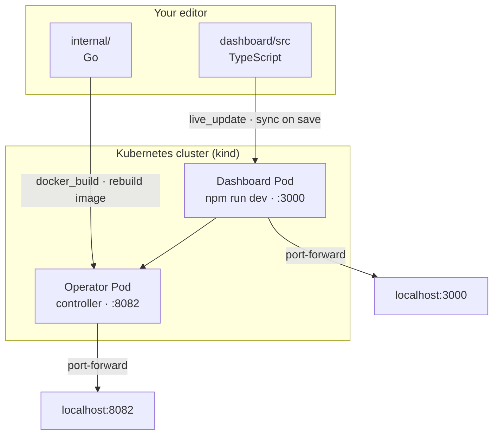

This guide walks you through setting up a local development environment for Omnia.

## Prerequisites

Install the required tools:

- **Go 1.25+**: [Download Go](https://golang.org/dl/)
- **Docker**: [Install Docker](https://docs.docker.com/get-docker/)
- **kubectl**: [Install kubectl](https://kubernetes.io/docs/tasks/tools/)
- **kind**: [Install kind](https://kind.sigs.k8s.io/docs/user/quick-start/#installation)
- **Helm**: [Install Helm](https://helm.sh/docs/intro/install/)
- **Tilt**: [Install Tilt](https://docs.tilt.dev/install.html) (recommended for development)
- **Node.js 20+**: [Download Node.js](https://nodejs.org/) (for dashboard development)

## Quick start with Tilt (recommended)

Tilt provides hot-reload development with automatic file syncing. Changes to dashboard source files are reflected on save without rebuilding Docker images.

### 1. Create a local cluster

```bash
kind create cluster --name omnia-dev
```

### 2. Start Tilt

```bash
# Core features only
tilt up

# Or with enterprise features (Arena Fleet, NFS, Redis)
ENABLE_ENTERPRISE=true tilt up
```

This will:
- Build the operator and dashboard images
- Deploy them to your local cluster via Helm
- Set up port forwards automatically
- Watch for file changes and sync them on change

### Environment variables

| Variable | Default | Description |
|----------|---------|-------------|
| `ENABLE_ENTERPRISE` | `false` | Enable enterprise features (Arena controller, NFS, Redis) |
| `ENABLE_DEMO` | `false` | Enable demo mode with Ollama + OPA |
| `ENABLE_OBSERVABILITY` | `true` | Enable Prometheus/Grafana |
| `ENABLE_FULL_STACK` | `false` | Enable Istio, Loki, Alloy |
| `ENABLE_LANGCHAIN` | `false` | Enable LangChain runtime demos |

### 3. Access the services

- **Dashboard**: http://localhost:3000
- **Operator API**: http://localhost:8082
- **Grafana** (if observability enabled): http://localhost:3001
- **VS Code Server** (enterprise only): http://localhost:8888

### Enterprise features

When `ENABLE_ENTERPRISE=true`, the following additional components are deployed:

- **Arena Controller**: Manages ArenaSource and ArenaJob resources
- **Arena Worker**: Executes evaluation jobs
- **NFS Server**: Shared workspace storage (development only)
- **Redis**: Work queue for Arena job distribution
- **VS Code Server**: Browse/edit workspace content at http://localhost:8888

### 4. Develop with hot reload

Edit files in `dashboard/src/` - changes sync and Next.js hot-reloads; no Docker rebuild required.

For Go operator changes, Tilt rebuilds the image automatically (Go doesn't support hot reload).

### 5. View logs

Press `s` in the Tilt UI to stream logs, or visit http://localhost:10350 for the web UI.

### 6. Stop development

```bash
tilt down
```

## How Tilt works

The `Tiltfile` at the project root configures:

1. **Dashboard hot-reload**: Uses `live_update` to sync source files directly into the running container. The Next.js dev server detects changes and hot-reloads.

2. **Operator rebuild**: Watches Go source files and rebuilds the image when they change.

3. **Helm deployment**: Deploys the chart with development-specific values from `charts/omnia/values-dev.yaml`.



## Manual setup (without Tilt)

If you prefer not to use Tilt, you can set up manually:

### Create a local cluster

Create a kind cluster with port forwarding:

```bash
cat <<EOF | kind create cluster --name omnia-dev --config=-
kind: Cluster
apiVersion: kind.x-k8s.io/v1alpha4
nodes:
- role: control-plane
  extraPortMappings:
  - containerPort: 30080
    hostPort: 8080
    protocol: TCP
EOF
```

### Build and load images

```bash
# Build operator
make docker-build IMG=omnia-operator:dev

# Build dashboard
docker build -t omnia-dashboard:dev ./dashboard

# Load into kind
kind load docker-image omnia-operator:dev --name omnia-dev
kind load docker-image omnia-dashboard:dev --name omnia-dev
```

### Install with Helm

```bash
helm install omnia charts/omnia -n omnia-system --create-namespace \
  --set image.repository=omnia-operator \
  --set image.tag=dev \
  --set image.pullPolicy=Never \
  --set dashboard.enabled=true \
  --set dashboard.image.repository=omnia-dashboard \
  --set dashboard.image.tag=dev \
  --set dashboard.image.pullPolicy=Never
```

## Using Ollama for local LLM development

For testing with a real local LLM (no API costs), you can enable Ollama with the llava vision model:

### Requirements

- **RAM**: Minimum 8GB, 16GB recommended
- **Disk**: ~10GB for the llava:7b model
- **CPU**: 4+ cores (GPU optional but significantly faster)

### Start with Ollama

```bash
# Using make target
make dev-ollama

# Or set environment variable
ENABLE_OLLAMA=true tilt up
```

This will:
1. Deploy Ollama to the cluster
2. Create a PersistentVolume for model caching
3. Pull the llava:7b vision model (first run takes several minutes)
4. Create a demo vision-capable AgentRuntime

### Access Ollama

- **From cluster**: `http://ollama.ollama-system:11434`
- **From host**: `http://localhost:11434` (via port-forward)

### Test the vision agent

Once deployed, you can test the `ollama-vision-agent` through the dashboard. It supports:
- Text conversations
- Image analysis (upload images for vision capabilities)
- No API keys required

### GPU acceleration (optional)

For faster inference:

- **NVIDIA GPUs**: Install nvidia-docker2 and configure Docker/kind with GPU access
- **Apple Silicon**: Use Docker Desktop with "Use Rosetta" disabled

### Demo mode with Helm

For production-like demos, deploy both the main Omnia chart and the separate demos chart:

```bash
# Install the Omnia operator
helm install omnia charts/omnia -n omnia-system --create-namespace

# Install the demo agents (Ollama + vision/tools demos)
helm install omnia-demos charts/omnia-demos -n omnia-demo --create-namespace
```

This deploys Ollama with pre-configured vision and tools demo agents. The demos chart is separate from the main chart for cleaner production deployments.

## Deploy Redis (optional)

For session persistence testing:

```bash
kubectl create namespace redis
helm repo add bitnami https://charts.bitnami.com/bitnami
helm install redis bitnami/redis -n redis \
  --set auth.enabled=false \
  --set architecture=standalone
```

## Deploy test resources

Apply sample manifests to create test agents:

```bash
kubectl apply -f config/samples/
```

## Using demo mode for testing

For local development without LLM API costs, use the `demo` or `echo` handler:

```yaml
apiVersion: omnia.altairalabs.ai/v1alpha1
kind: AgentRuntime
metadata:
  name: test-agent
spec:
  promptPackRef:
    name: test-prompts
  facades:
    - type: websocket
      handler: demo  # Use 'echo' for simple connectivity testing
  context:
    type: memory
```

The demo handler provides:
- Streaming responses that simulate real LLM output
- Simulated tool calls for testing
- No API key required

## Troubleshooting

### Tilt not detecting file changes

Ensure you're editing files in the correct directory. Check the Tilt UI for sync status.

### Dashboard not hot-reloading

The dashboard runs `npm run dev` which uses Next.js Fast Refresh. Check the browser console for errors.

### Operator not starting

```bash
kubectl logs -n omnia-system deployment/omnia-controller-manager
```

### Image not found / ImagePullBackOff

Ensure `image.pullPolicy=Never` is set and the image was loaded into kind:

```bash
kind load docker-image <image>:<tag> --name omnia-dev
```

### WebSocket connection refused

Ensure the agent service is ready:

```bash
kubectl get endpoints <agent-name>
```
