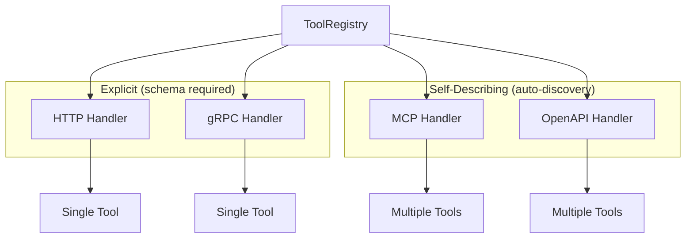
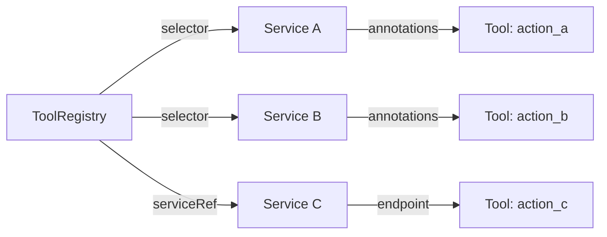

The ToolRegistry custom resource defines tool handlers available to AI agents. Handlers can expose one or more tools and come in two categories:

- **Self-describing** (MCP, OpenAPI): Automatically discover tools at runtime
- **Explicit** (HTTP, gRPC): Require a tool definition with name, description, and input schema

## API version

```yaml
apiVersion: omnia.altairalabs.ai/v1alpha1
kind: ToolRegistry
```



## Spec fields

### `handlers`

List of handler definitions. Each handler connects to an external service that provides tools.

```yaml
spec:
  handlers:
    - name: calculator
      type: http
      endpoint:
        url: https://api.example.com/calculate
      tool:
        name: calculate
        description: "Perform mathematical calculations"
        inputSchema:
          type: object
          properties:
            expression:
              type: string
          required: [expression]
```

## Handler types

| Type | Category | Description |
|------|----------|-------------|
| `http` | Explicit | HTTP REST endpoint |
| `grpc` | Explicit | gRPC service using Tool protocol |
| `mcp` | Self-describing | Model Context Protocol server |
| `openapi` | Self-describing | OpenAPI/Swagger-documented service |

### Handler definition

Common fields for all handler types:

| Field | Type | Required | Description |
|-------|------|----------|-------------|
| `name` | string | Yes | Unique handler name |
| `type` | string | Yes | Handler type (http, grpc, mcp, openapi) |
| `endpoint.url` | string | Conditional | Direct URL (for http/grpc) |
| `endpoint.serviceRef` | object | Conditional | Kubernetes Service reference |
| `timeout` | string | No | Request timeout (e.g., "30s") |
| `retries` | int | No | Number of retry attempts |

### Tool definition (for explicit handlers)

HTTP and gRPC handlers require a `tool` definition:

| Field | Type | Required | Description |
|-------|------|----------|-------------|
| `tool.name` | string | Yes | Tool name exposed to the LLM |
| `tool.description` | string | Yes | Human-readable description |
| `tool.inputSchema` | object | Yes | JSON Schema for input parameters |
| `tool.outputSchema` | object | No | JSON Schema for output (optional) |

## HTTP handler

Configure HTTP-specific options for explicit tool endpoints:

```yaml
- name: search-api
  type: http
  endpoint:
    url: https://api.example.com/search
  tool:
    name: search
    description: "Search the knowledge base"
    inputSchema:
      type: object
      properties:
        query:
          type: string
          description: "Search query"
        limit:
          type: integer
          default: 10
      required: [query]
  httpConfig:
    method: POST
    headers:
      Content-Type: application/json
    contentType: application/json
  timeout: "30s"
  retries: 3
```

### HTTP configuration options

| Field | Type | Default | Description |
|-------|------|---------|-------------|
| `method` | string | `POST` | HTTP method |
| `headers` | map | - | Additional HTTP headers |
| `contentType` | string | `application/json` | Content-Type header |
| `authType` | string | `bearer` | **Deprecated** — use the handler-level `auth` stanza. Auth type (`bearer` or `basic`). |
| `authSecretRef` | object | - | **Deprecated** — use the handler-level `auth` stanza. Reference to a Secret holding the credential (see below). |

### Authenticating tools

Authentication is configured with the **handler-level `auth` stanza** (a sibling
of `httpConfig`/`openAPIConfig`/…), so the same shape applies across handler
types:

```yaml
handlers:
  - name: my-api
    type: http
    httpConfig:
      endpoint: https://api.example.com
    auth:
      type: bearer              # none | bearer | basic
      secretRef:
        name: my-tool-credentials   # a Kubernetes Secret in the same namespace
        key: token                  # for basic, the value is "username:password"
```

| Field | Type | Default | Description |
|-------|------|---------|-------------|
| `auth.type` | string | `none` | Authentication mechanism: `none`, `bearer`, `basic`, `serviceAccount`, or `workloadIdentity`. |
| `auth.secretRef` | object | - | Secret holding the credential (required for `bearer`/`basic`). |
| `auth.serviceAccount.audience` | string | - | Audience the projected ServiceAccount token binds to (required for `serviceAccount`). |
| `auth.workloadIdentity` | object | - | Hosted same-cloud identity (`cloud`, `audience`). Required for `workloadIdentity`. Only `cloud: azure` is supported. |

The `auth` stanza applies to **http, openapi, grpc, and mcp** handlers (the
runtime attaches the credential as an HTTP `Authorization` header, gRPC
`authorization` metadata, or an MCP transport header). Auth is not supported on
a **stdio** MCP transport (no header channel) and is rejected.

- **`bearer` / `basic`** — the operator resolves `secretRef` into an
  operator-managed `<agentruntime>-tool-secrets` Secret, mounted read-only into
  the runtime. The token value never enters the tools ConfigMap.
- **`serviceAccount`** — the operator projects an audience-bound Kubernetes
  ServiceAccount token into the runtime; the tool backend validates it via
  TokenReview. Sent as `Authorization: Bearer <token>`.
- **`workloadIdentity`** — resolved by the runtime under the pod's ambient
  Azure identity (core), currently on **http handlers only**; `cloud` must be
  `azure`. The runtime acquires a token for `audience` and sets it on `header`
  (default `Authorization`). Only http handlers are supported in this
  milestone — the operator rejects `workloadIdentity` on openapi, grpc, and mcp
  handlers at reconcile. The pod's identity must be granted every WIF tool's
  API; per-tool identity separation is a future option.

A missing Secret/key, an unsupported type, or a stdio-MCP+auth combination fails
the AgentRuntime reconcile — it does not silently send an unauthenticated request.
A `workloadIdentity` handler whose token cannot be acquired at call time fails
that tool call rather than calling the backend unauthenticated.

:::note[Azure workload-identity setup]
`workloadIdentity` reuses the agent pod's **ambient** Azure identity — the same
identity keyless [Azure provider auth](/reference/core/provider/) uses — resolved
via `DefaultAzureCredential`. No credential is stored by Omnia. To enable it, the
cluster/infra side must, once per agent identity:

1. Give the agent pod an Azure Workload Identity: label the pod
   `azure.workload.identity/use: "true"` and annotate its ServiceAccount with
   `azure.workload.identity/client-id: <app-or-uami-client-id>`.
2. Create a **federated identity credential** on that Entra ID app / user-assigned
   managed identity trusting the cluster OIDC issuer and subject
   `system:serviceaccount:<namespace>:<serviceAccount>` (Terraform-side).
3. Grant that identity access to **every** WIF tool's API. Because one pod identity
   is shared across the model provider and all tools, its API grants are the union
   of what those tools need — the "one-identity" consequence noted above. Per-tool
   identity separation is a future option.
:::

:::note[Deprecated: `authType` / `authSecretRef`]
The per-config `authType` and `authSecretRef` fields on `httpConfig`/`openAPIConfig`
are deprecated in favour of the `auth` stanza above. They still work and are
normalized into it, but setting **both** a handler `auth` stanza and a legacy
`authType`/`authSecretRef` on the same handler is rejected.
:::

## GRPC handler

Configure gRPC handlers using the Omnia Tool protocol:

```yaml
- name: grpc-tools
  type: grpc
  endpoint:
    url: tool-service.tools.svc.cluster.local:50051
  tool:
    name: process_data
    description: "Process data via gRPC"
    inputSchema:
      type: object
      properties:
        data:
          type: string
      required: [data]
  grpcConfig:
    tls: false
    tlsInsecureSkipVerify: false
```

### GRPC configuration options

| Field | Type | Default | Description |
|-------|------|---------|-------------|
| `tls` | bool | `false` | Enable TLS |
| `tlsCertPath` | string | - | Path to TLS certificate |
| `tlsKeyPath` | string | - | Path to TLS key |
| `tlsCAPath` | string | - | Path to CA certificate |
| `tlsInsecureSkipVerify` | bool | `false` | Skip TLS verification |

## MCP handler (self-describing)

Model Context Protocol handlers automatically discover tools from the MCP server. No `tool` definition is required.

**SSE Transport** (connect to MCP server via Server-Sent Events):

```yaml
- name: mcp-server
  type: mcp
  mcpConfig:
    transport: sse
    endpoint: http://mcp-server.tools.svc.cluster.local:8080/sse
```

**Stdio Transport** (spawn MCP server as subprocess):

```yaml
- name: filesystem-tools
  type: mcp
  mcpConfig:
    transport: stdio
    command: /usr/local/bin/mcp-filesystem
    args:
      - "--root=/data"
    workDir: /app
    env:
      LOG_LEVEL: info
```

### MCP configuration options

| Field | Type | Required | Description |
|-------|------|----------|-------------|
| `transport` | string | Yes | `sse` or `stdio` |
| `endpoint` | string | For SSE | SSE endpoint URL |
| `command` | string | For stdio | Command to execute |
| `args` | []string | No | Command arguments |
| `workDir` | string | No | Working directory |
| `env` | map | No | Environment variables |

## OpenAPI handler (self-describing)

OpenAPI handlers automatically discover tools from an OpenAPI/Swagger specification. Each operation becomes a tool.

```yaml
- name: petstore
  type: openapi
  openAPIConfig:
    specURL: https://petstore.swagger.io/v2/swagger.json
    baseURL: https://petstore.swagger.io/v2
    operationFilter:
      - getPetById
      - findPetsByStatus
```

### OpenAPI configuration options

| Field | Type | Required | Description |
|-------|------|----------|-------------|
| `specURL` | string | Yes | URL to OpenAPI spec (v2 or v3) |
| `baseURL` | string | No | Override the base URL from spec |
| `operationFilter` | []string | No | Limit to specific operation IDs |
| `headers` | map | No | Additional headers for requests |
| `authType` | string | No | **Deprecated** — use the handler-level `auth` stanza. Auth type (`bearer` or `basic`). |
| `authSecretRef` | object | No | **Deprecated** — use the handler-level `auth` stanza. Reference to a Secret holding the credential — see "Authenticating tools" under the HTTP Handler section above. |

## Service discovery

Handlers can reference Kubernetes Services instead of direct URLs:



```yaml
- name: internal-tool
  type: http
  endpoint:
    serviceRef:
      name: tool-service
      namespace: tools  # Optional, defaults to ToolRegistry namespace
      port: 8080
  tool:
    name: internal_action
    description: "Perform internal action"
    inputSchema:
      type: object
```

### Service labels for discovery

Services can be automatically discovered using label selectors:

```yaml
spec:
  handlers:
    - name: platform-tools
      selector:
        matchLabels:
          omnia.altairalabs.ai/tool: "true"
          team: platform
```

### Service annotations

Customize discovered tool behavior with annotations:

| Annotation | Description | Default |
|------------|-------------|---------|
| `omnia.altairalabs.ai/tool-path` | API endpoint path | `/` |
| `omnia.altairalabs.ai/tool-description` | Tool description | Service name |
| `omnia.altairalabs.ai/tool-type` | Handler type | `http` |

Example annotated Service:

```yaml
apiVersion: v1
kind: Service
metadata:
  name: weather-api
  labels:
    omnia.altairalabs.ai/tool: "true"
  annotations:
    omnia.altairalabs.ai/tool-path: "/v1/weather"
    omnia.altairalabs.ai/tool-description: "Get weather forecasts"
spec:
  selector:
    app: weather-service
  ports:
    - name: http
      port: 80
      targetPort: 8080
```

## Status fields

### `phase`

Current phase of the ToolRegistry:

| Value | Description |
|-------|-------------|
| `Pending` | Discovering tools |
| `Ready` | All handlers available |
| `Degraded` | Some handlers unavailable |
| `Failed` | No handlers available |

### `discoveredToolsCount`

Total number of tools discovered across all handlers.

### `availableToolsCount`

Number of tools currently available.

### `discoveredTools`

List of discovered tools with their status:

```yaml
status:
  discoveredTools:
    - handlerName: calculator
      name: calculate
      status: Available
      endpoint: https://api.example.com/calculate
    - handlerName: petstore
      name: getPetById
      status: Available
      endpoint: https://petstore.swagger.io/v2
```

### `conditions`

| Type | Description |
|------|-------------|
| `HandlersAvailable` | At least one handler is connected |
| `AllHandlersReady` | All configured handlers are ready |

## Complete example

ToolRegistry with multiple handler types:

```yaml
apiVersion: omnia.altairalabs.ai/v1alpha1
kind: ToolRegistry
metadata:
  name: agent-tools
  namespace: agents
spec:
  handlers:
    # Explicit HTTP tool with schema
    - name: calculator
      type: http
      endpoint:
        url: https://api.example.com/calculate
      tool:
        name: calculate
        description: "Perform mathematical calculations"
        inputSchema:
          type: object
          properties:
            expression:
              type: string
              description: "Mathematical expression to evaluate"
          required: [expression]
      httpConfig:
        method: POST
      timeout: "10s"

    # gRPC tool service
    - name: user-service
      type: grpc
      endpoint:
        serviceRef:
          name: user-grpc
          namespace: internal
          port: 50051
      tool:
        name: get_user
        description: "Retrieve user information"
        inputSchema:
          type: object
          properties:
            user_id:
              type: string
          required: [user_id]

    # Self-describing MCP server
    - name: code-tools
      type: mcp
      mcpConfig:
        transport: sse
        endpoint: http://mcp-code.tools.svc.cluster.local:8080/sse

    # Self-describing OpenAPI service
    - name: external-api
      type: openapi
      openAPIConfig:
        specURL: https://api.example.com/openapi.json
        operationFilter:
          - searchProducts
          - getProductDetails
```

Status after discovery:

```yaml
status:
  phase: Ready
  discoveredToolsCount: 8
  availableToolsCount: 8
  discoveredTools:
    - handlerName: calculator
      name: calculate
      status: Available
    - handlerName: user-service
      name: get_user
      status: Available
    - handlerName: code-tools
      name: read_file
      status: Available
    - handlerName: code-tools
      name: write_file
      status: Available
    - handlerName: external-api
      name: searchProducts
      status: Available
    - handlerName: external-api
      name: getProductDetails
      status: Available
  conditions:
    - type: HandlersAvailable
      status: "True"
    - type: AllHandlersReady
      status: "True"
```
