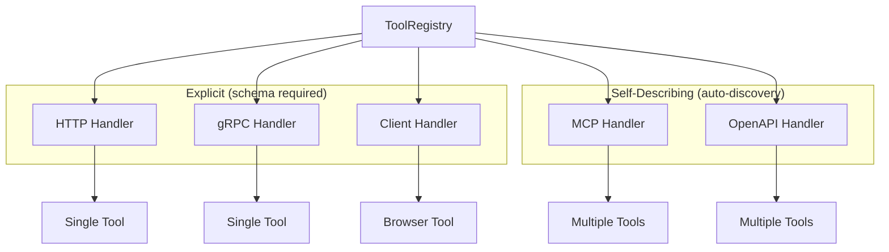

The ToolRegistry custom resource defines tool handlers available to AI agents. Handlers can expose one or more tools and come in two categories:

- **Self-describing** (MCP, OpenAPI): Automatically discover tools at runtime
- **Explicit** (HTTP, gRPC, client): Require a tool definition with name, description, and input schema

:::note[Endpoints live inside the type-specific config block]
There is **no** handler-level `endpoint` field. The endpoint for a handler lives
inside its type block: `httpConfig.endpoint`, `grpcConfig.endpoint`,
`mcpConfig.endpoint`, or `openAPIConfig.specURL`. The CRD uses strict schema
validation, so an unknown field such as a top-level `endpoint:` is **rejected**
by the API server.
:::

## API version

```yaml
apiVersion: omnia.altairalabs.ai/v1alpha1
kind: ToolRegistry
```



## Spec fields

### `handlers`

List of handler definitions (at least one is required). Each handler connects to
a tool source and exposes one or more tools.

```yaml
spec:
  handlers:
    - name: calculator
      type: http
      httpConfig:
        endpoint: https://api.example.com/calculate
        method: POST
      tool:
        name: calculate
        description: "Perform mathematical calculations"
        inputSchema:
          type: object
          properties:
            expression:
              type: string
          required: [expression]
```

## Handler types

| Type | Category | Description |
|------|----------|-------------|
| `http` | Explicit | HTTP REST endpoint |
| `grpc` | Explicit | gRPC service using the Omnia Tool protocol |
| `mcp` | Self-describing | Model Context Protocol server |
| `openapi` | Self-describing | OpenAPI/Swagger-documented service |
| `client` | Explicit | Browser-executed tool (runs in the connected client) |

### Handler definition

Common fields for all handler types:

| Field | Type | Required | Description |
|-------|------|----------|-------------|
| `name` | string | Yes | Unique handler name (`^[a-z0-9]([-a-z0-9]*[a-z0-9])?$`, max 63 chars) |
| `type` | string | Yes | Handler type (`http`, `grpc`, `mcp`, `openapi`, `client`) |
| `tool` | object | Conditional | Tool definition — required for `http`, `grpc`, and `client` |
| `httpConfig` | object | Conditional | Required when `type: http` |
| `grpcConfig` | object | Conditional | Required when `type: grpc` |
| `mcpConfig` | object | Conditional | Required when `type: mcp` |
| `openAPIConfig` | object | Conditional | Required when `type: openapi` |
| `clientConfig` | object | No | Optional consent configuration for `type: client` |
| `auth` | object | No | How the runtime authenticates to the backend (see [Authenticating tools](/how-to/tools/authenticate-tools/)) |
| `timeout` | string | No | Per-invocation wall-clock timeout. Defaults to `30s` |

:::caution[There is no `retries` field]
A handler-level `retries` field existed in earlier releases and has been
**removed**. Retry behaviour is now configured per transport via
`httpConfig.retryPolicy`, `grpcConfig.retryPolicy`, `mcpConfig.retryPolicy`, and
`openAPIConfig.retryPolicy`. See [Advanced HTTP tools](/how-to/tools/advanced-http-tools/).
:::

### Tool definition (for explicit handlers)

`http`, `grpc`, and `client` handlers require a `tool` definition:

| Field | Type | Required | Description |
|-------|------|----------|-------------|
| `tool.name` | string | Yes | Tool name exposed to the LLM (`^[a-z][a-z0-9_]*$`, max 64) |
| `tool.description` | string | Yes | Human-readable description |
| `tool.inputSchema` | object | Yes | JSON Schema for input parameters |
| `tool.outputSchema` | object | No | JSON Schema for output (optional) |

## HTTP handler

The endpoint URL lives in `httpConfig.endpoint` (**required**):

```yaml
- name: search-api
  type: http
  httpConfig:
    endpoint: https://api.example.com/search
    method: POST
    headers:
      Content-Type: application/json
    contentType: application/json
  tool:
    name: search
    description: "Search the knowledge base"
    inputSchema:
      type: object
      properties:
        query:
          type: string
          description: "Search query"
        limit:
          type: integer
          default: 10
      required: [query]
  timeout: "30s"
```

### HTTP configuration options

| Field | Type | Default | Description |
|-------|------|---------|-------------|
| `endpoint` | string | — | **Required.** HTTP endpoint URL |
| `method` | string | `POST` | HTTP method |
| `headers` | map | — | Additional HTTP headers |
| `contentType` | string | `application/json` | Content-Type header |
| `retryPolicy` | object | — | Retry behaviour — see [Advanced HTTP tools](/how-to/tools/advanced-http-tools/) |
| `authType` | string | — | **Deprecated** — use the handler-level `auth` stanza. Auth type (`bearer` or `basic`). |
| `authSecretRef` | object | — | **Deprecated** — use the handler-level `auth` stanza. Reference to a Secret holding the credential. |

The HTTP handler also supports request/response shaping fields —
`urlTemplate`, `queryParams`, `headerParams`, `staticQuery`, `staticBody`,
`bodyMapping`, `responseMapping`, and `redact`. These are **not** exposed in the
dashboard UI; see [Advanced HTTP tools](/how-to/tools/advanced-http-tools/).

### Authenticating tools

Authentication is configured with the **handler-level `auth` stanza** (a sibling
of `httpConfig`/`openAPIConfig`/…), so the same shape applies across handler
types:

```yaml
handlers:
  - name: my-api
    type: http
    httpConfig:
      endpoint: https://api.example.com
    auth:
      type: bearer              # none | bearer | basic | serviceAccount | workloadIdentity
      secretRef:
        name: my-tool-credentials   # a Kubernetes Secret in the same namespace
        key: token                  # for basic, the value is "username:password"
    tool:
      name: my_tool
      description: "Call the authenticated API"
      inputSchema:
        type: object
```

| Field | Type | Default | Description |
|-------|------|---------|-------------|
| `auth.type` | string | `none` | Authentication mechanism: `none`, `bearer`, `basic`, `serviceAccount`, or `workloadIdentity`. |
| `auth.secretRef` | object | - | Secret holding the credential (required for `bearer`/`basic`). |
| `auth.serviceAccount.audience` | string | - | Audience the projected ServiceAccount token binds to (required for `serviceAccount`). |
| `auth.workloadIdentity` | object | - | Hosted same-cloud identity (`cloud`, `audience`). Required for `workloadIdentity`. Only `cloud: azure` is supported. |

The `auth` stanza applies to **http, openapi, grpc, and mcp** handlers (the
runtime attaches the credential as an HTTP `Authorization` header, gRPC
`authorization` metadata, or an MCP transport header). Auth is not supported on
a **stdio** MCP transport (no header channel) and is rejected.

- **`bearer` / `basic`** — the operator resolves `secretRef` into an
  operator-managed `<agentruntime>-tool-secrets` Secret, mounted read-only into
  the runtime. The token value never enters the tools ConfigMap.
- **`serviceAccount`** — the operator projects an audience-bound Kubernetes
  ServiceAccount token into the runtime; the tool backend validates it via
  TokenReview. Sent as `Authorization: Bearer <token>`.
- **`workloadIdentity`** — resolved by the runtime under the pod's ambient
  Azure identity (core); `cloud` must be `azure`. The runtime acquires a token
  for `audience` and sets it on `header` (default `Authorization`). Supported on
  **http, grpc, and mcp (sse / streamable-http) and openapi** handlers — the
  token is acquired per call (per request for mcp/openapi, so it survives token
  expiry). Not supported on **stdio** MCP (no header channel), which is rejected
  at reconcile. The pod's identity must be granted every WIF tool's API; per-tool
  identity separation is a future option.

A missing Secret/key, an unsupported type, or a stdio-MCP+auth combination fails
the AgentRuntime reconcile — it does not silently send an unauthenticated request.
A `workloadIdentity` handler whose token cannot be acquired at call time fails
that tool call rather than calling the backend unauthenticated.

:::note[Azure workload-identity setup]
`workloadIdentity` reuses the agent pod's **ambient** Azure identity — the same
identity keyless [Azure provider auth](/reference/core/provider/) uses — resolved
via `DefaultAzureCredential`. No credential is stored by Omnia. To enable it, the
cluster/infra side must, once per agent identity:

1. Give the agent pod an Azure Workload Identity: label the pod
   `azure.workload.identity/use: "true"` and annotate its ServiceAccount with
   `azure.workload.identity/client-id: <app-or-uami-client-id>`.
2. Create a **federated identity credential** on that Entra ID app / user-assigned
   managed identity trusting the cluster OIDC issuer and subject
   `system:serviceaccount:<namespace>:<serviceAccount>` (Terraform-side).
3. Grant that identity access to **every** WIF tool's API. Because one pod identity
   is shared across the model provider and all tools, its API grants are the union
   of what those tools need — the "one-identity" consequence noted above. Per-tool
   identity separation is a future option.
:::

For a task-oriented walkthrough (creating the credential Secret and verifying the
mounted `<agentruntime>-tool-secrets`), see the how-to:
[Authenticating tools](/how-to/tools/authenticate-tools/).

:::note[Deprecated: `authType` / `authSecretRef`]
The per-config `authType` and `authSecretRef` fields on `httpConfig`/`openAPIConfig`
are deprecated in favour of the `auth` stanza. They still work and are normalized
into it, but setting **both** a handler `auth` stanza and a legacy
`authType`/`authSecretRef` on the same handler is rejected.
:::

## GRPC handler

The endpoint (`host:port`) lives in `grpcConfig.endpoint` (**required**):

```yaml
- name: grpc-tools
  type: grpc
  grpcConfig:
    endpoint: tool-service.tools.svc.cluster.local:50051
    tls: false
    tlsInsecureSkipVerify: false
  tool:
    name: process_data
    description: "Process data via gRPC"
    inputSchema:
      type: object
      properties:
        data:
          type: string
      required: [data]
```

### GRPC configuration options

| Field | Type | Default | Description |
|-------|------|---------|-------------|
| `endpoint` | string | — | **Required.** gRPC server address (`host:port`) |
| `tls` | bool | `false` | Enable TLS |
| `tlsCertPath` | string | — | Path to TLS certificate |
| `tlsKeyPath` | string | — | Path to TLS key |
| `tlsCAPath` | string | — | Path to CA certificate |
| `tlsInsecureSkipVerify` | bool | `false` | Skip TLS verification |
| `retryPolicy` | object | — | Retry behaviour (per gRPC status code) |

The backend behind `grpcConfig.endpoint` must implement the **Omnia Tool
protocol** defined by [`api/proto/tools/v1/tools.proto`](https://github.com/AltairaLabs/Omnia/blob/main/api/proto/tools/v1/tools.proto)
(`ToolService`), not an arbitrary gRPC API. See
[Build a tool backend](/how-to/tools/build-a-tool-backend/) for the full
contract, including when `ListTools` is required.

## MCP handler (self-describing)

Model Context Protocol handlers automatically discover tools from the MCP server. No `tool` definition is required.

**SSE Transport** (connect to MCP server via Server-Sent Events):

```yaml
- name: mcp-server
  type: mcp
  mcpConfig:
    transport: sse
    endpoint: http://mcp-server.tools.svc.cluster.local:8080/sse
```

**Streamable HTTP Transport**:

```yaml
- name: mcp-http
  type: mcp
  mcpConfig:
    transport: streamable-http
    endpoint: http://mcp-server.tools.svc.cluster.local:8080/mcp
```

**Stdio Transport** (spawn MCP server as subprocess):

```yaml
- name: filesystem-tools
  type: mcp
  mcpConfig:
    transport: stdio
    command: /usr/local/bin/mcp-filesystem
    args:
      - "--root=/data"
    workDir: /app
    env:
      LOG_LEVEL: info
```

### MCP configuration options

| Field | Type | Required | Description |
|-------|------|----------|-------------|
| `transport` | string | Yes | `sse`, `streamable-http`, or `stdio` |
| `endpoint` | string | For `sse` / `streamable-http` | Server URL |
| `command` | string | For `stdio` | Command to execute |
| `args` | []string | No | Command arguments |
| `workDir` | string | No | Working directory |
| `env` | map | No | Environment variables |
| `toolFilter` | object | No | `allowlist` / `blocklist` of tool names to expose |
| `retryPolicy` | object | No | Retry behaviour for CallTool failures |

`auth` is supported on `sse` and `streamable-http` transports (the credential is
attached as a transport header). Auth on a `stdio` transport is rejected (no
header channel).

## OpenAPI handler (self-describing)

OpenAPI handlers automatically discover tools from an OpenAPI/Swagger specification. Each operation becomes a tool.

```yaml
- name: petstore
  type: openapi
  openAPIConfig:
    specURL: https://petstore.swagger.io/v2/swagger.json
    baseURL: https://petstore.swagger.io/v2
    operationFilter:
      - getPetById
      - findPetsByStatus
```

### OpenAPI configuration options

| Field | Type | Required | Description |
|-------|------|----------|-------------|
| `specURL` | string | Yes | URL to OpenAPI spec (v2 or v3) |
| `baseURL` | string | No | Override the base URL from spec |
| `operationFilter` | []string | No | Limit to specific operation IDs |
| `headers` | map | No | Additional headers for requests |
| `retryPolicy` | object | No | Retry behaviour (uses the HTTP retry policy shape) |
| `authType` | string | No | **Deprecated** — use the handler-level `auth` stanza. |
| `authSecretRef` | object | No | **Deprecated** — use the handler-level `auth` stanza. |

## Client handler (browser-executed)

`client` handlers are executed by the connected browser client over the
WebSocket facade, not by the runtime. They take an explicit `tool` definition
like HTTP/gRPC handlers, plus optional consent configuration. See
[Client-side tools](/how-to/tools/client-tools/).

```yaml
- name: geolocation
  type: client
  clientConfig:
    consentMessage: "Allow the assistant to read your location?"
    categories: [location]
  tool:
    name: get_location
    description: "Read the user's current location from the browser"
    inputSchema:
      type: object
```

## Status fields

### `phase`

Current phase of the ToolRegistry:

| Value | Description |
|-------|-------------|
| `Pending` | Initial state before the first reconcile completes |
| `Ready` | Every discovered tool is `Available` |
| `Degraded` | Some tools `Available`, some `Unavailable`. Reserved for backend health — **not currently emitted** (see note) |
| `Failed` | A handler failed validation, or no tools were discovered |

:::note[Status is config-level, not a live health check]
The controller marks a tool `Available` when its handler config is valid and the
endpoint resolves — it does **not** probe the backend for reachability. `phase:
Ready` means "the configuration is valid", not "the backend is up". Because there
is no reachability probe today, no tool is ever marked `Unavailable`, so
`Degraded` is not currently emitted — it is reserved for a future probe-backed
status.
:::

### `discoveredToolsCount`

Total number of tools discovered across all handlers.

### `discoveredTools`

List of discovered tools with their status:

```yaml
status:
  discoveredTools:
    - handlerName: calculator
      name: calculate
      status: Available
      endpoint: https://api.example.com/calculate
    - handlerName: petstore
      name: petstore
      status: Available
      endpoint: https://petstore.swagger.io/v2/swagger.json
```

### `conditions`

| Type | Description |
|------|-------------|
| `HandlersValid` | `True` when every handler passed validation; `False` (with the errors) otherwise |
| `ToolsDiscovered` | Reports how many tools were discovered from how many handlers |

## Complete example

ToolRegistry with multiple handler types:

```yaml
apiVersion: omnia.altairalabs.ai/v1alpha1
kind: ToolRegistry
metadata:
  name: agent-tools
  namespace: agents
spec:
  handlers:
    # Explicit HTTP tool with schema
    - name: calculator
      type: http
      httpConfig:
        endpoint: https://api.example.com/calculate
        method: POST
      tool:
        name: calculate
        description: "Perform mathematical calculations"
        inputSchema:
          type: object
          properties:
            expression:
              type: string
              description: "Mathematical expression to evaluate"
          required: [expression]
      timeout: "10s"

    # gRPC tool service
    - name: user-service
      type: grpc
      grpcConfig:
        endpoint: user-grpc.internal.svc.cluster.local:50051
      tool:
        name: get_user
        description: "Retrieve user information"
        inputSchema:
          type: object
          properties:
            user_id:
              type: string
          required: [user_id]

    # Self-describing MCP server
    - name: code-tools
      type: mcp
      mcpConfig:
        transport: sse
        endpoint: http://mcp-code.tools.svc.cluster.local:8080/sse

    # Self-describing OpenAPI service
    - name: external-api
      type: openapi
      openAPIConfig:
        specURL: https://api.example.com/openapi.json
        operationFilter:
          - searchProducts
          - getProductDetails
```

Status after reconcile:

```yaml
status:
  phase: Ready
  discoveredToolsCount: 4
  discoveredTools:
    - handlerName: calculator
      name: calculate
      status: Available
    - handlerName: user-service
      name: get_user
      status: Available
    - handlerName: code-tools
      name: code-tools
      status: Available
    - handlerName: external-api
      name: external-api
      status: Available
  conditions:
    - type: HandlersValid
      status: "True"
    - type: ToolsDiscovered
      status: "True"
```

:::note[Self-describing handlers report one placeholder entry until runtime]
`mcp` and `openapi` handlers contribute a single placeholder `discoveredTools`
entry (named after the handler) at reconcile time. The individual tools they
expose are discovered by the runtime when the agent starts.
:::
