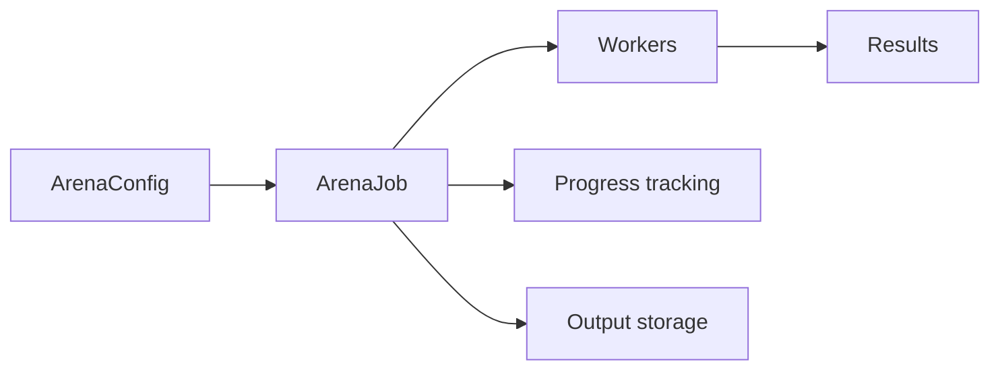

:::note[Enterprise Feature]
ArenaJob is an enterprise feature. The CRD is only installed when `enterprise.enabled=true` in your Helm values. See [Installing a License](/how-to/operations/install-license/) for details.
:::

The ArenaJob custom resource defines a test execution that runs scenarios from an ArenaConfig. It supports evaluation, load testing, and data generation job types with configurable workers and output destinations.

## API version

```yaml
apiVersion: omnia.altairalabs.ai/v1alpha1
kind: ArenaJob
```

## Overview

ArenaJob provides:

- **Multiple job types**: Evaluation, load testing, and data generation
- **Worker scaling**: Configure replicas and autoscaling
- **Flexible output**: Store results in S3 or PVC
- **Scheduling support**: Cron-based recurring execution
- **Progress tracking**: Real-time status and progress updates

## Spec fields

### `sourceRef`

Reference to the ArenaSource containing test scenarios and configuration.

| Field | Type | Required | Description |
|-------|------|----------|-------------|
| `name` | string | Yes | Name of the ArenaSource |

```yaml
spec:
  sourceRef:
    name: my-evaluation-source
```

### `type`

The type of job to execute.

| Value | Description |
|-------|-------------|
| `evaluation` | Run prompt evaluation against test scenarios (default) |
| `loadtest` | Run load testing against providers |
| `datagen` | Generate synthetic data using prompts |

```yaml
spec:
  type: evaluation
```

### `scenarios`

Override scenario selection from the ArenaConfig. If not specified, uses the ArenaConfig's scenario settings.

| Field | Type | Description |
|-------|------|-------------|
| `include` | []string | Glob patterns for scenarios to include |
| `exclude` | []string | Glob patterns for scenarios to exclude |

```yaml
spec:
  scenarios:
    include:
      - "scenarios/critical-*.yaml"
    exclude:
      - "*-slow.yaml"
```

### `evaluation`

Settings specific to evaluation jobs.

| Field | Type | Description |
|-------|------|-------------|
| `outputFormats` | []string | Result formats: junit, json, csv |

```yaml
spec:
  type: evaluation
  evaluation:
    outputFormats:
      - junit
      - json
```

### `loadTest`

Settings specific to load testing jobs.

| Field | Type | Default | Description |
|-------|------|---------|-------------|
| `rampUp` | string | "30s" | Duration to ramp up to target |
| `duration` | string | "5m" | Total test duration |
| `targetRPS` | integer | - | Target requests per second |

```yaml
spec:
  type: loadtest
  loadTest:
    rampUp: 1m
    duration: 10m
    targetRPS: 100
```

### `dataGen`

Settings specific to data generation jobs.

| Field | Type | Default | Description |
|-------|------|---------|-------------|
| `count` | integer | 100 | Number of items to generate |
| `format` | string | "jsonl" | Output format: json, jsonl, csv |

```yaml
spec:
  type: datagen
  dataGen:
    count: 1000
    format: jsonl
```

### `workers`

Configure the worker pool for job execution.

| Field | Type | Default | Description |
|-------|------|---------|-------------|
| `replicas` | integer | 1 | Number of worker replicas |
| `minReplicas` | integer | - | Minimum for autoscaling |
| `maxReplicas` | integer | - | Maximum for autoscaling |

```yaml
spec:
  workers:
    replicas: 10
```

For autoscaling:

```yaml
spec:
  workers:
    minReplicas: 2
    maxReplicas: 20
```

### `providers`

Map of group names to lists of provider/agent entries. Groups correspond to the arena config's provider groups (e.g., `"default"`, `"judge"`, `"selfplay"`). When set, provider YAML files from the arena project are ignored and the worker resolves providers directly from CRDs.

Each entry is an `ArenaProviderEntry` with exactly one of the following fields:

| Field | Type | Required | Description |
|-------|------|----------|-------------|
| `providerRef` | object | Conditional | Reference to a Provider CRD |
| `providerRef.name` | string | Yes | Name of the Provider resource |
| `providerRef.namespace` | string | No | Namespace (defaults to the ArenaJob's namespace) |
| `agentRef` | object | Conditional | Reference to an AgentRuntime CRD |
| `agentRef.name` | string | Yes | Name of the AgentRuntime resource |

A CEL validation rule enforces that exactly one of `providerRef` or `agentRef` is set on each entry. Setting both or neither will be rejected at admission time.

Agents and LLM providers are interchangeable in the scenario x provider matrix. An `agentRef` entry causes the worker to connect to the agent over WebSocket instead of making direct LLM API calls.

#### Example: single provider group

```yaml
spec:
  providers:
    default:
      - providerRef:
          name: gpt4-prod
```

#### Example: multiple providers in a group

When a group contains multiple entries, each provider is evaluated against every scenario:

```yaml
spec:
  providers:
    default:
      - providerRef:
          name: gpt4-prod
      - providerRef:
          name: claude-sonnet
      - providerRef:
          name: gemini-pro
```

#### Example: separate judge provider

Use a dedicated provider group for the judge (evaluator) model:

```yaml
spec:
  providers:
    default:
      - providerRef:
          name: gpt4-prod
      - providerRef:
          name: claude-sonnet
    judge:
      - providerRef:
          name: claude-opus
```

#### Example: agent entry

Reference a deployed AgentRuntime instead of a raw LLM provider. The worker connects to the agent's WebSocket endpoint:

```yaml
spec:
  providers:
    default:
      - agentRef:
          name: my-support-agent
```

#### Example: self-play with mixed types

Mix LLM providers and agents in a self-play evaluation:

```yaml
spec:
  providers:
    selfplay:
      - providerRef:
          name: gpt4-prod
      - agentRef:
          name: my-agent-v2
    judge:
      - providerRef:
          name: claude-opus
```

#### Example: cross-namespace provider

Reference a Provider in a different namespace:

```yaml
spec:
  providers:
    default:
      - providerRef:
          name: shared-gpt4
          namespace: shared-providers
```

### `toolRegistries`

List of ToolRegistry CRD references whose discovered tools replace the arena config's tool and MCP server file references. When set, tool YAML files from the arena project are ignored.

| Field | Type | Required | Description |
|-------|------|----------|-------------|
| `name` | string | Yes | Name of the ToolRegistry resource |

```yaml
spec:
  toolRegistries:
    - name: production-tools
```

#### How tool registries work

1. The controller reads each referenced ToolRegistry CRD
2. Discovered tools from each registry's status are extracted
3. These tools replace any tools defined in the arena config files
4. The worker receives the resolved tool endpoints via configuration

This is useful for:

- Switching between mock and real tool implementations per environment
- Routing tool calls to different endpoints
- Dynamic service discovery for tool handlers

#### Example: multiple tool registries

```yaml
spec:
  toolRegistries:
    - name: core-tools
    - name: billing-tools
```

#### Combining providers and tool registries

You can use both `providers` and `toolRegistries` together for complete CRD-based runtime configuration:

```yaml
apiVersion: omnia.altairalabs.ai/v1alpha1
kind: ArenaJob
metadata:
  name: production-eval
spec:
  sourceRef:
    name: my-source
  providers:
    default:
      - providerRef:
          name: gpt4-prod
      - providerRef:
          name: claude-sonnet
    judge:
      - providerRef:
          name: claude-opus
  toolRegistries:
    - name: production-tools
  workers:
    replicas: 5
  output:
    type: s3
    s3:
      bucket: arena-results
      prefix: "evals/"
```

### `output`

Configure where job results are stored.

| Field | Type | Required | Description |
|-------|------|----------|-------------|
| `type` | string | Yes | Destination type: s3, pvc |
| `s3` | object | Conditional | S3 configuration (when type is s3) |
| `pvc` | object | Conditional | PVC configuration (when type is pvc) |

#### S3 output

| Field | Type | Required | Description |
|-------|------|----------|-------------|
| `bucket` | string | Yes | S3 bucket name |
| `prefix` | string | No | Key prefix for objects |
| `region` | string | No | AWS region |
| `endpoint` | string | No | Custom S3-compatible endpoint |
| `secretRef` | object | No | Credentials secret reference |

```yaml
spec:
  output:
    type: s3
    s3:
      bucket: arena-results
      prefix: "evals/nightly/"
      region: us-west-2
      secretRef:
        name: s3-credentials
```

#### PVC output

| Field | Type | Required | Description |
|-------|------|----------|-------------|
| `claimName` | string | Yes | PVC name |
| `subPath` | string | No | Subdirectory within PVC |

```yaml
spec:
  output:
    type: pvc
    pvc:
      claimName: arena-results-pvc
      subPath: "evals/"
```

### `schedule`

Configure scheduled/recurring job execution.

| Field | Type | Default | Description |
|-------|------|---------|-------------|
| `cron` | string | - | Cron expression for scheduling |
| `timezone` | string | "UTC" | Timezone for cron |
| `concurrencyPolicy` | string | "Forbid" | Allow, Forbid, or Replace |

```yaml
spec:
  schedule:
    cron: "0 2 * * *"  # 2am daily
    timezone: "America/New_York"
    concurrencyPolicy: Forbid
```

### `ttlSecondsAfterFinished`

How long to keep completed jobs before automatic cleanup.

```yaml
spec:
  ttlSecondsAfterFinished: 86400  # 24 hours
```

## Status fields

### `phase`

| Value | Description |
|-------|-------------|
| `Pending` | Job is waiting to start |
| `Running` | Job is actively executing |
| `Succeeded` | Job completed successfully |
| `Failed` | Job failed |
| `Cancelled` | Job was cancelled |

### `progress`

Tracks job execution progress.

| Field | Description |
|-------|-------------|
| `total` | Total number of work items |
| `completed` | Successfully completed items |
| `failed` | Failed items |
| `pending` | Pending items |

### `result`

Contains summary results for completed jobs.

| Field | Description |
|-------|-------------|
| `url` | URL to access detailed results |
| `summary` | Aggregated result metrics |

### `conditions`

| Type | Description |
|------|-------------|
| `Ready` | Overall readiness of the job |
| `ConfigValid` | ArenaConfig reference is valid and ready |
| `JobCreated` | Worker K8s Job has been created |
| `Progressing` | Job is actively executing workers |

### Timing fields

| Field | Description |
|-------|-------------|
| `startTime` | When the job started |
| `completionTime` | When the job completed |
| `lastScheduleTime` | Last scheduled job trigger |
| `nextScheduleTime` | Next scheduled execution |

### `activeWorkers`

Current number of active worker pods.

## Complete examples

### Basic evaluation job

```yaml
apiVersion: omnia.altairalabs.ai/v1alpha1
kind: ArenaJob
metadata:
  name: basic-eval
  namespace: arena
spec:
  sourceRef:
    name: my-config
```

### Multi-worker evaluation

```yaml
apiVersion: omnia.altairalabs.ai/v1alpha1
kind: ArenaJob
metadata:
  name: parallel-eval
  namespace: arena
spec:
  sourceRef:
    name: provider-comparison
  type: evaluation
  evaluation:
    outputFormats:
      - junit
      - json
  workers:
    replicas: 10
  output:
    type: s3
    s3:
      bucket: arena-results
      prefix: "evals/parallel/"
```

### Scheduled nightly evaluation

```yaml
apiVersion: omnia.altairalabs.ai/v1alpha1
kind: ArenaJob
metadata:
  name: nightly-eval
  namespace: arena
spec:
  sourceRef:
    name: production-tests
  type: evaluation
  workers:
    replicas: 5
  output:
    type: s3
    s3:
      bucket: arena-results
      prefix: "evals/nightly/"
  schedule:
    cron: "0 2 * * *"
    timezone: "UTC"
  ttlSecondsAfterFinished: 604800  # 7 days
```

### Load testing job

```yaml
apiVersion: omnia.altairalabs.ai/v1alpha1
kind: ArenaJob
metadata:
  name: provider-loadtest
  namespace: arena
spec:
  sourceRef:
    name: load-test-config
  type: loadtest
  loadTest:
    rampUp: 2m
    duration: 30m
    targetRPS: 500
  workers:
    minReplicas: 5
    maxReplicas: 50
  output:
    type: s3
    s3:
      bucket: loadtest-results
      prefix: "loadtests/"
```

### Data generation job

```yaml
apiVersion: omnia.altairalabs.ai/v1alpha1
kind: ArenaJob
metadata:
  name: synthetic-data
  namespace: arena
spec:
  sourceRef:
    name: datagen-config
  type: datagen
  dataGen:
    count: 10000
    format: jsonl
  workers:
    replicas: 4
  output:
    type: pvc
    pvc:
      claimName: generated-data
      subPath: "batch-001/"
```

## Workflow

1. **Create ArenaConfig** - Define test configuration with providers and settings
2. **Create ArenaJob** - Reference the config and specify execution parameters
3. **Monitor Progress** - Watch status.progress for completion
4. **Retrieve Results** - Access results from configured output destination



## Related resources

- **[ArenaSource](/reference/evaluation/arenasource)**: Defines bundle sources
- **[ArenaConfig](/reference/evaluation/arenaconfig)**: Test configuration
- **[Provider](/reference/core/provider)**: LLM provider configuration
