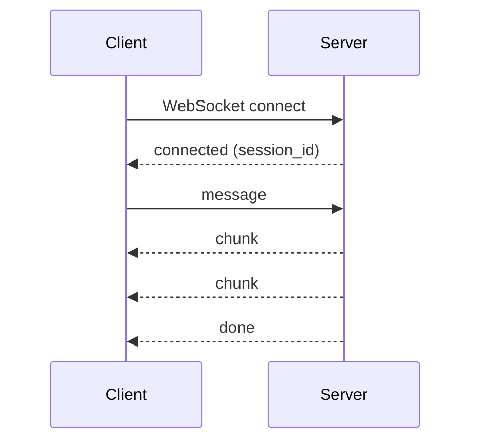
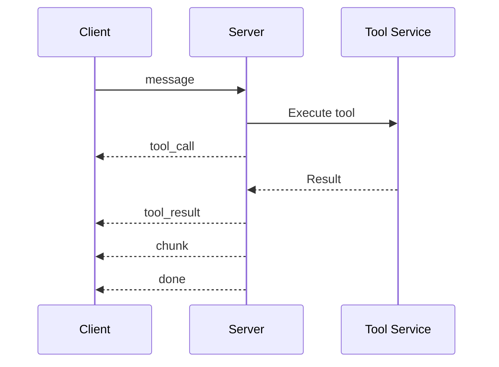
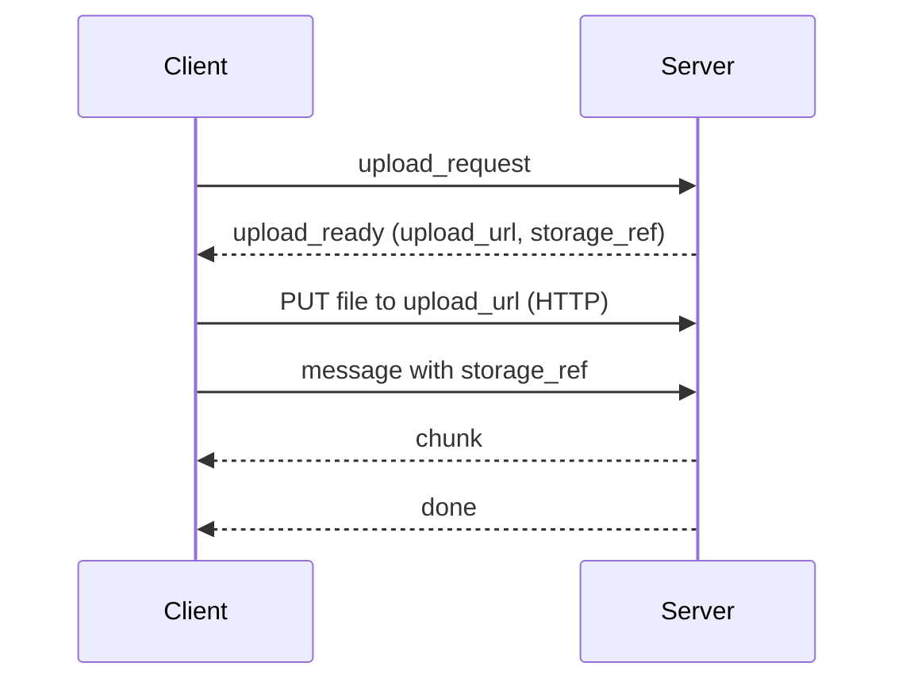
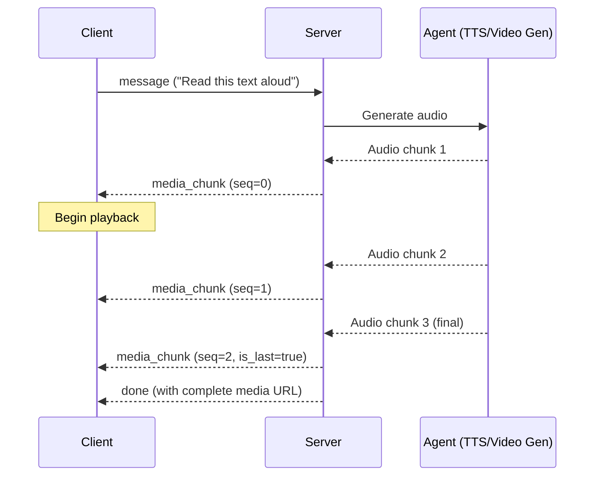
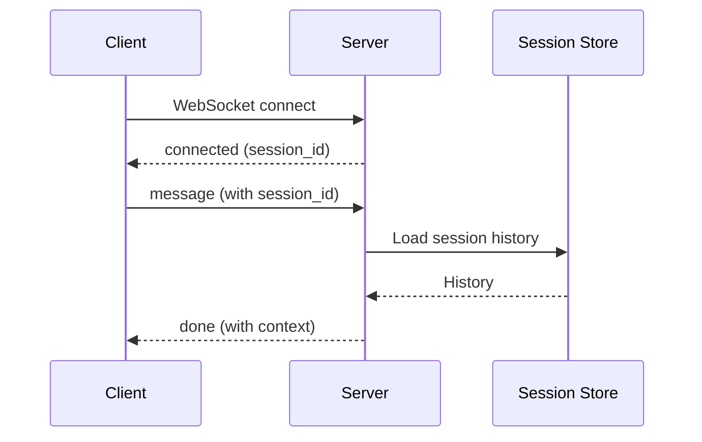
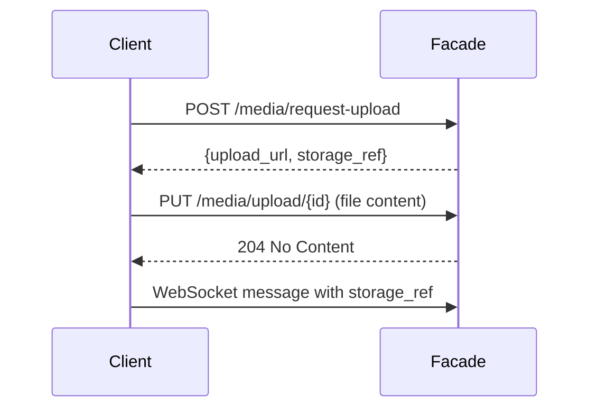

This document describes the WebSocket protocol used by Omnia agent facades.

## Connection

### URL Format

```text
ws://host:port?agent=<agent-name>&namespace=<namespace>
```

| Parameter | Required | Description |
|-----------|----------|-------------|
| `agent` | Yes | Name of the AgentRuntime |
| `namespace` | No | Namespace (defaults to `default`) |

### Example

```bash
websocat "ws://localhost:8080?agent=my-agent&namespace=production"
```

## Message Types

### Client Messages

Messages sent from client to server.

#### Message

Send a user message to the agent:

```json
{
  "type": "message",
  "content": "Hello, how are you?",
  "session_id": "optional-session-id",
  "metadata": {
    "user_id": "user-123"
  }
}
```

| Field | Type | Required | Description |
|-------|------|----------|-------------|
| `type` | string | Yes | Must be `"message"` |
| `content` | string | No | User message content (text-only) |
| `parts` | array | No | Multi-modal content parts (see below) |
| `session_id` | string | No | Resume existing session |
| `metadata` | object | No | Custom metadata |

> **Note**: Either `content` or `parts` should be provided. If both are present, `parts` takes precedence.

#### Multi-Modal Message

Send a message with images or other media:

```json
{
  "type": "message",
  "session_id": "sess-abc123",
  "parts": [
    {
      "type": "text",
      "text": "What's in this image?"
    },
    {
      "type": "image",
      "media": {
        "url": "https://example.com/photo.jpg",
        "mime_type": "image/jpeg"
      }
    }
  ]
}
```

##### ContentPart Types

| Type | Description |
|------|-------------|
| `text` | Plain text content |
| `image` | Image (JPEG, PNG, GIF, WebP) |
| `audio` | Audio file (MP3, WAV, OGG) |
| `video` | Video file (MP4, WebM) |
| `file` | Generic file attachment |

##### ContentPart Structure

```typescript
interface ContentPart {
  type: "text" | "image" | "audio" | "video" | "file"
  text?: string        // For type: "text"
  media?: MediaContent // For media types
}

interface MediaContent {
  // Data source (exactly one required)
  data?: string        // Base64-encoded (< 256KB recommended)
  url?: string         // HTTP/HTTPS URL
  storage_ref?: string // Backend storage reference

  // Required
  mime_type: string    // e.g., "image/jpeg", "audio/mp3"

  // Optional metadata
  filename?: string
  size_bytes?: number

  // Image-specific
  width?: number
  height?: number
  detail?: "low" | "high" | "auto"  // Vision model hint

  // Audio/Video-specific
  duration_ms?: number
  sample_rate?: number  // Audio: Hz
  channels?: number     // Audio: 1=mono, 2=stereo
}
```

##### Example: Image with Base64 Data

```json
{
  "type": "message",
  "parts": [
    { "type": "text", "text": "Describe this image" },
    {
      "type": "image",
      "media": {
        "data": "iVBORw0KGgoAAAANSUhEUgAAAAEAAAABCAYAAAAfFcSJAAAADUlEQVR...",
        "mime_type": "image/png"
      }
    }
  ]
}
```

#### Upload Request

Request an upload URL for a file (requires facade media storage to be enabled):

```json
{
  "type": "upload_request",
  "session_id": "sess-abc123",
  "upload_request": {
    "filename": "photo.jpg",
    "mime_type": "image/jpeg",
    "size_bytes": 102400
  }
}
```

| Field | Type | Required | Description |
|-------|------|----------|-------------|
| `type` | string | Yes | Must be `"upload_request"` |
| `session_id` | string | No | Resume existing session |
| `upload_request.filename` | string | Yes | Original filename |
| `upload_request.mime_type` | string | Yes | MIME type of the file |
| `upload_request.size_bytes` | number | Yes | File size in bytes |

The server responds with an `upload_ready` message containing the upload URL. After uploading the file via HTTP PUT, the client can reference it using the `storage_ref` in subsequent messages.

### Server Messages

Messages sent from server to client.

#### Connected

Sent immediately after connection:

```json
{
  "type": "connected",
  "session_id": "sess-abc123"
}
```

#### Chunk

Streaming response chunk:

```json
{
  "type": "chunk",
  "content": "Hello! I'm doing"
}
```

#### Done

Final response completion:

```json
{
  "type": "done",
  "content": "Hello! I'm doing great, thank you for asking!"
}
```

#### Multi-Modal Response

For responses containing media (e.g., generated images), the server uses the `parts` array:

```json
{
  "type": "done",
  "session_id": "sess-abc123",
  "parts": [
    {
      "type": "text",
      "text": "Here's the image you requested:"
    },
    {
      "type": "image",
      "media": {
        "url": "https://storage.example.com/generated/img-123.png",
        "mime_type": "image/png",
        "width": 1024,
        "height": 1024
      }
    }
  ]
}
```

> **Note**: When `parts` is present, it takes precedence over `content`. For backward compatibility, text-only responses may use either format.

#### Tool Call

Agent is calling a tool:

```json
{
  "type": "tool_call",
  "tool_call": {
    "id": "tc-123",
    "name": "weather",
    "arguments": {
      "location": "San Francisco"
    }
  }
}
```

#### Tool Result

Result from a tool call:

```json
{
  "type": "tool_result",
  "tool_result": {
    "id": "tc-123",
    "result": "72°F, Sunny"
  }
}
```

#### Upload Ready

Response to an `upload_request` with the upload URL:

```json
{
  "type": "upload_ready",
  "session_id": "sess-abc123",
  "upload_ready": {
    "upload_id": "upl-xyz789",
    "upload_url": "http://agent.example.com/media/upload/upl-xyz789",
    "storage_ref": "omnia://sessions/sess-abc123/media/med-def456",
    "expires_at": "2025-01-09T12:00:00Z"
  }
}
```

| Field | Type | Description |
|-------|------|-------------|
| `upload_ready.upload_id` | string | Unique upload identifier |
| `upload_ready.upload_url` | string | URL to PUT the file content |
| `upload_ready.storage_ref` | string | Storage reference for the uploaded file |
| `upload_ready.expires_at` | string | When the upload URL expires (ISO 8601) |

#### Upload Complete

Notification that a file upload has completed successfully:

```json
{
  "type": "upload_complete",
  "session_id": "sess-abc123",
  "upload_complete": {
    "upload_id": "upl-xyz789",
    "storage_ref": "omnia://sessions/sess-abc123/media/med-def456",
    "size_bytes": 102400
  }
}
```

| Field | Type | Description |
|-------|------|-------------|
| `upload_complete.upload_id` | string | Upload identifier |
| `upload_complete.storage_ref` | string | Storage reference for the uploaded file |
| `upload_complete.size_bytes` | number | Actual file size in bytes |

#### Media Chunk

Streaming media chunk for audio/video responses. Allows playback to begin before the entire media is generated:

```json
{
  "type": "media_chunk",
  "session_id": "sess-abc123",
  "media_chunk": {
    "media_id": "audio-xyz789",
    "sequence": 0,
    "is_last": false,
    "data": "//uQxAAAAAANIAAAAAExBTUUzLjEwMFVVVVVVVVVV...",
    "mime_type": "audio/mp3"
  }
}
```

| Field | Type | Description |
|-------|------|-------------|
| `media_chunk.media_id` | string | Unique identifier for the media stream |
| `media_chunk.sequence` | number | Sequence number for ordering (0-indexed) |
| `media_chunk.is_last` | boolean | Whether this is the final chunk |
| `media_chunk.data` | string | Base64-encoded chunk data |
| `media_chunk.mime_type` | string | MIME type (e.g., "audio/mp3", "video/mp4") |

The client should:
1. Buffer chunks by `media_id` and `sequence`
2. Begin playback once sufficient data is buffered
3. Assemble the complete media when `is_last: true` is received
4. The final `done` message may include a complete media URL for replay

#### Error

Error message:

```json
{
  "type": "error",
  "error": {
    "code": "INVALID_MESSAGE",
    "message": "Failed to parse message"
  }
}
```

## Error Codes

| Code | Description |
|------|-------------|
| `INVALID_MESSAGE` | Message format is invalid |
| `SESSION_NOT_FOUND` | Specified session doesn't exist |
| `PROVIDER_ERROR` | LLM provider returned an error |
| `TOOL_ERROR` | Tool execution failed |
| `INTERNAL_ERROR` | Internal server error |
| `UPLOAD_FAILED` | File upload operation failed |
| `MEDIA_NOT_ENABLED` | Media storage is not enabled on the facade |

## Message Flow

### New Conversation



### With Tool Calls



### With File Upload (WebSocket)



This flow shows uploading a file via WebSocket before sending a message that references it. The client:
1. Sends an `upload_request` via WebSocket
2. Receives `upload_ready` with the upload URL
3. PUTs the file content to the upload URL via HTTP
4. Sends a message with the `storage_ref` in the media content

### With Streaming Media Response



This flow shows streaming audio/video responses. The client:
1. Sends a message requesting audio/video generation
2. Receives `media_chunk` messages as data becomes available
3. Buffers chunks by `media_id` and `sequence` number
4. Begins playback once sufficient data is buffered
5. Assembles the complete media when `is_last: true` is received
6. Optionally uses the complete media URL from the `done` message for replay

### Session Resumption



## Session Handling

### New Session

Omit `session_id` to create a new session:

```json
{"type": "message", "content": "Hello"}
```

The server responds with a `connected` message containing the new session ID.

### Resume Session

Include `session_id` to resume:

```json
{
  "type": "message",
  "session_id": "sess-abc123",
  "content": "Continue our conversation"
}
```

If the session exists and hasn't expired, conversation history is preserved.

### Session Expiration

Sessions expire based on the AgentRuntime's `session.ttl` configuration. Attempting to resume an expired session creates a new one.

## Media Upload (Optional)

When facade media storage is enabled, clients can upload files via HTTP before referencing them in WebSocket messages. This avoids base64-encoding large files in the WebSocket protocol.

### Upload Flow



### Step 1: Request Upload URL

```bash
POST /media/request-upload
Content-Type: application/json

{
  "session_id": "sess-abc123",
  "filename": "photo.jpg",
  "mime_type": "image/jpeg",
  "size_bytes": 102400
}
```

Response:

```json
{
  "upload_url": "http://agent.example.com/media/upload/upl-xyz789",
  "upload_id": "upl-xyz789",
  "storage_ref": "omnia://sessions/sess-abc123/media/med-def456",
  "expires_at": "2025-01-09T12:00:00Z"
}
```

### Step 2: Upload File

```bash
PUT /media/upload/upl-xyz789
Content-Type: image/jpeg

<binary file content>
```

Response: `204 No Content` on success.

### Step 3: Reference in WebSocket Message

```json
{
  "type": "message",
  "session_id": "sess-abc123",
  "parts": [
    { "type": "text", "text": "What's in this image?" },
    {
      "type": "image",
      "media": {
        "storage_ref": "omnia://sessions/sess-abc123/media/med-def456",
        "mime_type": "image/jpeg"
      }
    }
  ]
}
```

### Media Info Endpoint

Retrieve metadata about uploaded media:

```bash
GET /media/info/{session-id}/{media-id}
```

Response:

```json
{
  "filename": "photo.jpg",
  "mime_type": "image/jpeg",
  "size_bytes": 102400,
  "created_at": "2025-01-09T11:00:00Z",
  "expires_at": "2025-01-10T11:00:00Z"
}
```

### Media Download Endpoint

Download previously uploaded media:

```bash
GET /media/download/{session-id}/{media-id}
```

Returns the file with appropriate `Content-Type` and `Content-Disposition` headers.

> **Note**: Media upload is only available when the facade is configured with media storage. See [AgentRuntime facade.media configuration](/reference/agentruntime/#facademedia) for details.

## Connection Health

The server sends WebSocket ping frames to maintain connection health. Clients should respond with pong frames automatically (most WebSocket libraries handle this).

Default timeouts:
- Ping interval: 30 seconds
- Pong timeout: 60 seconds
