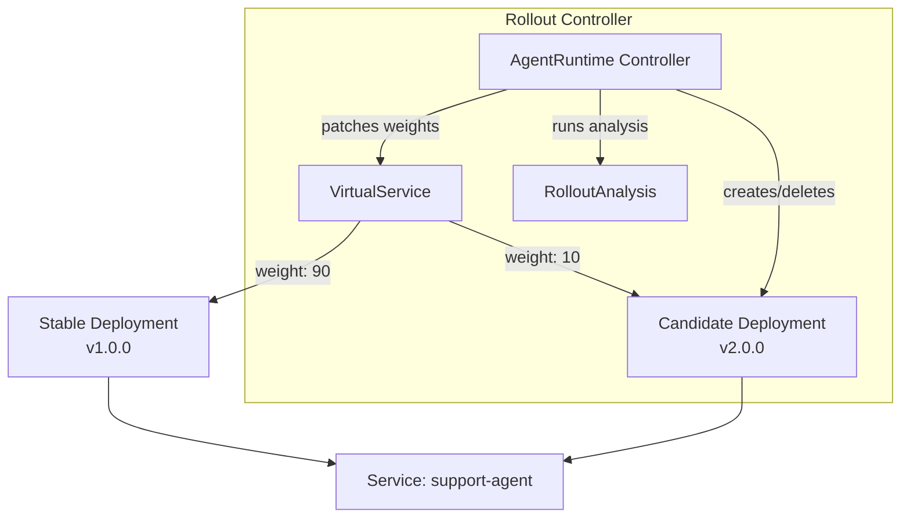

This tutorial walks through deploying a prompt change using progressive rollouts. You'll configure Istio traffic routing, create a canary rollout, watch it progress, and then promote the change.

## Scenario

You have a customer support agent (`support-agent`) running PromptPack version `1.0.0`. You've written a new version `2.0.0` with improved system prompts, and want to roll it out gradually — starting at 10% of traffic, validating quality, then increasing to 100%.

## Prerequisites

- A running Omnia cluster with **Istio** installed
- An existing AgentRuntime (`support-agent`) in the `production` namespace
- The new PromptPack version (`2.0.0`) deployed as a ConfigMap and PromptPack resource
- `kubectl` and `istioctl` available

## Step 1: Create Istio Traffic Resources

The rollout controller manages traffic by patching Istio VirtualService and DestinationRule resources. Create these for your agent:

```yaml
apiVersion: networking.istio.io/v1
kind: DestinationRule
metadata:
  name: support-agent-dr
  namespace: production
spec:
  host: support-agent
  subsets:
    - name: stable
      labels:
        omnia.altairalabs.ai/variant: stable
    - name: candidate
      labels:
        omnia.altairalabs.ai/variant: candidate
---
apiVersion: networking.istio.io/v1
kind: VirtualService
metadata:
  name: support-agent-vs
  namespace: production
spec:
  hosts:
    - support-agent
  http:
    - name: primary
      route:
        - destination:
            host: support-agent
            subset: stable
          weight: 100
        - destination:
            host: support-agent
            subset: candidate
          weight: 0
```

Apply:

```bash
kubectl apply -f istio-traffic.yaml
```

## Step 2: Configure the Rollout

Update your AgentRuntime to add a rollout configuration with the candidate version:

```yaml
apiVersion: omnia.altairalabs.ai/v1alpha1
kind: AgentRuntime
metadata:
  name: support-agent
  namespace: production
spec:
  promptPackRef:
    name: support-pack
    version: "1.0.0"

  providers:
    - name: default
      providerRef:
        name: claude-sonnet

  facade:
    type: websocket
    port: 8080
    handler: runtime

  rollout:
    candidate:
      promptPackVersion: "2.0.0"
    steps:
      - setWeight: 10
      - pause:
          duration: "5m"
      - analysis:
          templateName: quality-check
      - setWeight: 50
      - pause:
          duration: "10m"
      - setWeight: 100
    rollback:
      mode: automatic
    trafficRouting:
      istio:
        virtualService:
          name: support-agent-vs
          routes: [primary]
        destinationRule:
          name: support-agent-dr
```

Apply:

```bash
kubectl apply -f support-agent.yaml
```

The controller detects that `candidate.promptPackVersion` ("2.0.0") differs from `spec.promptPackRef.version` ("1.0.0") and begins the rollout.

## Step 3: Watch the Rollout Progress

Monitor the rollout status:

```bash
kubectl get agentruntime support-agent -n production -o jsonpath='{.status.rollout}' | jq
```

```json
{
  "active": true,
  "currentStep": 0,
  "currentWeight": 10,
  "stableVersion": "1.0.0",
  "candidateVersion": "2.0.0"
}
```

The controller creates a second Deployment for the candidate and sets the initial traffic weight to 10%.

## Step 4: Verify Traffic Splitting

Confirm Istio is routing traffic correctly:

```bash
kubectl get virtualservice support-agent-vs -n production -o jsonpath='{.spec.http[0].route}' | jq
```

You should see the stable subset at weight 90 and the candidate subset at weight 10.

:::tip
Use the `x-omnia-variant` response header to confirm which version served a request. Stable traffic returns `stable`, candidate traffic returns `candidate`.
:::

## Step 5: Observe Analysis and Progression

After the 5-minute pause, the controller runs the `quality-check` analysis. If the analysis passes, it advances to the next step (setWeight: 50), pauses for 10 minutes, then completes at 100%.

Watch the step progression:

```bash
kubectl get agentruntime support-agent -n production -w
```

:::note[Enterprise]
The `analysis` step type requires the `RolloutAnalysis` CRD, which is an enterprise feature. Without it, use `pause` steps with manual verification.
:::

## Step 6: Promotion

When the rollout reaches `setWeight: 100`, the controller promotes the candidate. It copies the candidate overrides into the main spec, removes the candidate Deployment, and returns to a single-Deployment state.

After promotion:

```bash
kubectl get agentruntime support-agent -n production -o jsonpath='{.status.rollout}'
```

```json
{
  "active": false,
  "stableVersion": "2.0.0"
}
```

The `spec.promptPackRef.version` is now `"2.0.0"` and the rollout is idle.

## Rolling Back

If a problem is detected during the rollout, rollback depends on the configured mode:

- **automatic** — the controller reverts the candidate to match the current spec if an analysis step fails
- **manual** — remove the `rollout.candidate` block and reapply; the controller tears down the candidate Deployment
- **disabled** — the rollout continues regardless of analysis failures

```bash
# Manual rollback: remove the candidate
kubectl patch agentruntime support-agent -n production --type merge \
  -p '{"spec":{"rollout":{"candidate":null}}}'
```

## Alternative Patterns

### Blue/Green (Instant Flip)

Skip the gradual weight increase and flip all traffic at once, with a pre-flip analysis:

```yaml
rollout:
  candidate:
    promptPackVersion: "2.0.0"
  steps:
    - analysis:
        templateName: pre-deploy-check
    - setWeight: 100
  rollback:
    mode: automatic
```

### A/B Experiment with Sticky Sessions

Split traffic 50/50 with consistent user routing for experiments:

```yaml
rollout:
  candidate:
    promptPackVersion: "2.0.0"
  steps:
    - setWeight: 50
    - pause: {}  # Indefinite — promote manually when experiment concludes
  stickySession:
    hashOn: "x-user-id"
```

With `stickySession`, the same user always hits the same variant, enabling clean A/B comparisons.

## What You've Built



The rollout controller manages the full lifecycle:
1. Creates a candidate Deployment with the override configuration
2. Patches Istio VirtualService weights at each `setWeight` step
3. Pauses for observation or runs analysis templates
4. Promotes by merging candidate into spec, or rolls back on failure

## Next Steps

- Review the [AgentRuntime rollout reference](/reference/agentruntime/#rollout) for all available fields
- Read [Rollout Strategies](/explanation/rollout-strategies/) to understand the design decisions
- Configure [RolloutAnalysis](/reference/rolloutanalysis/) templates for automated quality gates
- Set up [observability](/how-to/setup-observability/) to monitor rollout metrics

## Related Resources

- [Rollout Strategies](/explanation/rollout-strategies/) — design and architecture
- [AgentRuntime CRD Reference](/reference/agentruntime/) — field-by-field specification
- [RolloutAnalysis CRD Reference](/reference/rolloutanalysis/) — analysis template specification
