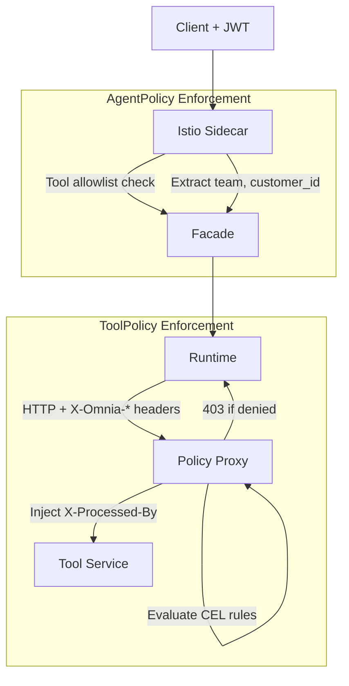

This tutorial walks through securing a customer service agent step by step. You'll restrict tool access, propagate user identity, enforce business rules with CEL, and validate everything in audit mode before going live.

## Scenario

You have a customer service agent (`support-agent`) with access to a `customer-tools` ToolRegistry containing:

- `lookup_order` — look up order details
- `check_status` — check order status
- `process_refund` — issue refunds
- `delete_account` — delete a customer account

The agent should be able to look up orders and process refunds, but **not** delete accounts. Refunds should be capped at $500 and require a reason. The user's team identity must flow through to downstream services.

## Prerequisites

- A running Omnia cluster with Istio enabled
- JWT authentication configured (see [Configure Agent Authentication](/how-to/configure-authentication/))
- The `support-agent` AgentRuntime and `customer-tools` ToolRegistry deployed

## Step 1: Restrict Tool Access with AgentPolicy

Start by limiting which tools the agent can call. Create an AgentPolicy with a tool allowlist:

```yaml
apiVersion: omnia.altairalabs.ai/v1alpha1
kind: AgentPolicy
metadata:
  name: support-agent-policy
  namespace: production
spec:
  selector:
    agents:
      - support-agent

  toolAccess:
    mode: allowlist
    rules:
      - registry: customer-tools
        tools:
          - lookup_order
          - check_status
          - process_refund
      # delete_account is deliberately excluded
```

Apply it:

```bash
kubectl apply -f support-agent-policy.yaml
```

Verify the policy is active:

```bash
kubectl get agentpolicies -n production
```

```
NAME                    MODE      PHASE    MATCHED   AGE
support-agent-policy    enforce   Active   1         10s
```

The agent can now only call `lookup_order`, `check_status`, and `process_refund`. Any attempt to call `delete_account` is blocked at the Istio network level.

## Step 2: Map JWT Claims for User Identity

Add claim mapping so the user's team and customer ID flow through to tool services:

```yaml
apiVersion: omnia.altairalabs.ai/v1alpha1
kind: AgentPolicy
metadata:
  name: support-agent-policy
  namespace: production
spec:
  selector:
    agents:
      - support-agent

  toolAccess:
    mode: allowlist
    rules:
      - registry: customer-tools
        tools:
          - lookup_order
          - check_status
          - process_refund

  claimMapping:
    forwardClaims:
      - claim: team
        header: X-Omnia-Claim-Team
      - claim: customer_id
        header: X-Omnia-Claim-Customer-Id
```

Apply the update:

```bash
kubectl apply -f support-agent-policy.yaml
```

Now every tool call includes `X-Omnia-Claim-Team` and `X-Omnia-Claim-Customer-Id` headers, extracted from the user's JWT.

## Step 3: Add Business Rules with ToolPolicy

:::note[Enterprise]
ToolPolicy is an Enterprise feature. See [Licensing](/explanation/licensing/) for details.
:::

Create a ToolPolicy with CEL rules to enforce refund limits and require a reason:

```yaml
apiVersion: omnia.altairalabs.ai/v1alpha1
kind: ToolPolicy
metadata:
  name: refund-guardrails
  namespace: production
spec:
  selector:
    registry: customer-tools
    tools:
      - process_refund

  requiredClaims:
    - claim: Team
      message: "Team claim is required for refund operations"
    - claim: Customer-Id
      message: "Customer ID is required for refund operations"

  rules:
    - name: max-refund-amount
      description: "Cap refunds at $500"
      deny:
        cel: 'has(body.amount) && double(body.amount) > 500.0'
        message: "Refund amount exceeds the $500 limit"

    - name: require-reason
      description: "All refunds must include a reason"
      deny:
        cel: '!has(body.reason) || body.reason == ""'
        message: "A reason is required for refund requests"

  headerInjection:
    - header: X-Processed-By
      cel: 'headers["X-Omnia-Claim-Team"]'

  mode: audit  # Start in audit mode
  onFailure: deny

  audit:
    logDecisions: true
```

Apply it:

```bash
kubectl apply -f refund-guardrails.yaml
```

Verify:

```bash
kubectl get toolpolicies -n production
```

```
NAME                 REGISTRY         MODE    PHASE    RULES   AGE
refund-guardrails    customer-tools   audit   Active   2       10s
```

## Step 4: Validate in Audit Mode

With `mode: audit`, the policy logs violations but does not block requests. This lets you verify the rules are matching correctly before enforcement.

Test the agent by making a refund call that violates the rules (e.g., amount > $500). Then check the policy proxy logs:

```bash
kubectl logs -n production -l app=customer-tools -c policy-proxy | grep policy_decision
```

You should see audit entries like:

```json
{
  "msg": "policy_decision",
  "decision": "deny",
  "wouldDeny": true,
  "mode": "audit",
  "policy": "refund-guardrails",
  "rule": "max-refund-amount",
  "message": "Refund amount exceeds the $500 limit",
  "path": "/v1/refund",
  "method": "POST"
}
```

The `wouldDeny: true` field confirms the rule would deny in enforce mode, but the request was allowed through.

:::tip
Keep audit mode active for at least a few hours in production to capture a representative sample of traffic before switching to enforce.
:::

## Step 5: Switch to Enforce Mode

Once audit logs confirm the policy is working correctly, switch to enforce mode:

```yaml
spec:
  mode: enforce
```

```bash
kubectl apply -f refund-guardrails.yaml
```

Verify the mode changed:

```bash
kubectl get toolpolicies -n production
```

```
NAME                 REGISTRY         MODE      PHASE    RULES   AGE
refund-guardrails    customer-tools   enforce   Active   2       1h
```

Now any refund over $500 or without a reason returns a 403 response:

```json
{
  "error": "policy_denied",
  "rule": "max-refund-amount",
  "message": "Refund amount exceeds the $500 limit"
}
```

## What You've Built

Here's the complete security architecture for your agent:



**AgentPolicy** provides:
- Tool allowlist — `delete_account` blocked at the network level
- Claim mapping — `team` and `customer_id` propagated as headers

**ToolPolicy** provides:
- Required claims — team and customer ID must be present
- CEL rules — refund amount cap and reason requirement
- Header injection — team identity forwarded to the tool service
- Audit logging — full decision trail

## Next Steps

- Add more CEL rules for other tools in the registry
- Configure `audit.redactFields` to mask sensitive data in logs
- Create policies for other agents in the namespace
- Review the [AgentPolicy Reference](/reference/agentpolicy/) and [ToolPolicy Reference](/reference/toolpolicy/) for all available fields

## Related Resources

- [Policy Engine Architecture](/explanation/policy-engine/) — how the policy engine works
- [AgentPolicy CRD Reference](/reference/agentpolicy/) — field-by-field specification
- [ToolPolicy CRD Reference](/reference/toolpolicy/) — field-by-field specification
- [Configure Agent Policies](/how-to/configure-agent-policies/) — operational guide
- [Configure Tool Policies](/how-to/configure-tool-policies/) — operational guide
