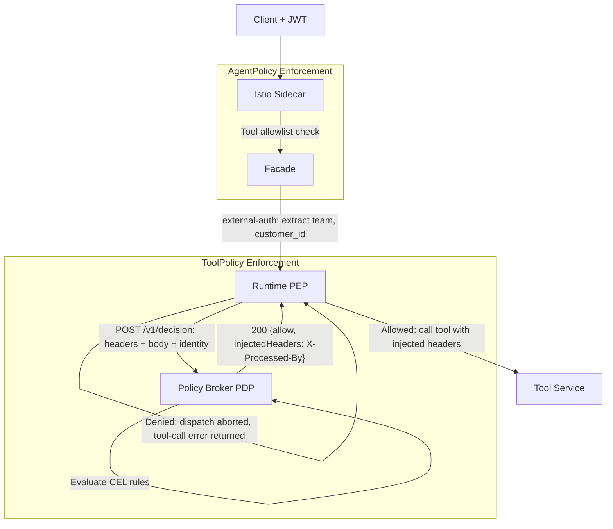

This tutorial walks through securing a customer service agent step by step. You'll restrict tool access, propagate user identity, enforce business rules with CEL, and validate everything in audit mode before going live.

## Scenario

You have a customer service agent (`support-agent`) with access to a `customer-tools` ToolRegistry containing:

- `lookup_order` — look up order details
- `check_status` — check order status
- `process_refund` — issue refunds
- `delete_account` — delete a customer account

The agent should be able to look up orders and process refunds, but **not** delete accounts. Refunds should be capped at $500 and require a reason. The user's team identity must flow through to downstream services.

## Prerequisites

- A running Omnia cluster with Istio enabled — **and, under ambient mode, a waypoint proxy enrolled for the `support-agent` Service**, since AgentPolicy's `toolAccess` rules match on the `X-Omnia-Tool-Name` HTTP header (an L7 attribute) and ztunnel alone only enforces L4. Without a waypoint, the generated AuthorizationPolicy is created but never enforced.
- JWT authentication configured (see [Configure Agent Authentication](/how-to/security/configure-authentication/))
- The `support-agent` AgentRuntime and `customer-tools` ToolRegistry deployed

## Step 1: restrict tool access with AgentPolicy

Start by limiting which tools the agent can call. Create an AgentPolicy with a tool allowlist:

```yaml
apiVersion: omnia.altairalabs.ai/v1alpha1
kind: AgentPolicy
metadata:
  name: support-agent-policy
  namespace: production
spec:
  selector:
    agents:
      - support-agent

  toolAccess:
    mode: allowlist
    rules:
      - registry: customer-tools
        tools:
          - lookup_order
          - check_status
          - process_refund
      # delete_account is deliberately excluded
```

Apply it:

```bash
kubectl apply -f support-agent-policy.yaml
```

Verify the policy is active:

```bash
kubectl get agentpolicies -n production
```

```
NAME                    MODE      PHASE    MATCHED   AGE
support-agent-policy    enforce   Active   1         10s
```

The agent can now only call `lookup_order`, `check_status`, and `process_refund`. Any attempt to call `delete_account` is blocked at the Istio network level — **provided the agent's Service is enrolled behind a waypoint** (see prerequisites); plain ambient mode with no waypoint leaves the generated `AuthorizationPolicy` unenforced.

## Step 2: forward user identity claims

AgentPolicy has no claim-mapping configuration — it only governs tool allow/deny. Claim forwarding to downstream tools is configured on the `support-agent` AgentRuntime's external-auth block (`spec.externalAuth.oidc.claimMapping`, already set up as part of the JWT authentication prerequisite — see [Configure Agent Authentication](/how-to/security/configure-authentication/)).

Once that's in place, the facade extracts the configured claims from the verified JWT and forwards them as `X-Omnia-Claim-*` headers on every tool call — for example `X-Omnia-Claim-Team` and `X-Omnia-Claim-Customer-Id` — with no further AgentPolicy changes needed.

## Step 3: add business rules with ToolPolicy

:::note[Enterprise]
ToolPolicy is an Enterprise feature. See [Licensing](/explanation/platform/licensing/) for details.
:::

Create a ToolPolicy with CEL rules to enforce refund limits and require a reason:

```yaml
apiVersion: omnia.altairalabs.ai/v1alpha1
kind: ToolPolicy
metadata:
  name: refund-guardrails
  namespace: production
spec:
  selector:
    registry: customer-tools
    tools:
      - process_refund

  requiredClaims:
    - claim: Team
      message: "Team claim is required for refund operations"
    - claim: Customer-Id
      message: "Customer ID is required for refund operations"

  rules:
    - name: max-refund-amount
      description: "Cap refunds at $500"
      deny:
        cel: 'has(body.amount) && double(body.amount) > 500.0'
        message: "Refund amount exceeds the $500 limit"

    - name: require-reason
      description: "All refunds must include a reason"
      deny:
        cel: '!has(body.reason) || body.reason == ""'
        message: "A reason is required for refund requests"

  headerInjection:
    - header: X-Processed-By
      cel: 'headers["X-Omnia-Claim-Team"]'

  mode: audit  # Start in audit mode
  onFailure: deny
```

Apply it:

```bash
kubectl apply -f refund-guardrails.yaml
```

Verify:

```bash
kubectl get toolpolicies -n production
```

```
NAME                 REGISTRY         MODE    PHASE    RULES   AGE
refund-guardrails    customer-tools   audit   Active   2       10s
```

## Step 4: validate in audit mode

With `mode: audit`, the policy logs violations but does not block requests. This lets you verify the rules are matching correctly before enforcement.

Test the agent by making a refund call that violates the rules (e.g., amount > $500). Then check the policy-broker logs (the broker runs as a sidecar in the `support-agent` agent pod, not on `customer-tools`). Agent pods carry a fixed `app.kubernetes.io/name=omnia-agent` label across every AgentRuntime, so select on `app.kubernetes.io/instance` (the AgentRuntime name) to target this one agent:

```bash
kubectl logs -n production -l app.kubernetes.io/instance=support-agent -c policy-broker | grep policy_decision
```

You should see a pair of audit log lines like:

```json
{"msg":"policy_decision","allowed":true,"deniedBy":"max-refund-amount","message":"Refund amount exceeds the $500 limit","mode":"audit","policy":"refund-guardrails"}
{"msg":"broker_tool_decision","toolName":"process_refund","toolRegistry":"customer-tools","allowed":true,"deniedBy":"max-refund-amount","mode":"audit"}
```

In audit mode a matched deny rule still sets `deniedBy` and `message`, but `allowed` stays `true` — the call is let through with the violation logged. That combination (`"mode":"audit"` + non-empty `deniedBy`) is exactly what would flip to a hard denial once the policy switches to `mode: enforce`.

:::tip
Keep audit mode active for at least a few hours in production to capture a representative sample of traffic before switching to enforce.
:::

## Step 5: switch to enforce mode

Once audit logs confirm the policy is working correctly, switch to enforce mode:

```yaml
spec:
  mode: enforce
```

```bash
kubectl apply -f refund-guardrails.yaml
```

Verify the mode changed:

```bash
kubectl get toolpolicies -n production
```

```
NAME                 REGISTRY         MODE      PHASE    RULES   AGE
refund-guardrails    customer-tools   enforce   Active   2       1h
```

Now any refund over $500 or without a reason is denied — the broker returns `allow: false` and the runtime aborts the tool call instead of invoking it:

```json
{
  "allow": false,
  "deniedBy": "max-refund-amount",
  "message": "Refund amount exceeds the $500 limit",
  "mode": "enforce",
  "wouldDeny": false,
  "injectedHeaders": null
}
```

## What you've built

Here's the complete security architecture for your agent:


```mermaid
graph TB
    CLIENT[Client + JWT] --> ISTIO[Istio Sidecar]

    subgraph "AgentPolicy Enforcement"
        ISTIO -->|Tool allowlist check| FACADE[Facade]
    end

    FACADE -->|"external-auth: extract team, customer_id"| RUNTIME[Runtime PEP]

    subgraph "ToolPolicy Enforcement"
        RUNTIME -->|"POST /v1/decision: headers + body + identity"| BROKER[Policy Broker PDP]
        BROKER -->|Check required claims| BROKER
        BROKER -->|Evaluate CEL rules| BROKER
        BROKER -->|"200 {allow, injectedHeaders: X-Processed-By}"| RUNTIME
    end

    RUNTIME -->|"Denied: dispatch aborted, tool-call error returned"| RUNTIME
    RUNTIME -->|Allowed: call tool with injected headers| TOOL[Tool Service]
```

**AgentPolicy** provides:
- Tool allowlist — `delete_account` blocked at the network level

**AgentRuntime external-auth** provides:
- Claim mapping — `team` and `customer_id` propagated as `X-Omnia-Claim-*` headers

**ToolPolicy** provides:
- Required claims — team and customer ID must be present
- CEL rules — refund amount cap and reason requirement
- Header injection — team identity forwarded to the tool service (applied by the runtime, only when allowed)
- Audit logging — full decision trail

## Next steps

- Add more CEL rules for other tools in the registry
- Create policies for other agents in the namespace
- Review the [AgentPolicy Reference](/reference/policies/agentpolicy/) and [ToolPolicy Reference](/reference/policies/toolpolicy/) for all available fields

## Related resources

- [Policy Engine Architecture](/explanation/security/policy-engine/) — how the policy engine works
- [AgentPolicy CRD Reference](/reference/policies/agentpolicy/) — field-by-field specification
- [ToolPolicy CRD Reference](/reference/policies/toolpolicy/) — field-by-field specification
- [Configure Agent Policies](/how-to/security/configure-agent-policies/) — operational guide
- [Configure Tool Policies](/how-to/security/configure-tool-policies/) — operational guide
