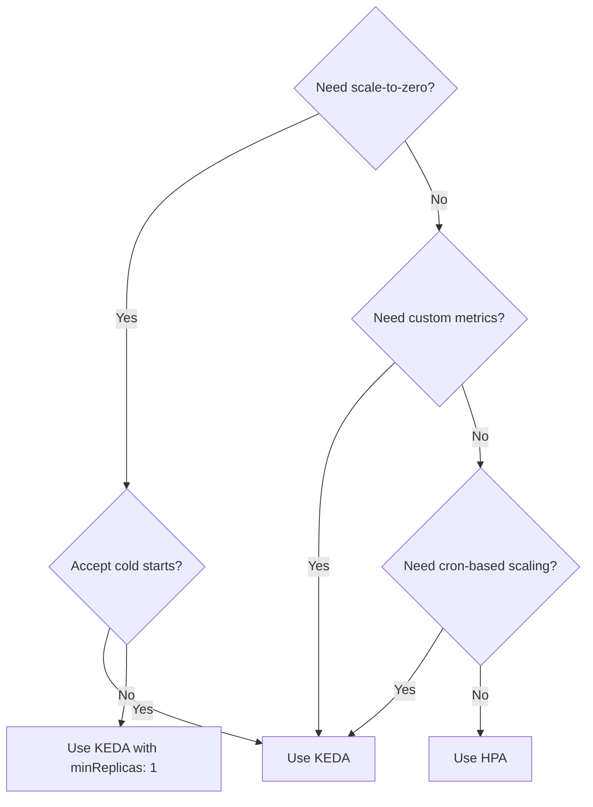
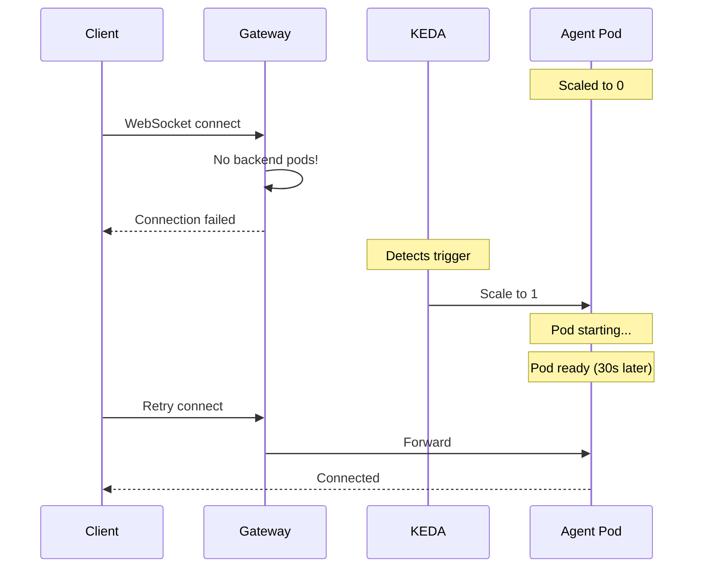

# Autoscaling

Omnia supports two autoscaling mechanisms: standard Kubernetes HPA and KEDA. This document explains when to use each and how they work with AI agents.

## Choosing an Autoscaler



## Agent Workload Characteristics

AI agents have unique scaling characteristics compared to typical web services:

1. **I/O Bound**: Agents spend most time waiting for LLM API responses, not computing
2. **Long-Running Connections**: WebSocket connections persist for entire conversations
3. **Memory-Heavy**: Each connection/session consumes memory for context
4. **Variable Latency**: LLM responses can take 1-30+ seconds

These characteristics inform Omnia's default autoscaling settings.

## HPA (Standard Autoscaling)

The Horizontal Pod Autoscaler is Kubernetes' built-in scaling mechanism.

### How It Works

1. HPA periodically queries metrics from the Metrics Server
2. Calculates desired replicas based on target utilization
3. Scales the Deployment up or down

### Default Configuration

Omnia's HPA defaults are optimized for agent workloads:

```yaml
autoscaling:
  enabled: true
  type: hpa
  minReplicas: 1
  maxReplicas: 10
  targetMemoryUtilizationPercentage: 70  # Primary metric
  targetCPUUtilizationPercentage: 90     # Safety valve
  scaleDownStabilizationSeconds: 300     # 5 minute cooldown
```

**Why memory is primary:**
- Each WebSocket connection uses memory for buffers
- Session context (conversation history) consumes memory
- CPU usage is low while waiting for LLM responses

**Why 90% CPU as secondary:**
- Acts as a safety valve for unexpected CPU spikes
- Prevents CPU exhaustion during message parsing/serialization

**Why 5-minute scale-down stabilization:**
- Prevents thrashing during bursty traffic
- WebSocket connections may reconnect shortly after disconnecting
- LLM calls have high latency; recent scale-up may still be needed

### When to Use HPA

Use standard HPA when:
- You don't need scale-to-zero
- You want simplicity (no additional dependencies)
- Resource-based metrics (CPU/memory) are sufficient
- You're running in an environment without KEDA

## KEDA (Advanced Autoscaling)

KEDA (Kubernetes Event-Driven Autoscaling) extends HPA with custom metrics and scale-to-zero.

### How It Works

1. KEDA polls external metric sources (Prometheus, queues, etc.)
2. Creates/manages an HPA behind the scenes
3. Can scale to zero when no events/metrics trigger scaling
4. Scales from zero when triggers fire

### Default Configuration

```yaml
autoscaling:
  enabled: true
  type: keda
  minReplicas: 1  # Set to 0 for scale-to-zero
  maxReplicas: 20
  keda:
    pollingInterval: 30
    cooldownPeriod: 300
```

### Default Trigger

If no custom triggers are specified, Omnia configures a Prometheus trigger:

```yaml
triggers:
  - type: prometheus
    metadata:
      serverAddress: "http://omnia-prometheus-server.omnia-system.svc.cluster.local/prometheus"
      query: 'sum(omnia_agent_connections_active{agent="<name>",namespace="<ns>"}) or vector(0)'
      threshold: "10"
```

This scales based on active WebSocket connections:
- Below 10 connections per pod: consider scaling down
- Above 10 connections per pod: scale up

### When to Use KEDA

Use KEDA when:
- You want custom metrics (connections, queue depth, etc.)
- You need scale-to-zero (with caveats, see below)
- You want cron-based scaling (business hours)
- You need to scale on external events

### Available Triggers

**Prometheus** (recommended for agents):
```yaml
triggers:
  - type: prometheus
    metadata:
      serverAddress: "http://prometheus:9090"
      query: 'sum(omnia_agent_connections_active{agent="my-agent"})'
      threshold: "10"
```

**Cron** (business hours scaling):
```yaml
triggers:
  - type: cron
    metadata:
      timezone: "America/New_York"
      start: "0 8 * * 1-5"   # 8am Mon-Fri
      end: "0 18 * * 1-5"    # 6pm Mon-Fri
      desiredReplicas: "5"
```

**CPU/Memory** (like HPA):
```yaml
triggers:
  - type: cpu
    metadata:
      type: Utilization
      value: "70"
```

## Scale-to-Zero Considerations

KEDA supports scaling to zero replicas, but there are important tradeoffs:

### The Cold Start Problem



When scaled to zero:
1. New connection arrives at the gateway
2. No pods exist to handle it
3. Connection fails or times out
4. KEDA scales up (too late for that request)

### Solutions

**1. Don't scale to zero (recommended)**:
```yaml
autoscaling:
  minReplicas: 1  # Always have one pod ready
```

You still benefit from scale-out (1→N) and scale-in (N→1).

**2. Accept cold starts**:
For non-interactive workloads or where occasional failures are acceptable.

**3. Use a proxy/queue**:
The KEDA HTTP Add-on can buffer requests during scale-up, but it's not production-ready.

### Recommendation

For most production deployments, use `minReplicas: 1`. The cost of one always-running pod is usually worth the reliability.

## Metrics for Scaling

Omnia agents expose these Prometheus metrics:

| Metric | Description | Good for Scaling? |
|--------|-------------|-------------------|
| `omnia_agent_connections_active` | Current WebSocket connections | Yes - direct load indicator |
| `omnia_agent_requests_inflight` | Pending LLM requests | Yes - indicates processing load |
| `omnia_agent_request_duration_seconds` | Request latency | No - trailing indicator |
| `omnia_agent_sessions_active` | Active sessions | Maybe - depends on session lifetime |

### Recommended Scaling Query

```promql
sum(omnia_agent_connections_active{agent="my-agent"}) or vector(0)
```

The `or vector(0)` ensures the query returns 0 when no metrics exist (new deployments).

## Tuning Guidelines

### For Latency-Sensitive Workloads

Scale up aggressively, scale down conservatively:

```yaml
autoscaling:
  type: hpa
  targetMemoryUtilizationPercentage: 50  # Lower threshold
  scaleDownStabilizationSeconds: 600     # 10 minutes
```

### For Cost-Sensitive Workloads

Scale down more aggressively:

```yaml
autoscaling:
  type: keda
  minReplicas: 1
  keda:
    cooldownPeriod: 60  # 1 minute
    triggers:
      - type: prometheus
        metadata:
          threshold: "20"  # Higher threshold per pod
```

### For Predictable Traffic

Use cron-based scaling:

```yaml
autoscaling:
  type: keda
  keda:
    triggers:
      # Base capacity during business hours
      - type: cron
        metadata:
          timezone: "UTC"
          start: "0 8 * * 1-5"
          end: "0 18 * * 1-5"
          desiredReplicas: "5"
      # Connection-based scaling for spikes
      - type: prometheus
        metadata:
          query: 'sum(omnia_agent_connections_active{agent="my-agent"})'
          threshold: "10"
```

## Comparison Summary

| Feature | HPA | KEDA |
|---------|-----|------|
| Built-in | Yes | Requires installation |
| Scale to zero | No | Yes (with caveats) |
| Custom metrics | Limited | Extensive |
| Cron scaling | No | Yes |
| Complexity | Low | Medium |
| Dependencies | Metrics Server | KEDA + metric source |

Choose HPA for simplicity, KEDA for advanced scaling scenarios.
