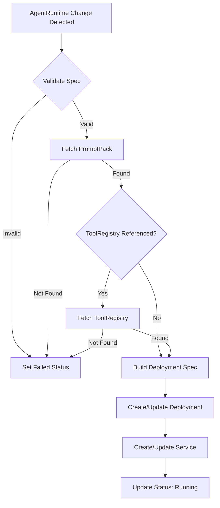
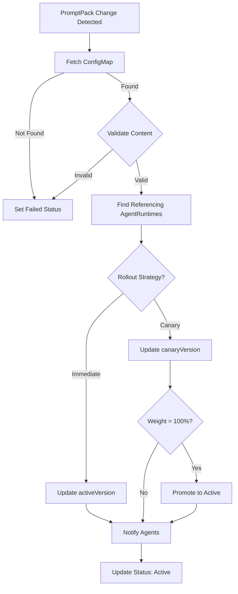
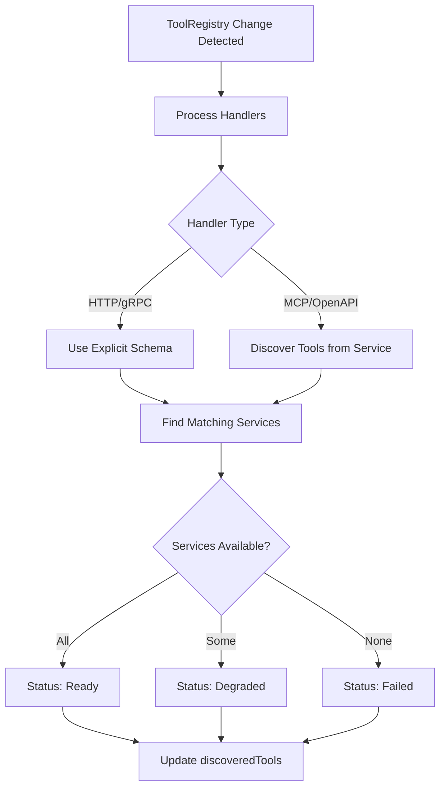

# Controller Reconciliation

This document explains the reconciliation logic used by Omnia's Kubernetes controllers.

## Reconciliation Pattern

Omnia follows the Kubernetes controller reconciliation pattern:

1. **Watch** - Monitor resources for changes
2. **Queue** - Add changed resources to work queue
3. **Reconcile** - Process each resource to achieve desired state
4. **Requeue** - Retry on transient failures

## AgentRuntime Controller

### Reconciliation Flow

### Deployment Building

The controller builds the Deployment spec with:

1. **Container image** - From operator configuration
2. **Environment variables**:
   - `OMNIA_AGENT_NAME` - AgentRuntime name
   - `OMNIA_NAMESPACE` - Namespace
   - `OMNIA_PROVIDER_*` - Provider configuration
   - `OMNIA_SESSION_*` - Session configuration
3. **Volume mounts** - PromptPack ConfigMap
4. **Resource limits** - From spec
5. **Labels** - For identification and selection

### Status Updates

The controller updates status with:

- `phase` - Current lifecycle phase
- `replicas` - Desired and ready counts
- `conditions` - Detailed state information

### Watched Resources

The AgentRuntime controller watches:

- AgentRuntime resources (primary)
- PromptPack resources (to detect changes)
- ToolRegistry resources (to detect changes)

## PromptPack Controller

### Reconciliation Flow

### Rollout Strategies

#### Immediate

Changes apply immediately:

1. Validate new content
2. Update `activeVersion`
3. Agents pick up changes on next request

#### Canary

Gradual rollout:

1. Validate new content
2. Set `canaryVersion`
3. Route percentage of traffic to canary
4. Monitor for issues
5. Promote when weight reaches 100%

### Watched Resources

The PromptPack controller watches:

- PromptPack resources (primary)
- ConfigMaps (to detect content changes)

## ToolRegistry Controller

### Reconciliation Flow

### Tool Discovery

For selector-based tools:

1. Find Services matching labels
2. Parse tool metadata from annotations
3. Determine endpoint URL from Service
4. Check Service has ready endpoints

### Status Phases

| Phase | Condition |
|-------|-----------|
| `Ready` | All tools available |
| `Degraded` | Some tools unavailable |
| `Failed` | No tools available |

### Watched Resources

The ToolRegistry controller watches:

- ToolRegistry resources (primary)
- Services (to detect tool availability changes)

## Error Handling

### Transient Errors

On transient errors (network issues, API rate limits):

1. Log the error
2. Set status condition to reflect issue
3. Requeue with exponential backoff
4. Retry reconciliation

### Permanent Errors

On permanent errors (invalid spec, missing resources):

1. Log the error
2. Set phase to `Failed`
3. Set condition with error message
4. Do not requeue (wait for spec change)

## Concurrency

Controllers process resources concurrently:

- Default: 1 worker per controller
- Configurable via operator flags
- Safe: Each resource reconciled by one worker at a time

## Requeuing

Controllers requeue resources to:

- Retry after transient failures
- Check status of dependent resources
- Implement polling for external state

Requeue intervals:

| Scenario | Interval |
|----------|----------|
| Success | Not requeued |
| Transient error | 5s - 5m (exponential) |
| Waiting for dependency | 30s |
