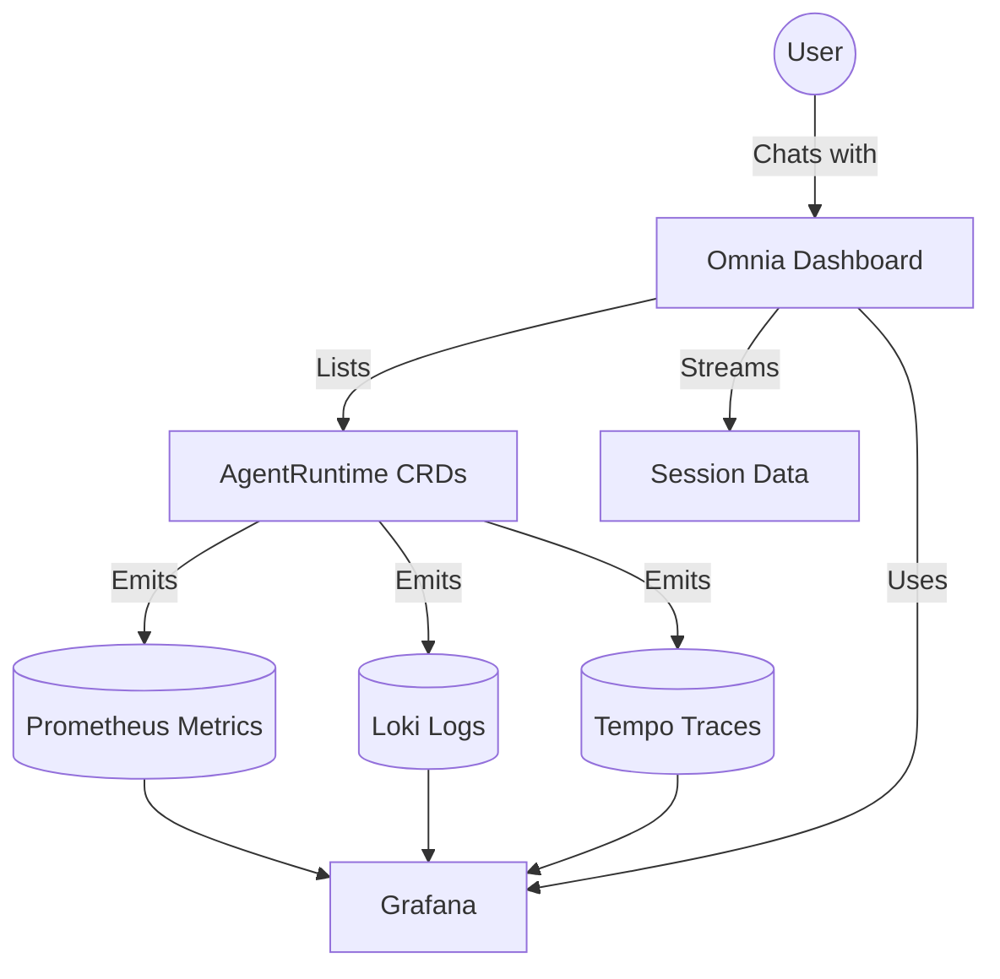

# Mermaid Diagram Demo

Mermaid diagrams render client-side. The diagram below should render automatically.

```mermaid
graph TD
  User((User)) -->|Chats with| Dashboard[Omnia Dashboard]
  Dashboard -->|Lists| Agents[AgentRuntime CRDs]
  Dashboard -->|Streams| Sessions[Session Data]
  Agents -->|Emits| Metrics[(Prometheus Metrics)]
  Agents -->|Emits| Logs[(Loki Logs)]
  Agents -->|Emits| Traces[(Tempo Traces)]
  Metrics --> Grafana[Grafana]
  Logs --> Grafana
  Traces --> Grafana
  Dashboard -->|Uses| Grafana
```
